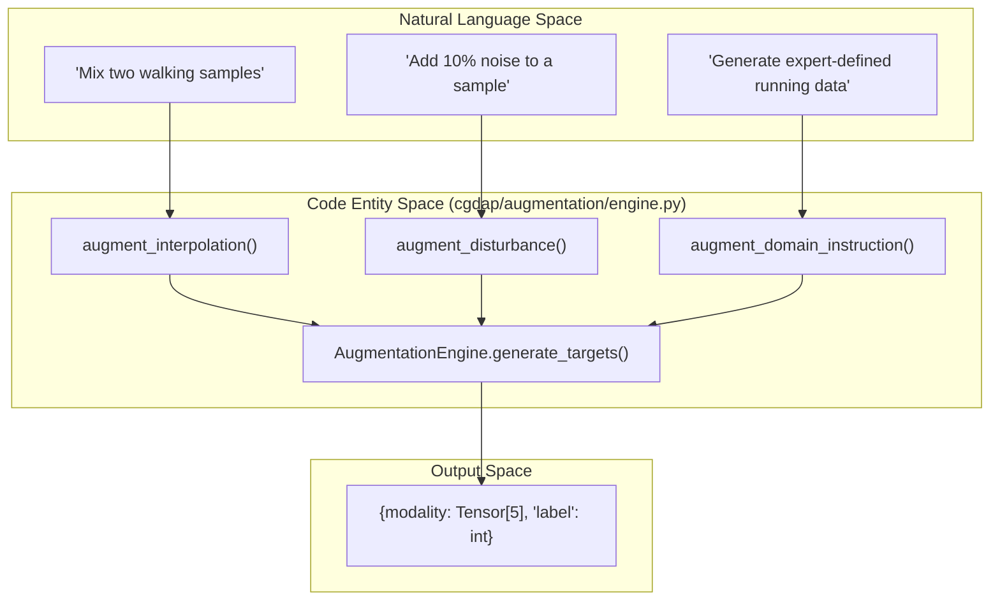
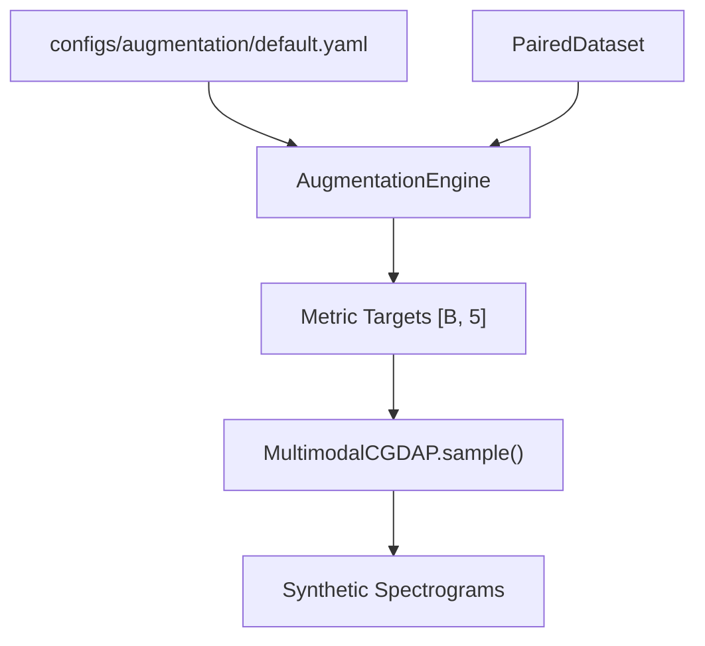

# Augmentation Engine

> **Relevant source files**
> * [cgdap/__init__.py](https://github.com/yashwantherukulla/IoT-Data-Aug/blob/3c2a9426/cgdap/__init__.py)
> * [cgdap/augmentation/__init__.py](https://github.com/yashwantherukulla/IoT-Data-Aug/blob/3c2a9426/cgdap/augmentation/__init__.py)
> * [cgdap/augmentation/engine.py](https://github.com/yashwantherukulla/IoT-Data-Aug/blob/3c2a9426/cgdap/augmentation/engine.py)
> * [cgdap/data/raw_loader.py](https://github.com/yashwantherukulla/IoT-Data-Aug/blob/3c2a9426/cgdap/data/raw_loader.py)
> * [configs/augmentation/default.yaml](https://github.com/yashwantherukulla/IoT-Data-Aug/blob/3c2a9426/configs/augmentation/default.yaml)

The `AugmentationEngine` is a core component of the CGDAP pipeline responsible for generating synthetic conditioning targets in the metric space. Rather than generating random noise, the engine produces structured metric vectors—covering `temporal_range`, `f0_amplitude`, `contrast`, `flatness`, and `entropy` [cgdap/augmentation/engine.py L30-L31](https://github.com/yashwantherukulla/IoT-Data-Aug/blob/3c2a9426/cgdap/augmentation/engine.py#L30-L31)

—that guide the diffusion model to synthesize realistic IoT sensor spectrograms.

By operating in the metric space, the engine allows for precise control over the physical characteristics of the generated data, such as signal intensity or spectral complexity, across multiple modalities (e.g., `acc` and `gyr`).

### System Architecture and Code Mapping

The following diagram illustrates how high-level augmentation concepts map to the implementation within `cgdap/augmentation/engine.py`.

**Augmentation Mapping: Concept to Code**

**Sources:** [cgdap/augmentation/engine.py L52-L141](https://github.com/yashwantherukulla/IoT-Data-Aug/blob/3c2a9426/cgdap/augmentation/engine.py#L52-L141)

 [cgdap/augmentation/engine.py L184-L210](https://github.com/yashwantherukulla/IoT-Data-Aug/blob/3c2a9426/cgdap/augmentation/engine.py#L184-L210)

---

## Augmentation Modes

The engine supports three distinct strategies for generating metric targets, configured via the `mode` parameter in the augmentation configuration [configs/augmentation/default.yaml L6](https://github.com/yashwantherukulla/IoT-Data-Aug/blob/3c2a9426/configs/augmentation/default.yaml#L6-L6)

| Mode | Strategy | Requirement |
| --- | --- | --- |
| **Interpolation** | Blends two real samples of the same label using a truncated normal distribution. | Requires `register_samples()` to be called first [cgdap/augmentation/engine.py L172-L182](https://github.com/yashwantherukulla/IoT-Data-Aug/blob/3c2a9426/cgdap/augmentation/engine.py#L172-L182) |
| **Disturbance** | Perturbs a real sample's metrics by a uniform percentage range per metric. | Requires a reference `sample` dictionary [cgdap/augmentation/engine.py L83-L87](https://github.com/yashwantherukulla/IoT-Data-Aug/blob/3c2a9426/cgdap/augmentation/engine.py#L83-L87) |
| **Domain Instruction** | Samples targets directly from expert-defined ranges for specific activities. | Requires an `activity` string key [cgdap/augmentation/engine.py L107-L112](https://github.com/yashwantherukulla/IoT-Data-Aug/blob/3c2a9426/cgdap/augmentation/engine.py#L107-L112) |

For a deep dive into the mathematical implementation and configuration of these modes, see **[Augmentation Modes (#5.1)]**.

**Sources:** [cgdap/augmentation/engine.py L5-L14](https://github.com/yashwantherukulla/IoT-Data-Aug/blob/3c2a9426/cgdap/augmentation/engine.py#L5-L14)

 [configs/augmentation/default.yaml L9-L27](https://github.com/yashwantherukulla/IoT-Data-Aug/blob/3c2a9426/configs/augmentation/default.yaml#L9-L27)

---

## Synthetic Sample Generation

The `AugmentationEngine` serves as the front-end for the generation pipeline. Once targets are generated, they are passed to the `MultimodalCGDAP.sample` method to produce the final spectrograms. This workflow ensures that synthetic data remains grounded in the statistical properties defined by the augmentation mode.

**Generation Data Flow**

The generation process involves resolving model checkpoints, loading the diffusion denoiser, and executing the reverse DDPM loop to transform noise into spectrograms conditioned on the engine's targets.

For details on the sampling loop and saving outputs, see **[Synthetic Sample Generation (#5.2)]**.

**Sources:** [cgdap/augmentation/engine.py L149-L168](https://github.com/yashwantherukulla/IoT-Data-Aug/blob/3c2a9426/cgdap/augmentation/engine.py#L149-L168)

 [cgdap/augmentation/engine.py L184-L210](https://github.com/yashwantherukulla/IoT-Data-Aug/blob/3c2a9426/cgdap/augmentation/engine.py#L184-L210)

---

## Configuration Reference

The engine is highly configurable through the `augmentation` block. It defines the perturbation scales for `disturbance` and the specific physical boundaries for `domain_instruction`.

* **Disturbance Scales:** Configures the `+/-` range for each metric (e.g., `temporal_range: 0.10` for 10% variation) [configs/augmentation/default.yaml L17-L23](https://github.com/yashwantherukulla/IoT-Data-Aug/blob/3c2a9426/configs/augmentation/default.yaml#L17-L23)
* **Domain Ranges:** Expert-defined `[low, high]` intervals for each activity and modality (e.g., `walking.acc.entropy: [5.0, 11.0]`) [configs/augmentation/default.yaml L27-L40](https://github.com/yashwantherukulla/IoT-Data-Aug/blob/3c2a9426/configs/augmentation/default.yaml#L27-L40)

**Sources:** [configs/augmentation/default.yaml L1-L92](https://github.com/yashwantherukulla/IoT-Data-Aug/blob/3c2a9426/configs/augmentation/default.yaml#L1-L92)