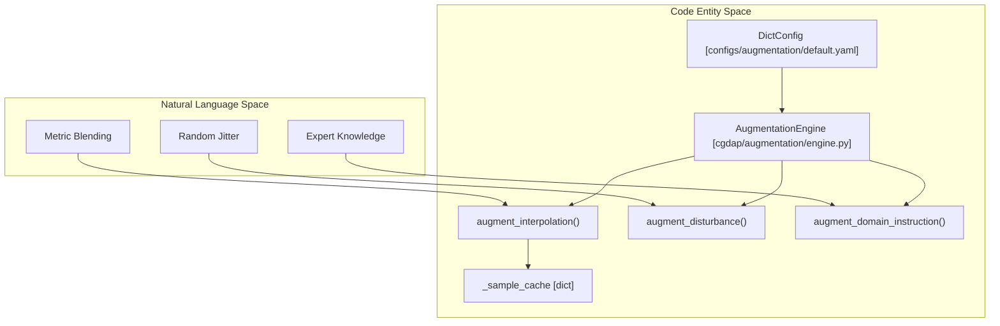
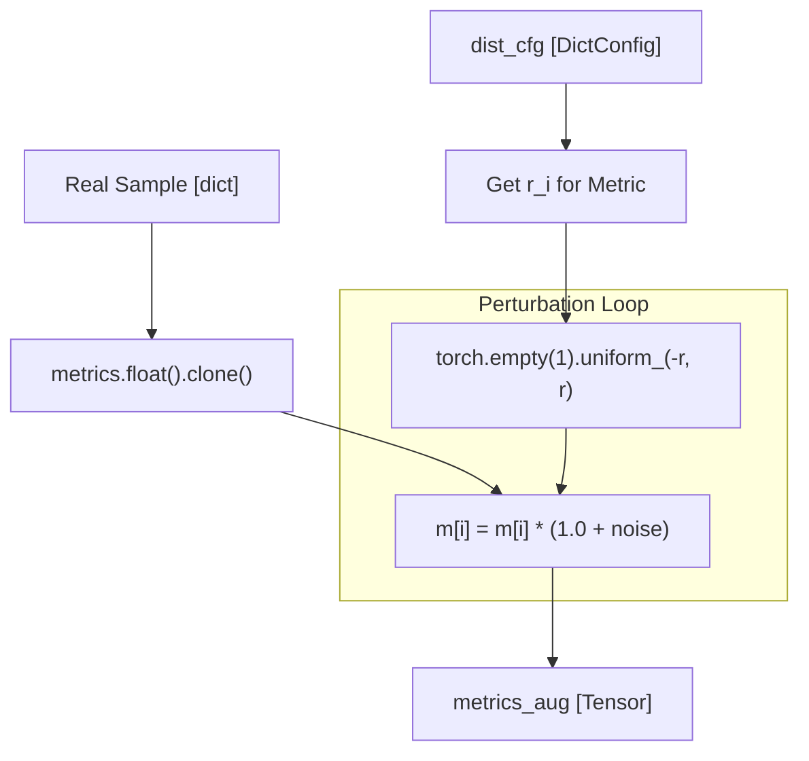

# Augmentation Modes

> **Relevant source files**
> * [cgdap/augmentation/engine.py](https://github.com/yashwantherukulla/IoT-Data-Aug/blob/3c2a9426/cgdap/augmentation/engine.py)
> * [cgdap/data/raw_loader.py](https://github.com/yashwantherukulla/IoT-Data-Aug/blob/3c2a9426/cgdap/data/raw_loader.py)
> * [configs/augmentation/default.yaml](https://github.com/yashwantherukulla/IoT-Data-Aug/blob/3c2a9426/configs/augmentation/default.yaml)

The `AugmentationEngine` is responsible for synthesizing target metric vectors that condition the `MultimodalCGDAP` generative model. By manipulating the metric space rather than the raw signal space, the system can generate diverse synthetic IoT sensor data that adheres to specific physical characteristics (e.g., higher intensity, varying frequency components).

The engine supports three distinct modes of operation: **Interpolation**, **Disturbance**, and **Domain Instruction**. These modes allow for varying levels of control, from data-driven blending to expert-defined physiological constraints.

### Augmentation Architecture

The `AugmentationEngine` acts as a strategy-pattern wrapper that selects the appropriate augmentation logic based on the configuration provided in `configs/augmentation/default.yaml`.

#### Data Flow and Entity Mapping

The following diagram illustrates how the natural language augmentation concepts map to the internal code entities and data structures.

**Title: Augmentation Entity Mapping**



**Sources:** [cgdap/augmentation/engine.py L149-L170](https://github.com/yashwantherukulla/IoT-Data-Aug/blob/3c2a9426/cgdap/augmentation/engine.py#L149-L170)

 [configs/augmentation/default.yaml L1-L6](https://github.com/yashwantherukulla/IoT-Data-Aug/blob/3c2a9426/configs/augmentation/default.yaml#L1-L6)

---

### 1. Interpolation Mode

Interpolation generates new metric targets by performing a linear combination of two real samples belonging to the same activity class. This ensures that the generated targets remain within the manifold of "realistic" data for that specific activity.

* **Mechanism**: It selects a random label, retrieves two distinct samples ($s_1, s_2$) from the `_sample_cache`, and computes $m_{aug} = \beta \cdot m_1 + (1 - \beta) \cdot m_2$ [cgdap/augmentation/engine.py L52-L78](https://github.com/yashwantherukulla/IoT-Data-Aug/blob/3c2a9426/cgdap/augmentation/engine.py#L52-L78)
* **Beta Distribution**: The mixing coefficient $\beta$ is sampled from a **Truncated Normal Distribution** to avoid extreme values and focus the blending near the mean [cgdap/augmentation/engine.py L38-L44](https://github.com/yashwantherukulla/IoT-Data-Aug/blob/3c2a9426/cgdap/augmentation/engine.py#L38-L44)

| Parameter | Configuration Key | Default Value |
| --- | --- | --- |
| Mean | `interpolation.beta_mean` | 0.5 |
| Std Dev | `interpolation.beta_std` | 0.1 |
| Lower Bound | `interpolation.beta_low` | 0.0 |
| Upper Bound | `interpolation.beta_high` | 1.0 |

**Sources:** [cgdap/augmentation/engine.py L52-L80](https://github.com/yashwantherukulla/IoT-Data-Aug/blob/3c2a9426/cgdap/augmentation/engine.py#L52-L80)

 [configs/augmentation/default.yaml L9-L14](https://github.com/yashwantherukulla/IoT-Data-Aug/blob/3c2a9426/configs/augmentation/default.yaml#L9-L14)

---

### 2. Disturbance Mode

Disturbance mode takes a single real sample and applies a uniform random perturbation to each of its five metrics. This is used to generate "near-neighbor" synthetic samples that explore the local vicinity of real data points.

* **Mechanism**: For each metric $i$ in the vector, a noise value is sampled from $U(-r_i, r_i)$. The augmented metric is calculated as $m_i' = m_i \cdot (1 + noise)$ [cgdap/augmentation/engine.py L83-L104](https://github.com/yashwantherukulla/IoT-Data-Aug/blob/3c2a9426/cgdap/augmentation/engine.py#L83-L104)
* **Metric-Specific Ranges**: Different metrics have different sensitivities. For example, `temporal_range` typically allows for 10% jitter, while `flatness` is constrained to 5% to maintain signal quality [configs/augmentation/default.yaml L17-L23](https://github.com/yashwantherukulla/IoT-Data-Aug/blob/3c2a9426/configs/augmentation/default.yaml#L17-L23)

**Title: Disturbance Logic Flow**



**Sources:** [cgdap/augmentation/engine.py L83-L104](https://github.com/yashwantherukulla/IoT-Data-Aug/blob/3c2a9426/cgdap/augmentation/engine.py#L83-L104)

 [configs/augmentation/default.yaml L17-L23](https://github.com/yashwantherukulla/IoT-Data-Aug/blob/3c2a9426/configs/augmentation/default.yaml#L17-L23)

---

### 3. Domain Instruction Mode

Domain Instruction is the most powerful mode, allowing for the generation of synthetic data without referencing any specific real samples. Instead, it samples targets directly from expert-defined ranges for each activity and modality.

* **Expert Ranges**: Defined in the configuration for activities like `walking`, `running`, and `jumping`. Each activity has specific ranges for both `acc` (accelerometer) and `gyr` (gyroscope) modalities [configs/augmentation/default.yaml L27-L66](https://github.com/yashwantherukulla/IoT-Data-Aug/blob/3c2a9426/configs/augmentation/default.yaml#L27-L66)
* **Schema**: The engine looks for modality-specific blocks (e.g., `domain_instruction.walking.acc.temporal_range`). If not found, it falls back to activity-level shared ranges [cgdap/augmentation/engine.py L129-L141](https://github.com/yashwantherukulla/IoT-Data-Aug/blob/3c2a9426/cgdap/augmentation/engine.py#L129-L141)

#### Supported Metrics

The engine generates targets for the following five differentiable metrics defined in `METRIC_NAMES`:

1. `temporal_range`
2. `f0_amplitude`
3. `contrast`
4. `flatness`
5. `entropy`

**Sources:** [cgdap/augmentation/engine.py L30](https://github.com/yashwantherukulla/IoT-Data-Aug/blob/3c2a9426/cgdap/augmentation/engine.py#L30-L30)

 [cgdap/augmentation/engine.py L107-L141](https://github.com/yashwantherukulla/IoT-Data-Aug/blob/3c2a9426/cgdap/augmentation/engine.py#L107-L141)

 [configs/augmentation/default.yaml L27-L92](https://github.com/yashwantherukulla/IoT-Data-Aug/blob/3c2a9426/configs/augmentation/default.yaml#L27-L92)

---

### Implementation Details

#### The AugmentationEngine Class

The `AugmentationEngine` [cgdap/augmentation/engine.py L149](https://github.com/yashwantherukulla/IoT-Data-Aug/blob/3c2a9426/cgdap/augmentation/engine.py#L149-L149)

 provides a unified interface for the generation pipeline.

1. **Initialization**: It takes the Hydra `DictConfig`, a list of `modalities`, and the `label_map` [cgdap/augmentation/engine.py L158-L168](https://github.com/yashwantherukulla/IoT-Data-Aug/blob/3c2a9426/cgdap/augmentation/engine.py#L158-L168)
2. **Registration**: For interpolation mode, `register_samples()` must be called to populate the `_sample_cache` with `PairedDataset` items [cgdap/augmentation/engine.py L172-L182](https://github.com/yashwantherukulla/IoT-Data-Aug/blob/3c2a9426/cgdap/augmentation/engine.py#L172-L182)
3. **Target Generation**: The `generate_targets()` method dispatches the call to the specific `augment_*` function based on `self.mode` [cgdap/augmentation/engine.py L184-L212](https://github.com/yashwantherukulla/IoT-Data-Aug/blob/3c2a9426/cgdap/augmentation/engine.py#L184-L212)

#### Configuration Reference

The behavior of these modes is governed by the `augmentation` block in the project configuration:

```markdown
# configs/augmentation/default.yamlmode: disturbance  # Options: interpolation, disturbance, domain_instruction disturbance:  temporal_range: 0.10  f0_amplitude: 0.10  # ... other metrics interpolation:  beta_mean: 0.5  # ... truncated normal params
```

**Sources:** [cgdap/augmentation/engine.py L149-L212](https://github.com/yashwantherukulla/IoT-Data-Aug/blob/3c2a9426/cgdap/augmentation/engine.py#L149-L212)

 [configs/augmentation/default.yaml L1-L23](https://github.com/yashwantherukulla/IoT-Data-Aug/blob/3c2a9426/configs/augmentation/default.yaml#L1-L23)