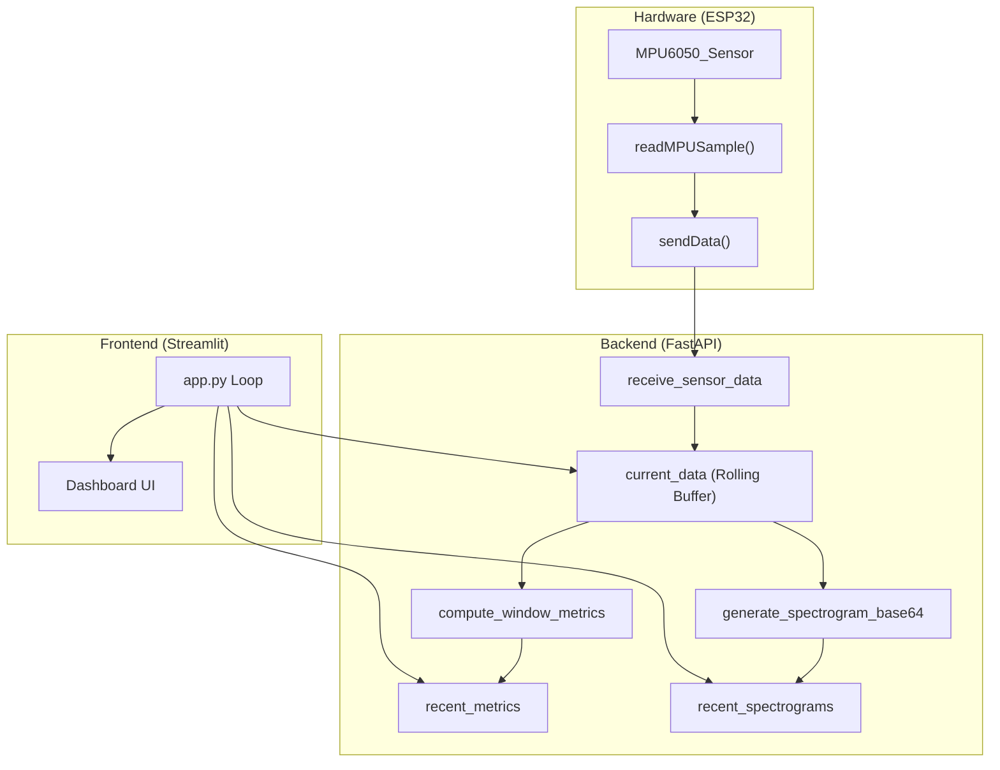
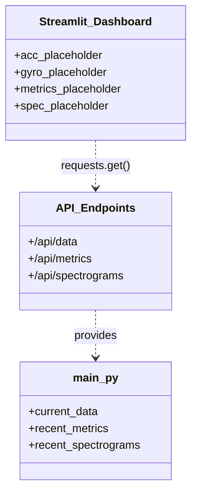

# Backend and Frontend

> **Relevant source files**
> * [esp32-sensor-stream/backend/main.py](https://github.com/yashwantherukulla/IoT-Data-Aug/blob/3c2a9426/esp32-sensor-stream/backend/main.py)
> * [esp32-sensor-stream/backend/spectrogram_utils.py](https://github.com/yashwantherukulla/IoT-Data-Aug/blob/3c2a9426/esp32-sensor-stream/backend/spectrogram_utils.py)
> * [esp32-sensor-stream/esp32_strem/esp32_strem.ino](https://github.com/yashwantherukulla/IoT-Data-Aug/blob/3c2a9426/esp32-sensor-stream/esp32_strem/esp32_strem.ino)
> * [esp32-sensor-stream/frontend/app.py](https://github.com/yashwantherukulla/IoT-Data-Aug/blob/3c2a9426/esp32-sensor-stream/frontend/app.py)

The real-time streaming component of the CGDAP project provides a live bridge between physical IoT sensors and the data representation used by the generative model. This sub-project consists of a **FastAPI** backend that processes high-frequency sensor streams into the spectrogram and metric formats defined in the core project, and a **Streamlit** frontend for real-time visualization.

## Backend Architecture (FastAPI)

The backend [esp32-sensor-stream/backend/main.py L7](https://github.com/yashwantherukulla/IoT-Data-Aug/blob/3c2a9426/esp32-sensor-stream/backend/main.py#L7-L7)

 serves as the central hub for data ingestion and processing. It maintains an in-memory rolling buffer of raw sensor samples and triggers feature extraction (spectrograms and metrics) whenever a complete window of data is accumulated.

### Data Ingestion and Rolling Buffer

The backend receives data via the `POST /api/sensor` endpoint [esp32-sensor-stream/backend/main.py L38-L39](https://github.com/yashwantherukulla/IoT-Data-Aug/blob/3c2a9426/esp32-sensor-stream/backend/main.py#L38-L39)

* **Data Model**: Incoming data is validated using the `SensorBatch` Pydantic model [esp32-sensor-stream/backend/main.py L10-L13](https://github.com/yashwantherukulla/IoT-Data-Aug/blob/3c2a9426/esp32-sensor-stream/backend/main.py#L10-L13)  which expects `device_id`, `acc` (accelerometer), and `gyro` (gyroscope) arrays.
* **Buffer Management**: Samples are stored in `current_data` [esp32-sensor-stream/backend/main.py L17-L20](https://github.com/yashwantherukulla/IoT-Data-Aug/blob/3c2a9426/esp32-sensor-stream/backend/main.py#L17-L20)  a rolling buffer capped at `MAX_SAMPLES = 1000` [esp32-sensor-stream/backend/main.py L16](https://github.com/yashwantherukulla/IoT-Data-Aug/blob/3c2a9426/esp32-sensor-stream/backend/main.py#L16-L16)  As new batches arrive, older samples are evicted [esp32-sensor-stream/backend/main.py L91-L92](https://github.com/yashwantherukulla/IoT-Data-Aug/blob/3c2a9426/esp32-sensor-stream/backend/main.py#L91-L92)
* **Windowing**: The backend tracks `samples_received` [esp32-sensor-stream/backend/main.py L35](https://github.com/yashwantherukulla/IoT-Data-Aug/blob/3c2a9426/esp32-sensor-stream/backend/main.py#L35-L35)  Once the count reaches `WINDOW_SIZE` (derived from the shared CGDAP configuration [esp32-sensor-stream/backend/main.py L36](https://github.com/yashwantherukulla/IoT-Data-Aug/blob/3c2a9426/esp32-sensor-stream/backend/main.py#L36-L36) ), a processing cycle is triggered [esp32-sensor-stream/backend/main.py L59-L60](https://github.com/yashwantherukulla/IoT-Data-Aug/blob/3c2a9426/esp32-sensor-stream/backend/main.py#L59-L60)

### Spectrogram and Metric Generation

When a window is full, the backend invokes utilities to transform raw XYZ data:

1. **Spectrograms**: The `generate_spectrogram_base64` function [esp32-sensor-stream/backend/spectrogram_utils.py L187](https://github.com/yashwantherukulla/IoT-Data-Aug/blob/3c2a9426/esp32-sensor-stream/backend/spectrogram_utils.py#L187-L187)  creates a visualization. It uses `compute_spectrogram` [esp32-sensor-stream/backend/spectrogram_utils.py L128](https://github.com/yashwantherukulla/IoT-Data-Aug/blob/3c2a9426/esp32-sensor-stream/backend/spectrogram_utils.py#L128-L128)  which implements a pure-NumPy STFT mirroring the PyTorch implementation used in training.
2. **Metrics**: The `compute_window_metrics` function [esp32-sensor-stream/backend/spectrogram_utils.py L75](https://github.com/yashwantherukulla/IoT-Data-Aug/blob/3c2a9426/esp32-sensor-stream/backend/spectrogram_utils.py#L75-L75)  calculates the five HAR metrics: `temporal_range`, `f0_amplitude`, `contrast`, `flatness`, and `entropy` [esp32-sensor-stream/backend/spectrogram_utils.py L12](https://github.com/yashwantherukulla/IoT-Data-Aug/blob/3c2a9426/esp32-sensor-stream/backend/spectrogram_utils.py#L12-L12)
3. **Storage**: The three most recent spectrograms are stored in `recent_spectrograms` [esp32-sensor-stream/backend/main.py L23-L26](https://github.com/yashwantherukulla/IoT-Data-Aug/blob/3c2a9426/esp32-sensor-stream/backend/main.py#L23-L26)  and the latest metrics are kept in `recent_metrics` [esp32-sensor-stream/backend/main.py L29-L32](https://github.com/yashwantherukulla/IoT-Data-Aug/blob/3c2a9426/esp32-sensor-stream/backend/main.py#L29-L32)

### API Endpoints

| Endpoint | Method | Description |
| --- | --- | --- |
| `/api/sensor` | `POST` | Receives `SensorBatch` from ESP32. Triggers processing. |
| `/api/data` | `GET` | Returns the raw rolling buffer for time-series plotting. |
| `/api/spectrograms` | `GET` | Returns the 3 most recent base64-encoded spectrogram images. |
| `/api/metrics` | `GET` | Returns the computed metrics for the latest window. |

**Sources:** [esp32-sensor-stream/backend/main.py L1-L106](https://github.com/yashwantherukulla/IoT-Data-Aug/blob/3c2a9426/esp32-sensor-stream/backend/main.py#L1-L106)

 [esp32-sensor-stream/backend/spectrogram_utils.py L1-L137](https://github.com/yashwantherukulla/IoT-Data-Aug/blob/3c2a9426/esp32-sensor-stream/backend/spectrogram_utils.py#L1-L137)

## Data Flow: Sensor to Dashboard

The following diagram illustrates the flow of data from the hardware level through the processing backend to the user interface.

### System Data Flow

**Sources:** [esp32-sensor-stream/esp32_strem/esp32_strem.ino L45-L55](https://github.com/yashwantherukulla/IoT-Data-Aug/blob/3c2a9426/esp32-sensor-stream/esp32_strem/esp32_strem.ino#L45-L55)

 [esp32-sensor-stream/backend/main.py L38-L94](https://github.com/yashwantherukulla/IoT-Data-Aug/blob/3c2a9426/esp32-sensor-stream/backend/main.py#L38-L94)

 [esp32-sensor-stream/frontend/app.py L38-L139](https://github.com/yashwantherukulla/IoT-Data-Aug/blob/3c2a9426/esp32-sensor-stream/frontend/app.py#L38-L139)

## Shared Configuration and Utilities

The backend ensures parity with the training pipeline by loading the global project configuration via `load_config()` [esp32-sensor-stream/backend/spectrogram_utils.py L118](https://github.com/yashwantherukulla/IoT-Data-Aug/blob/3c2a9426/esp32-sensor-stream/backend/spectrogram_utils.py#L118-L118)

 which uses Hydra to resolve `configs/config.yaml` [esp32-sensor-stream/backend/spectrogram_utils.py L120-L126](https://github.com/yashwantherukulla/IoT-Data-Aug/blob/3c2a9426/esp32-sensor-stream/backend/spectrogram_utils.py#L120-L126)

### Pure-NumPy Metric Implementations

To avoid heavy PyTorch dependencies on the lightweight streaming backend, `spectrogram_utils.py` provides NumPy-based mirrors of the core metric extraction logic:

* **`_metric_f0_amplitude`**: Implements the Harmonic Product Spectrum (HPS) using linear interpolation [esp32-sensor-stream/backend/spectrogram_utils.py L24-L49](https://github.com/yashwantherukulla/IoT-Data-Aug/blob/3c2a9426/esp32-sensor-stream/backend/spectrogram_utils.py#L24-L49)
* **`_metric_contrast`**: Calculates the difference between top and bottom percentiles of the spectrogram magnitude [esp32-sensor-stream/backend/spectrogram_utils.py L52-L57](https://github.com/yashwantherukulla/IoT-Data-Aug/blob/3c2a9426/esp32-sensor-stream/backend/spectrogram_utils.py#L52-L57)
* **`_metric_flatness`**: Computes the ratio of geometric mean to arithmetic mean [esp32-sensor-stream/backend/spectrogram_utils.py L60-L65](https://github.com/yashwantherukulla/IoT-Data-Aug/blob/3c2a9426/esp32-sensor-stream/backend/spectrogram_utils.py#L60-L65)

**Sources:** [esp32-sensor-stream/backend/spectrogram_utils.py L18-L73](https://github.com/yashwantherukulla/IoT-Data-Aug/blob/3c2a9426/esp32-sensor-stream/backend/spectrogram_utils.py#L18-L73)

 [esp32-sensor-stream/backend/spectrogram_utils.py L118-L126](https://github.com/yashwantherukulla/IoT-Data-Aug/blob/3c2a9426/esp32-sensor-stream/backend/spectrogram_utils.py#L118-L126)

## Frontend Dashboard (Streamlit)

The frontend [esp32-sensor-stream/frontend/app.py L1-L7](https://github.com/yashwantherukulla/IoT-Data-Aug/blob/3c2a9426/esp32-sensor-stream/frontend/app.py#L1-L7)

 provides a real-time monitoring interface. It operates on a 0.5-second refresh loop [esp32-sensor-stream/frontend/app.py L139](https://github.com/yashwantherukulla/IoT-Data-Aug/blob/3c2a9426/esp32-sensor-stream/frontend/app.py#L139-L139)

 polling the backend endpoints.

### Visualization Components

1. **Time-Series Charts**: Displays raw accelerometer (g) and gyroscope (°/s) data using `st.line_chart` [esp32-sensor-stream/frontend/app.py L58-L59](https://github.com/yashwantherukulla/IoT-Data-Aug/blob/3c2a9426/esp32-sensor-stream/frontend/app.py#L58-L59)  The display window size is configurable via a sidebar slider [esp32-sensor-stream/frontend/app.py L11](https://github.com/yashwantherukulla/IoT-Data-Aug/blob/3c2a9426/esp32-sensor-stream/frontend/app.py#L11-L11)
2. **Metric Tiles**: Uses `st.metric` to display the five HAR metrics for both accelerometer and gyroscope modalities [esp32-sensor-stream/frontend/app.py L86-L90](https://github.com/yashwantherukulla/IoT-Data-Aug/blob/3c2a9426/esp32-sensor-stream/frontend/app.py#L86-L90)  Tooltips are provided via `METRIC_META` [esp32-sensor-stream/frontend/app.py L14-L20](https://github.com/yashwantherukulla/IoT-Data-Aug/blob/3c2a9426/esp32-sensor-stream/frontend/app.py#L14-L20)
3. **Spectrogram Gallery**: Renders the base64-encoded images returned by the backend [esp32-sensor-stream/frontend/app.py L115-L118](https://github.com/yashwantherukulla/IoT-Data-Aug/blob/3c2a9426/esp32-sensor-stream/frontend/app.py#L115-L118)  It displays the three most recent windows to allow the user to observe temporal transitions in signal patterns [esp32-sensor-stream/frontend/app.py L105](https://github.com/yashwantherukulla/IoT-Data-Aug/blob/3c2a9426/esp32-sensor-stream/frontend/app.py#L105-L105)

### Code-to-UI Mapping

**Sources:** [esp32-sensor-stream/frontend/app.py L22-L35](https://github.com/yashwantherukulla/IoT-Data-Aug/blob/3c2a9426/esp32-sensor-stream/frontend/app.py#L22-L35)

 [esp32-sensor-stream/backend/main.py L96-L106](https://github.com/yashwantherukulla/IoT-Data-Aug/blob/3c2a9426/esp32-sensor-stream/backend/main.py#L96-L106)