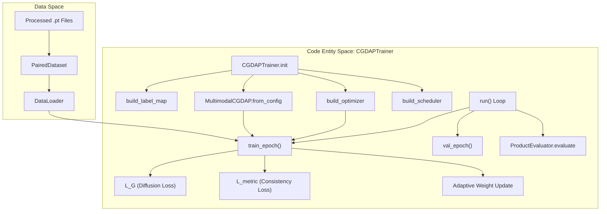
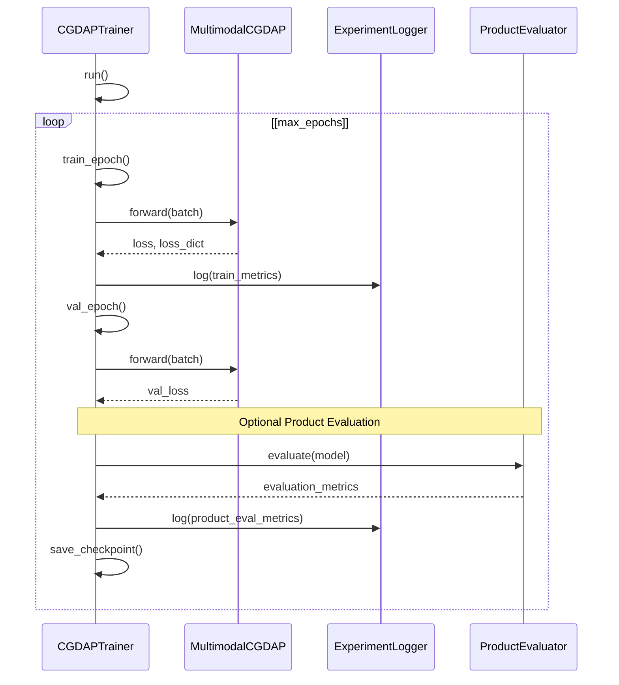

# CGDAPTrainer

> **Relevant source files**
> * [cgdap/training/trainer.py](https://github.com/yashwantherukulla/IoT-Data-Aug/blob/3c2a9426/cgdap/training/trainer.py)
> * [tests/test_trainer.py](https://github.com/yashwantherukulla/IoT-Data-Aug/blob/3c2a9426/tests/test_trainer.py)

The `CGDAPTrainer` is the central orchestration class for the IoT-Data-Augmentation framework. It manages the lifecycle of the training process, including data loading, model initialization, the diffusion training loop, adaptive loss weighting, and experiment tracking via Weights & Biases (W&B) or console logging.

## System Architecture and Data Flow

The following diagram illustrates how the `CGDAPTrainer` bridges high-level training configurations with low-level PyTorch entities and data structures.

### Training Lifecycle Overview

"CGDAPTrainer" orchestrates the flow from processed `.pt` files to a trained `MultimodalCGDAP` model.

**Sources:** [cgdap/training/trainer.py L167-L176](https://github.com/yashwantherukulla/IoT-Data-Aug/blob/3c2a9426/cgdap/training/trainer.py#L167-L176)

 [cgdap/training/trainer.py L255-L300](https://github.com/yashwantherukulla/IoT-Data-Aug/blob/3c2a9426/cgdap/training/trainer.py#L255-L300)

 [cgdap/training/trainer.py L348-L380](https://github.com/yashwantherukulla/IoT-Data-Aug/blob/3c2a9426/cgdap/training/trainer.py#L348-L380)

---

## Initialization and Setup

The trainer is initialized with a Hydra `DictConfig` object [cgdap/training/trainer.py L177](https://github.com/yashwantherukulla/IoT-Data-Aug/blob/3c2a9426/cgdap/training/trainer.py#L177-L177)

 During initialization, it performs several critical setup steps:

1. **Label Mapping**: It scans the processed training directory using `build_label_map` to create a consistent mapping between activity names and integer IDs [cgdap/training/trainer.py L195-L196](https://github.com/yashwantherukulla/IoT-Data-Aug/blob/3c2a9426/cgdap/training/trainer.py#L195-L196)
2. **Data Loading**: It constructs paired `DataLoader` objects for both training and validation using `make_paired_loader`. This ensures that multimodal samples (e.g., accelerometer and gyroscope) are synchronized across batches [cgdap/training/trainer.py L200-L215](https://github.com/yashwantherukulla/IoT-Data-Aug/blob/3c2a9426/cgdap/training/trainer.py#L200-L215)
3. **Model Factory**: The `MultimodalCGDAP` model is instantiated via its `from_config` method, which sets up the denoisers, noise schedules, and metric extractors [cgdap/training/trainer.py L218-L223](https://github.com/yashwantherukulla/IoT-Data-Aug/blob/3c2a9426/cgdap/training/trainer.py#L218-L223)
4. **Logging**: An `ExperimentLogger` is initialized to handle integration with W&B, including metric definitions for steps and epochs [cgdap/training/trainer.py L48-L92](https://github.com/yashwantherukulla/IoT-Data-Aug/blob/3c2a9426/cgdap/training/trainer.py#L48-L92)

**Sources:** [cgdap/training/trainer.py L177-L223](https://github.com/yashwantherukulla/IoT-Data-Aug/blob/3c2a9426/cgdap/training/trainer.py#L177-L223)

 [cgdap/training/trainer.py L48-L92](https://github.com/yashwantherukulla/IoT-Data-Aug/blob/3c2a9426/cgdap/training/trainer.py#L48-L92)

---

## The Epoch Loop (run)

The `run()` method contains the primary training loop. It iterates through epochs, calling training and validation logic, managing the learning rate scheduler, and triggering periodic checkpoints.

### Deterministic Validation

A key feature of the validation phase is the use of deterministic noise seeding. Before the `val_epoch` begins, the trainer sets a fixed seed to ensure that the noise added during the diffusion process is consistent across different validation runs, allowing for reliable performance tracking [cgdap/training/trainer.py L277-L280](https://github.com/yashwantherukulla/IoT-Data-Aug/blob/3c2a9426/cgdap/training/trainer.py#L277-L280)

### Training Execution Flow

**Sources:** [cgdap/training/trainer.py L255-L300](https://github.com/yashwantherukulla/IoT-Data-Aug/blob/3c2a9426/cgdap/training/trainer.py#L255-L300)

 [cgdap/training/trainer.py L348-L380](https://github.com/yashwantherukulla/IoT-Data-Aug/blob/3c2a9426/cgdap/training/trainer.py#L348-L380)

---

## Training and Gradient Management

Inside `train_epoch`, the trainer processes batches through the `MultimodalCGDAP` model.

* **Adaptive Metric Weighting**: The trainer tracks the `L_metric` (metric-consistency loss) and `L_G` (diffusion loss). If adaptive weighting is enabled, it updates the importance of the metric loss based on the `target_ratio` defined in the config [cgdap/training/trainer.py L372-L378](https://github.com/yashwantherukulla/IoT-Data-Aug/blob/3c2a9426/cgdap/training/trainer.py#L372-L378)
* **Gradient Clipping**: To prevent exploding gradients, the trainer computes the L2 norm of the gradients using `compute_grad_norm` before applying `torch.nn.utils.clip_grad_norm_` [cgdap/training/trainer.py L155-L164](https://github.com/yashwantherukulla/IoT-Data-Aug/blob/3c2a9426/cgdap/training/trainer.py#L155-L164)  [cgdap/training/trainer.py L382-L387](https://github.com/yashwantherukulla/IoT-Data-Aug/blob/3c2a9426/cgdap/training/trainer.py#L382-L387)
* **Loss Logging**: Metrics are logged both at the step level (for W&B charts) and aggregated at the epoch level [cgdap/training/trainer.py L392-L404](https://github.com/yashwantherukulla/IoT-Data-Aug/blob/3c2a9426/cgdap/training/trainer.py#L392-L404)

**Sources:** [cgdap/training/trainer.py L155-L164](https://github.com/yashwantherukulla/IoT-Data-Aug/blob/3c2a9426/cgdap/training/trainer.py#L155-L164)

 [cgdap/training/trainer.py L348-L408](https://github.com/yashwantherukulla/IoT-Data-Aug/blob/3c2a9426/cgdap/training/trainer.py#L348-L408)

---

## Checkpointing and RNG State Restoration

The trainer implements a robust checkpointing system that allows for full experiment resumption.

### State Dictionary Composition

When saving a checkpoint, the trainer includes:

* **Model State**: Weights of all denoisers and embedders [cgdap/training/trainer.py L465](https://github.com/yashwantherukulla/IoT-Data-Aug/blob/3c2a9426/cgdap/training/trainer.py#L465-L465)
* **Optimizer/Scheduler State**: Current momentum, learning rates, and step counts [cgdap/training/trainer.py L466-L467](https://github.com/yashwantherukulla/IoT-Data-Aug/blob/3c2a9426/cgdap/training/trainer.py#L466-L467)
* **Trainer State**: Current epoch, global step, and adaptive metric weights [cgdap/training/trainer.py L463-L470](https://github.com/yashwantherukulla/IoT-Data-Aug/blob/3c2a9426/cgdap/training/trainer.py#L463-L470)
* **RNG States**: The states for `torch`, `numpy`, and Python's `random` module [cgdap/training/trainer.py L471-L476](https://github.com/yashwantherukulla/IoT-Data-Aug/blob/3c2a9426/cgdap/training/trainer.py#L471-L476)

### Full RNG Restoration

Upon resuming, if `restore_rng_state` is enabled, the trainer restores all random number generator states. This ensures that the data shuffling in the `DataLoader` and the noise generation in the diffusion process continue exactly where they left off [cgdap/training/trainer.py L516-L521](https://github.com/yashwantherukulla/IoT-Data-Aug/blob/3c2a9426/cgdap/training/trainer.py#L516-L521)

| Component | State Saved | Purpose |
| --- | --- | --- |
| **Model** | `model.state_dict()` | Resumes neural network weights |
| **Optimizer** | `optimizer.state_dict()` | Resumes AdamW moments/velocity |
| **Scheduler** | `scheduler.state_dict()` | Resumes Cosine Annealing position |
| **RNG** | `torch.get_rng_state()` etc. | Ensures reproducible data/noise streams |
| **EMA Weights** | `model.metric_weights` | Resumes adaptive loss balancing |

**Sources:** [cgdap/training/trainer.py L455-L485](https://github.com/yashwantherukulla/IoT-Data-Aug/blob/3c2a9426/cgdap/training/trainer.py#L455-L485)

 [cgdap/training/trainer.py L487-L530](https://github.com/yashwantherukulla/IoT-Data-Aug/blob/3c2a9426/cgdap/training/trainer.py#L487-L530)