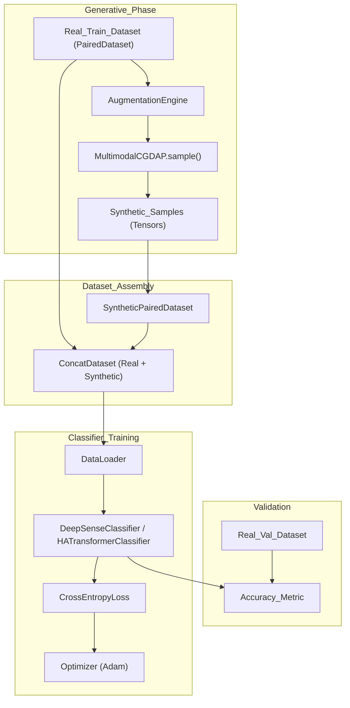
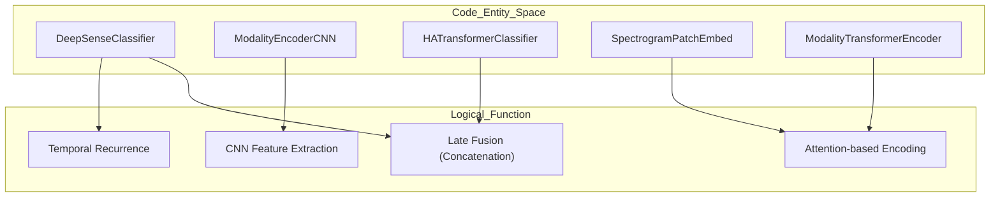

# Classifier Evaluation (DeepSense & Transformer)

> **Relevant source files**
> * [cgdap/evaluation/deepsense.py](https://github.com/yashwantherukulla/IoT-Data-Aug/blob/3c2a9426/cgdap/evaluation/deepsense.py)
> * [cgdap/evaluation/transformer.py](https://github.com/yashwantherukulla/IoT-Data-Aug/blob/3c2a9426/cgdap/evaluation/transformer.py)
> * [configs/evaluation/default.yaml](https://github.com/yashwantherukulla/IoT-Data-Aug/blob/3c2a9426/configs/evaluation/default.yaml)
> * [scripts/evaluate.py](https://github.com/yashwantherukulla/IoT-Data-Aug/blob/3c2a9426/scripts/evaluate.py)
> * [scripts/run_eval_report.py](https://github.com/yashwantherukulla/IoT-Data-Aug/blob/3c2a9426/scripts/run_eval_report.py)

The classifier evaluation pipeline serves as the primary downstream validation for the CGDAP generative model. It assesses the utility of synthetic data by training two standard Human Activity Recognition (HAR) architectures—**DeepSense** and **HATransformerClassifier**—on varying mixtures of real and generated data. This "Data Augmentation" evaluation determines if synthetic samples improve classification accuracy or can effectively substitute for real data in low-resource scenarios.

## Evaluation Pipeline Overview

The evaluation logic is encapsulated in `scripts/evaluate.py`, which manages the lifecycle of training multiple classifiers and comparing their performance.

### Core Workflow

1. **Model Loading**: Resolves the best available `MultimodalCGDAP` checkpoint from the training directory [scripts/evaluate.py L138-L158](https://github.com/yashwantherukulla/IoT-Data-Aug/blob/3c2a9426/scripts/evaluate.py#L138-L158)
2. **Synthetic Data Generation**: Uses the `AugmentationEngine` to generate new samples based on the configured mode (e.g., interpolation) [scripts/evaluate.py L202-L234](https://github.com/yashwantherukulla/IoT-Data-Aug/blob/3c2a9426/scripts/evaluate.py#L202-L234)
3. **Dataset Construction**: Creates a `SyntheticPairedDataset` from generated tensors and optionally combines it with the real training set using `ConcatDataset` [scripts/evaluate.py L32-L52](https://github.com/yashwantherukulla/IoT-Data-Aug/blob/3c2a9426/scripts/evaluate.py#L32-L52)
4. **Classifier Training**: Trains the selected architectures (DeepSense or Transformer) using early stopping based on validation accuracy [scripts/evaluate.py L74-L135](https://github.com/yashwantherukulla/IoT-Data-Aug/blob/3c2a9426/scripts/evaluate.py#L74-L135)
5. **Comparison**: Logs the final accuracy of "Real Only" vs "Real + Synthetic" configurations.

### Data Flow for Classifier Training

The following diagram illustrates how data flows from the generative model into the downstream classifiers.

**Classifier Training Data Flow**

Sources: [scripts/evaluate.py L32-L52](https://github.com/yashwantherukulla/IoT-Data-Aug/blob/3c2a9426/scripts/evaluate.py#L32-L52)

 [scripts/evaluate.py L202-L234](https://github.com/yashwantherukulla/IoT-Data-Aug/blob/3c2a9426/scripts/evaluate.py#L202-L234)

 [scripts/evaluate.py L74-L135](https://github.com/yashwantherukulla/IoT-Data-Aug/blob/3c2a9426/scripts/evaluate.py#L74-L135)

## Classifier Architectures

The system supports two distinct architectures for multimodal HAR classification, both implementing a "late fusion" strategy where modality-specific features are concatenated before a final classification head.

### 1. DeepSense Classifier

Inspired by the 2017 DeepSense framework, this model uses a combination of CNNs and RNNs to capture spatial-temporal dependencies in spectrograms.

* **Modality Encoder (`ModalityEncoderCNN`)**: Applies `Conv2d` layers over the time dimension (per frequency channel) followed by `AdaptiveAvgPool2d` to collapse the frequency dimension [cgdap/evaluation/deepsense.py L22-L52](https://github.com/yashwantherukulla/IoT-Data-Aug/blob/3c2a9426/cgdap/evaluation/deepsense.py#L22-L52)
* **Temporal Processing**: Each modality has its own `nn.GRU` to process the sequence of CNN features [cgdap/evaluation/deepsense.py L80-L90](https://github.com/yashwantherukulla/IoT-Data-Aug/blob/3c2a9426/cgdap/evaluation/deepsense.py#L80-L90)
* **Fusion**: The final hidden states of the GRUs for all modalities are concatenated and passed through a multi-layer perceptron (MLP) [cgdap/evaluation/deepsense.py L92-L99](https://github.com/yashwantherukulla/IoT-Data-Aug/blob/3c2a9426/cgdap/evaluation/deepsense.py#L92-L99)

### 2. HATransformerClassifier

A modern Transformer-based approach that treats spectrogram time-frames as sequence tokens.

* **Patch Embedding (`SpectrogramPatchEmbed`)**: Flattens the frequency and channel dimensions for each time step into a linear projection [cgdap/evaluation/transformer.py L22-L34](https://github.com/yashwantherukulla/IoT-Data-Aug/blob/3c2a9426/cgdap/evaluation/transformer.py#L22-L34)
* **Encoder (`ModalityTransformerEncoder`)**: Prepends a learnable `CLS` token to the sequence and applies `nn.TransformerEncoder` with sinusoidal positional encodings [cgdap/evaluation/transformer.py L53-L90](https://github.com/yashwantherukulla/IoT-Data-Aug/blob/3c2a9426/cgdap/evaluation/transformer.py#L53-L90)
* **Fusion**: Concatenates the `CLS` token outputs from each modality encoder into a final classification head [cgdap/evaluation/transformer.py L135-L142](https://github.com/yashwantherukulla/IoT-Data-Aug/blob/3c2a9426/cgdap/evaluation/transformer.py#L135-L142)

### System Entity Mapping

The following diagram maps the logical components of the classifiers to their specific code entities.

**Architecture Component Mapping**

Sources: [cgdap/evaluation/deepsense.py L54-L135](https://github.com/yashwantherukulla/IoT-Data-Aug/blob/3c2a9426/cgdap/evaluation/deepsense.py#L54-L135)

 [cgdap/evaluation/transformer.py L92-L171](https://github.com/yashwantherukulla/IoT-Data-Aug/blob/3c2a9426/cgdap/evaluation/transformer.py#L92-L171)

## Implementation Details

### SyntheticPairedDataset

This class is a lightweight, in-memory implementation of `torch.utils.data.Dataset` designed to hold generated samples produced by the `MultimodalCGDAP` model. Unlike the `PairedDataset` used for real data, it does not perform disk I/O, as samples are held in memory after generation.

| Method | Description |
| --- | --- |
| `__init__` | Accepts a list of dictionaries containing labels and modality spectrogram/metric tensors [scripts/evaluate.py L35-L36](https://github.com/yashwantherukulla/IoT-Data-Aug/blob/3c2a9426/scripts/evaluate.py#L35-L36) |
| `__getitem__` | Returns a dictionary structure identical to `PairedDataset` to ensure compatibility with existing data loaders [scripts/evaluate.py L41-L52](https://github.com/yashwantherukulla/IoT-Data-Aug/blob/3c2a9426/scripts/evaluate.py#L41-L52) |

### Evaluation Configuration

The evaluation parameters are defined in `configs/evaluation/default.yaml`.

| Parameter | Default | Description |
| --- | --- | --- |
| `n_epochs` | 20 | Maximum training epochs for the classifiers [configs/evaluation/default.yaml L11](https://github.com/yashwantherukulla/IoT-Data-Aug/blob/3c2a9426/configs/evaluation/default.yaml#L11-L11) |
| `patience` | 5 | Early stopping patience [configs/evaluation/default.yaml L12](https://github.com/yashwantherukulla/IoT-Data-Aug/blob/3c2a9426/configs/evaluation/default.yaml#L12-L12) |
| `augmentation.enabled` | true | Whether to generate synthetic data for training [configs/evaluation/default.yaml L21](https://github.com/yashwantherukulla/IoT-Data-Aug/blob/3c2a9426/configs/evaluation/default.yaml#L21-L21) |
| `samples_per_real` | 1 | Ratio of synthetic samples to real samples [configs/evaluation/default.yaml L22](https://github.com/yashwantherukulla/IoT-Data-Aug/blob/3c2a9426/configs/evaluation/default.yaml#L22-L22) |

### Classifier Training Loop

The `train_classifier` function implements the standard training protocol:

1. **Optimizer**: Uses Adam with a learning rate typically set to `1e-4` [scripts/evaluate.py L81-L89](https://github.com/yashwantherukulla/IoT-Data-Aug/blob/3c2a9426/scripts/evaluate.py#L81-L89)
2. **Loss**: `nn.CrossEntropyLoss` for activity classification [scripts/evaluate.py L90](https://github.com/yashwantherukulla/IoT-Data-Aug/blob/3c2a9426/scripts/evaluate.py#L90-L90)
3. **Early Stopping**: Monitors validation accuracy and restores the `best_state` if performance plateaus for `patience` epochs [scripts/evaluate.py L123-L135](https://github.com/yashwantherukulla/IoT-Data-Aug/blob/3c2a9426/scripts/evaluate.py#L123-L135)

Sources: [scripts/evaluate.py L74-L135](https://github.com/yashwantherukulla/IoT-Data-Aug/blob/3c2a9426/scripts/evaluate.py#L74-L135)

 [configs/evaluation/default.yaml L1-L52](https://github.com/yashwantherukulla/IoT-Data-Aug/blob/3c2a9426/configs/evaluation/default.yaml#L1-L52)