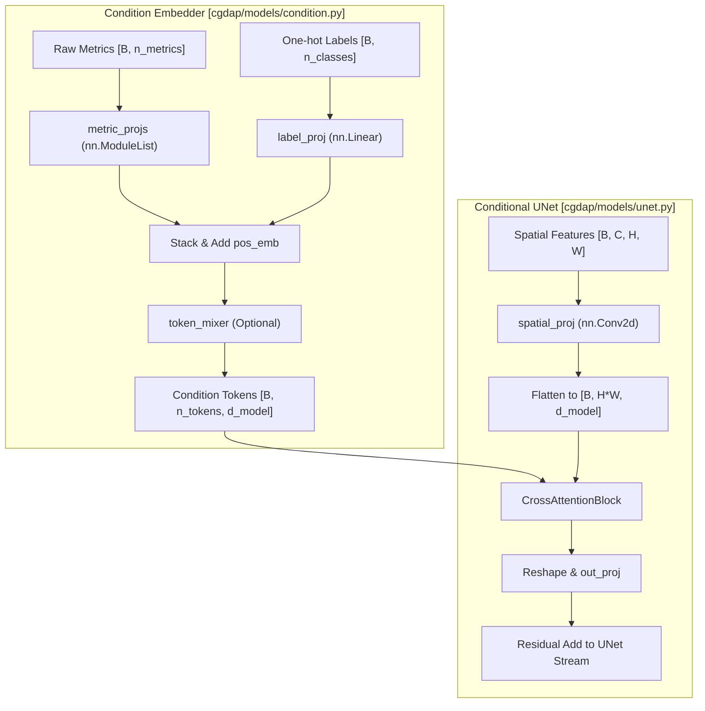
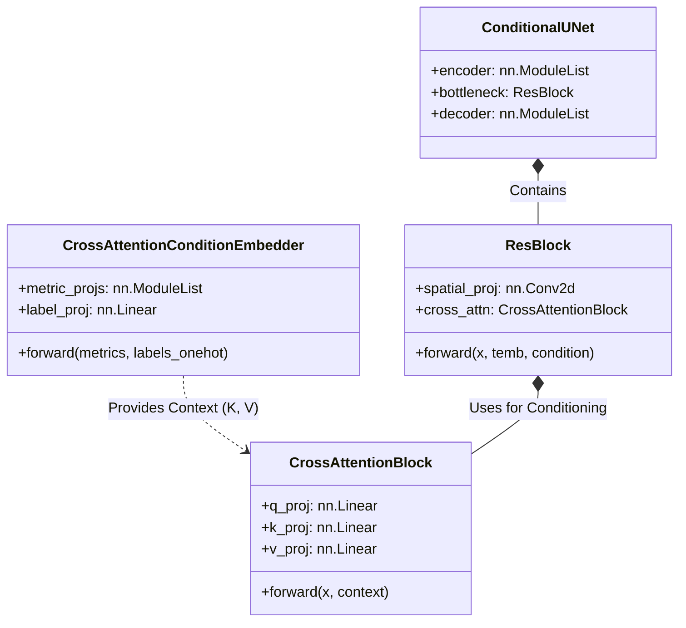

# Condition Embedder and Cross-Attention

> **Relevant source files**
> * [cgdap/models/condition.py](https://github.com/yashwantherukulla/IoT-Data-Aug/blob/3c2a9426/cgdap/models/condition.py)
> * [cgdap/models/unet.py](https://github.com/yashwantherukulla/IoT-Data-Aug/blob/3c2a9426/cgdap/models/unet.py)

The `CrossAttentionConditionEmbedder` is responsible for transforming raw conditioning signals—specifically scalar activity metrics and one-hot activity labels—into a sequence of latent tokens. These tokens are then injected into the `ConditionalUNet` denoiser via cross-attention mechanisms, allowing the model to dynamically attend to specific metrics at different spatial locations within the spectrogram feature maps.

## Overview and Implementation

The conditioning system replaces naive approaches (like scalar replication) with a flexible attention-based architecture. It projects diverse input types into a common embedding space, creating a "context" that the denoiser can query during the reverse diffusion process.

### Key Components

* **Per-Metric Linear Projections**: Each of the $N$ metrics is passed through its own `nn.Linear(1, d_model)` layer to create an individual metric token [cgdap/models/condition.py L124-L126](https://github.com/yashwantherukulla/IoT-Data-Aug/blob/3c2a9426/cgdap/models/condition.py#L124-L126)
* **Label Projection**: The one-hot activity label vector is projected via a single linear layer into the same `d_model` dimensionality [cgdap/models/condition.py L129](https://github.com/yashwantherukulla/IoT-Data-Aug/blob/3c2a9426/cgdap/models/condition.py#L129-L129)
* **Positional Encoding**: A learned parameter `pos_emb` is added to the token sequence to help the model distinguish between different metrics and the label token [cgdap/models/condition.py L133-L178](https://github.com/yashwantherukulla/IoT-Data-Aug/blob/3c2a9426/cgdap/models/condition.py#L133-L178)
* **Cross-Attention Block**: A standard multi-head attention module where the spatial features from the UNet act as Queries (Q), and the condition tokens act as Keys (K) and Values (V) [cgdap/models/condition.py L34-L82](https://github.com/yashwantherukulla/IoT-Data-Aug/blob/3c2a9426/cgdap/models/condition.py#L34-L82)

### Data Flow: Conditioning Injection

The following diagram illustrates the transformation of raw metrics into tokens and their subsequent interaction with the UNet spatial features.

**Conditioning Tokenization and Attention Flow**

Sources: [cgdap/models/condition.py L91-L186](https://github.com/yashwantherukulla/IoT-Data-Aug/blob/3c2a9426/cgdap/models/condition.py#L91-L186)

 [cgdap/models/unet.py L122-L153](https://github.com/yashwantherukulla/IoT-Data-Aug/blob/3c2a9426/cgdap/models/unet.py#L122-L153)

---

## CrossAttentionConditionEmbedder Detail

The `CrossAttentionConditionEmbedder` inherits from `BaseConditionEmbedder` and is registered under the alias `"cross_attention"` [cgdap/models/condition.py L90-L91](https://github.com/yashwantherukulla/IoT-Data-Aug/blob/3c2a9426/cgdap/models/condition.py#L90-L91)

### Forward Pass Logic

1. **Metric Processing**: Iterates through `n_metrics`, projecting each scalar into a `d_model` vector [cgdap/models/condition.py L168-L171](https://github.com/yashwantherukulla/IoT-Data-Aug/blob/3c2a9426/cgdap/models/condition.py#L168-L171)
2. **Label Processing**: Projects the activity label vector [cgdap/models/condition.py L173-L174](https://github.com/yashwantherukulla/IoT-Data-Aug/blob/3c2a9426/cgdap/models/condition.py#L173-L174)
3. **Token Mixing**: If the configured `n_cond_tokens` differs from the raw count (`n_metrics + 1`), a `token_mixer` linear layer re-projects the sequence length [cgdap/models/condition.py L138-L141](https://github.com/yashwantherukulla/IoT-Data-Aug/blob/3c2a9426/cgdap/models/condition.py#L138-L141)
4. **Normalization**: Applies `LayerNorm` and `Dropout` before returning the sequence [cgdap/models/condition.py L179](https://github.com/yashwantherukulla/IoT-Data-Aug/blob/3c2a9426/cgdap/models/condition.py#L179-L179)

| Parameter | Type | Description |
| --- | --- | --- |
| `n_metrics` | `int` | Number of differentiable metrics (e.g., 5) |
| `n_classes` | `int` | Number of activity classes in the dataset |
| `d_model` | `int` | Embedding dimension for tokens and attention |
| `n_heads` | `int` | Number of attention heads in `CrossAttentionBlock` |
| `n_cond_tokens` | `int` | Final length of the token sequence |

Sources: [cgdap/models/condition.py L108-L156](https://github.com/yashwantherukulla/IoT-Data-Aug/blob/3c2a9426/cgdap/models/condition.py#L108-L156)

---

## Integration in ConditionalUNet

The `ConditionalUNet` uses these tokens within its `ResBlock` layers. While every `ResBlock` receives the `condition` tensor, only those initialized with `use_cross_attn=True` perform the attention operation [cgdap/models/unet.py L108-L130](https://github.com/yashwantherukulla/IoT-Data-Aug/blob/3c2a9426/cgdap/models/unet.py#L108-L130)

### The Cross-Attention Mechanism

Inside a `ResBlock.forward()`, the following steps occur if cross-attention is enabled:

1. **Spatial Projection**: The feature map `h` (after standard convolutions) is projected from `out_ch` to `d_model` using a 1x1 convolution [cgdap/models/unet.py L147](https://github.com/yashwantherukulla/IoT-Data-Aug/blob/3c2a9426/cgdap/models/unet.py#L147-L147)
2. **Flattening**: The spatial dimensions $(H, W)$ are flattened into a single sequence of length $L = H \times W$ [cgdap/models/unet.py L148](https://github.com/yashwantherukulla/IoT-Data-Aug/blob/3c2a9426/cgdap/models/unet.py#L148-L148)
3. **Attention**: The `CrossAttentionBlock` computes: $$\text{Attention}(Q, K, V) = \text{softmax}\left(\frac{QK^T}{\sqrt{d}}\right)V$$ where $Q$ comes from the spatial features and $K, V$ come from the condition tokens [cgdap/models/condition.py L12-L73](https://github.com/yashwantherukulla/IoT-Data-Aug/blob/3c2a9426/cgdap/models/condition.py#L12-L73)
4. **Residual Connection**: The output is reshaped back to $[B, C, H, W]$, projected back to the original channel depth, and added to the main feature stream [cgdap/models/unet.py L150-L151](https://github.com/yashwantherukulla/IoT-Data-Aug/blob/3c2a9426/cgdap/models/unet.py#L150-L151)

**Code Entity Mapping: Cross-Attention Logic**

Sources: [cgdap/models/condition.py L34-L91](https://github.com/yashwantherukulla/IoT-Data-Aug/blob/3c2a9426/cgdap/models/condition.py#L34-L91)

 [cgdap/models/unet.py L96-L155](https://github.com/yashwantherukulla/IoT-Data-Aug/blob/3c2a9426/cgdap/models/unet.py#L96-L155)

## Configuration Reference

The embedder is typically configured via Hydra in `configs/model/cgdap.yaml`. Key settings include:

* `model.condition.d_model`: Must match the attention dimension expected by the UNet.
* `model.condition.n_heads`: Number of heads for multi-head attention.
* `model.condition.n_cond_tokens`: Usually set to `n_metrics + 1`.

Sources: [cgdap/models/condition.py L147-L156](https://github.com/yashwantherukulla/IoT-Data-Aug/blob/3c2a9426/cgdap/models/condition.py#L147-L156)