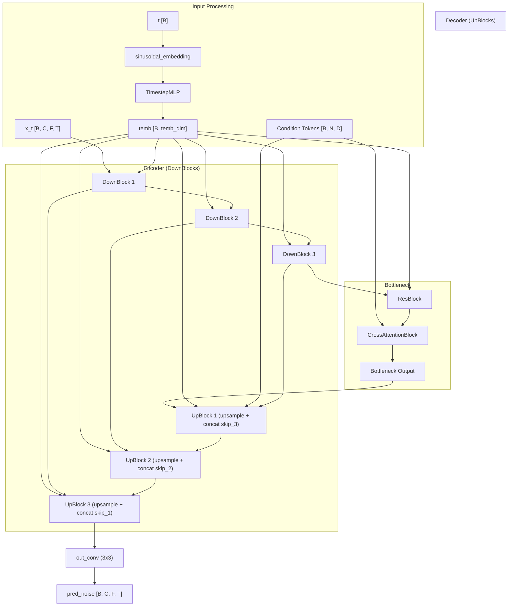
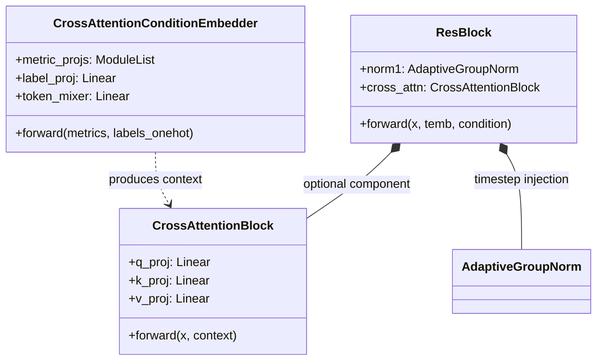

# ConditionalUNet Denoiser

> **Relevant source files**
> * [cgdap/models/condition.py](https://github.com/yashwantherukulla/IoT-Data-Aug/blob/3c2a9426/cgdap/models/condition.py)
> * [cgdap/models/unet.py](https://github.com/yashwantherukulla/IoT-Data-Aug/blob/3c2a9426/cgdap/models/unet.py)
> * [configs/model/cgdap.yaml](https://github.com/yashwantherukulla/IoT-Data-Aug/blob/3c2a9426/configs/model/cgdap.yaml)

The `ConditionalUNet` is the primary denoiser architecture used in the CGDAP framework to predict noise added to spectrograms during the diffusion process. It is designed to handle multi-channel spectrogram data (e.g., 3-axis accelerometer or gyroscope) and incorporates both temporal (diffusion timestep) and semantic (HAR activity and differentiable metrics) conditioning.

## Architecture Overview

The architecture follows a classic U-Net structure with symmetric encoder and decoder paths, linked by skip connections. It specifically adapts the standard U-Net for diffusion by using **Adaptive Group Norm (AdaGN)** for timestep injection and **Cross-Attention** for metric-based conditioning.

### Key Components

* **Sinusoidal Timestep Embedding**: Converts scalar timesteps into high-dimensional vectors.
* **Encoder (DownBlocks)**: Successive residual blocks followed by stride-2 convolutions to reduce spatial resolution.
* **Bottleneck**: The deepest part of the network, containing a residual block and mandatory cross-attention.
* **Decoder (UpBlocks)**: Bilinear upsampling followed by residual blocks that concatenate features from the encoder via skip connections.
* **AdaGN**: Injects temporal information by applying learned scale and shift parameters to feature maps.

### Data Flow Diagram

The following diagram illustrates the flow of a noisy spectrogram `x_t`, the timestep `t`, and the condition tokens through the `ConditionalUNet`.

**ConditionalUNet Data Flow**

Sources: `<FileRef file-url="https://github.com/yashwantherukulla/IoT-Data-Aug/blob/3c2a9426/cgdap/models/unet.py#L1-L15" min=1 max=15 file-path="cgdap/models/unet.py">Hii</FileRef>`, `<FileRef file-url="https://github.com/yashwantherukulla/IoT-Data-Aug/blob/3c2a9426/cgdap/models/unet.py#L228-L268" min=228 max=268 file-path="cgdap/models/unet.py">Hii</FileRef>`

---

## Timestep Injection (AdaGN)

The denoiser must be aware of the current diffusion timestep $t$ to adjust its denoising behavior. This is achieved through **Adaptive Group Norm (AdaGN)**.

1. **Embedding**: The integer $t$ is transformed via `sinusoidal_embedding` [cgdap/models/unet.py L35-L54](https://github.com/yashwantherukulla/IoT-Data-Aug/blob/3c2a9426/cgdap/models/unet.py#L35-L54)  and projected through a 2-layer `TimestepMLP` [cgdap/models/unet.py L56-L69](https://github.com/yashwantherukulla/IoT-Data-Aug/blob/3c2a9426/cgdap/models/unet.py#L56-L69)  to create `temb`.
2. **Injection**: In every `ResBlock`, the `AdaptiveGroupNorm` layer projects `temb` to a vector of size $2 \times Channels$. This vector is split into `scale` and `shift` parameters applied to the normalized feature map.

$$ \text{AdaGN}(x, \text{temb}) = \text{GroupNorm}(x) \cdot (1 + \text{scale}) + \text{shift} $$

Sources: `<FileRef file-url="https://github.com/yashwantherukulla/IoT-Data-Aug/blob/3c2a9426/cgdap/models/unet.py#L76-L89" min=76 max=89 file-path="cgdap/models/unet.py">Hii</FileRef>`, `<FileRef file-url="https://github.com/yashwantherukulla/IoT-Data-Aug/blob/3c2a9426/cgdap/models/unet.py#L113-L116" min=113 max=116 file-path="cgdap/models/unet.py">Hii</FileRef>`

---

## Condition Embedding and Cross-Attention

Semantic conditioning (activity labels and target metrics) is injected via cross-attention. This allows the model to dynamically attend to specific metrics at different spatial locations of the spectrogram.

### CrossAttentionConditionEmbedder

The `CrossAttentionConditionEmbedder` transforms raw condition data into a sequence of tokens:

* **Metrics**: Each of the 5 metrics is independently projected from a scalar to `d_model` [cgdap/models/condition.py L124-L126](https://github.com/yashwantherukulla/IoT-Data-Aug/blob/3c2a9426/cgdap/models/condition.py#L124-L126)
* **Labels**: The one-hot activity label is projected to `d_model` [cgdap/models/condition.py L129](https://github.com/yashwantherukulla/IoT-Data-Aug/blob/3c2a9426/cgdap/models/condition.py#L129-L129)
* **Mixing**: If configured, a `token_mixer` projects the $N_{metrics} + 1$ raw tokens into a fixed number of `n_cond_tokens` [cgdap/models/condition.py L138-L141](https://github.com/yashwantherukulla/IoT-Data-Aug/blob/3c2a9426/cgdap/models/condition.py#L138-L141)

### Cross-Attention Mechanism

Inside `ResBlock`, if `use_cross_attn` is enabled:

1. Spatial features $h \in \mathbb{R}^{B \times C \times F \times T}$ are projected to $Q \in \mathbb{R}^{B \times (F \cdot T) \times d_model}$ [cgdap/models/unet.py L147-L148](https://github.com/yashwantherukulla/IoT-Data-Aug/blob/3c2a9426/cgdap/models/unet.py#L147-L148)
2. Condition tokens serve as $K$ and $V$.
3. The `CrossAttentionBlock` computes the attention map and updates the spatial features [cgdap/models/condition.py L69-L82](https://github.com/yashwantherukulla/IoT-Data-Aug/blob/3c2a9426/cgdap/models/condition.py#L69-L82)

**Conditioning Architecture**

Sources: `<FileRef file-url="https://github.com/yashwantherukulla/IoT-Data-Aug/blob/3c2a9426/cgdap/models/condition.py#L91-L106" min=91 max=106 file-path="cgdap/models/condition.py">Hii</FileRef>`, `<FileRef file-url="https://github.com/yashwantherukulla/IoT-Data-Aug/blob/3c2a9426/cgdap/models/unet.py#L96-L131" min=96 max=131 file-path="cgdap/models/unet.py">Hii</FileRef>`

---

## Configuration

The UNet architecture is highly configurable via `configs/model/cgdap.yaml`. Key parameters include:

| Parameter | Description | Default |
| --- | --- | --- |
| `base_channels` | Initial feature dimension | 96 |
| `channel_multipliers` | Scaling of channels at each downsampling level | [1, 2, 4] |
| `n_res_blocks` | Number of residual blocks per resolution level | 1 |
| `cross_attn_depths` | Indices of blocks where cross-attention is applied | [0, 1] |
| `temb_dim` | Dimension of the timestep embedding | 256 |

The `cross_attn_depths` parameter determines where the semantic conditioning is injected:

* `0`: The Bottleneck block.
* `1`: The deepest `UpBlock` (closest to the bottleneck).

Sources: `<FileRef file-url="https://github.com/yashwantherukulla/IoT-Data-Aug/blob/3c2a9426/configs/model/cgdap.yaml#L33-L40" min=33 max=40 file-path="configs/model/cgdap.yaml">Hii</FileRef>`, `<FileRef file-url="https://github.com/yashwantherukulla/IoT-Data-Aug/blob/3c2a9426/cgdap/models/unet.py#L240-L244" min=240 max=244 file-path="cgdap/models/unet.py">Hii</FileRef>`