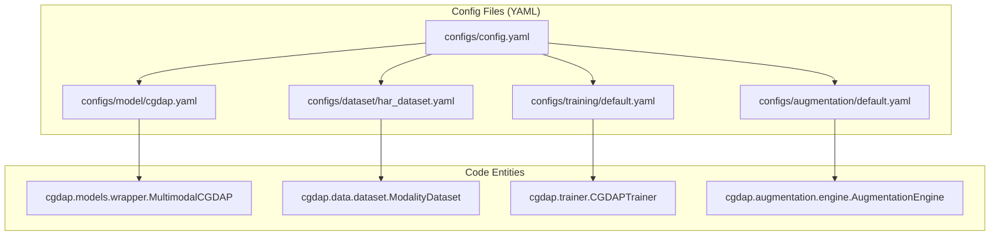
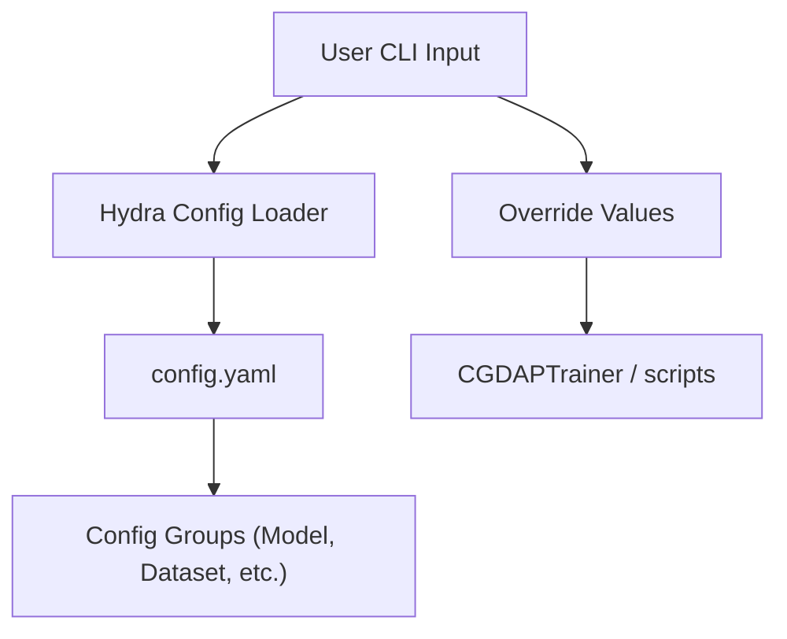

# Configuration Reference

> **Relevant source files**
> * [configs/augmentation/default.yaml](https://github.com/yashwantherukulla/IoT-Data-Aug/blob/3c2a9426/configs/augmentation/default.yaml)
> * [configs/config.yaml](https://github.com/yashwantherukulla/IoT-Data-Aug/blob/3c2a9426/configs/config.yaml)
> * [configs/dataset/har_dataset.yaml](https://github.com/yashwantherukulla/IoT-Data-Aug/blob/3c2a9426/configs/dataset/har_dataset.yaml)
> * [configs/evaluation/default.yaml](https://github.com/yashwantherukulla/IoT-Data-Aug/blob/3c2a9426/configs/evaluation/default.yaml)
> * [configs/logging/console.yaml](https://github.com/yashwantherukulla/IoT-Data-Aug/blob/3c2a9426/configs/logging/console.yaml)
> * [configs/logging/wandb.yaml](https://github.com/yashwantherukulla/IoT-Data-Aug/blob/3c2a9426/configs/logging/wandb.yaml)
> * [configs/model/cgdap.yaml](https://github.com/yashwantherukulla/IoT-Data-Aug/blob/3c2a9426/configs/model/cgdap.yaml)
> * [configs/training/default.yaml](https://github.com/yashwantherukulla/IoT-Data-Aug/blob/3c2a9426/configs/training/default.yaml)
> * [runner.ipynb](https://github.com/yashwantherukulla/IoT-Data-Aug/blob/3c2a9426/runner.ipynb)
> * [scripts/run_eval_report.py](https://github.com/yashwantherukulla/IoT-Data-Aug/blob/3c2a9426/scripts/run_eval_report.py)

The CGDAP system utilizes the **Hydra** configuration framework to manage its complex multimodal diffusion pipeline. This hierarchical system allows for modularity across datasets, model architectures, training regimes, and augmentation strategies. Configurations are stored as YAML files in the `configs/` directory and can be dynamically composed or overridden via the Command Line Interface (CLI).

### Configuration Hierarchy

The system is organized into a root configuration that imports specific "config groups." This structure ensures that changes to the model architecture (e.g., switching from a U-Net to a DiT) do not require modifications to the dataset or logging logic.

#### Hydra Config Mapping

The following diagram maps the configuration files to the logical components they control within the codebase.

**Config to Code Entity Mapping**

**Sources:** [configs/config.yaml L1-L34](https://github.com/yashwantherukulla/IoT-Data-Aug/blob/3c2a9426/configs/config.yaml#L1-L34)

 [configs/model/cgdap.yaml L1-L15](https://github.com/yashwantherukulla/IoT-Data-Aug/blob/3c2a9426/configs/model/cgdap.yaml#L1-L15)

---

### Root and Model Configuration

The root configuration defines the experiment identity and the default composition of all sub-configs. The model configuration specifically manages the selection of the denoiser, noise schedule, and conditioning mechanism.

* **Root (`config.yaml`)**: Sets the global `seed`, `experiment_name`, and default parameters for standalone generation scripts [configs/config.yaml L39-L60](https://github.com/yashwantherukulla/IoT-Data-Aug/blob/3c2a9426/configs/config.yaml#L39-L60)
* **Model (`model/cgdap.yaml`)**: Configures the `MultimodalCGDAP` wrapper. It defines hyperparameters for the `ConditionalUNet` (e.g., `base_channels`, `cross_attn_depths`) and the `DDPMSchedule` (e.g., `beta_start`, `train_timesteps`) [configs/model/cgdap.yaml L10-L50](https://github.com/yashwantherukulla/IoT-Data-Aug/blob/3c2a9426/configs/model/cgdap.yaml#L10-L50)

For details, see [Root and Model Configuration](/yashwantherukulla/IoT-Data-Aug/10.1-root-and-model-configuration).

**Sources:** [configs/config.yaml L1-L61](https://github.com/yashwantherukulla/IoT-Data-Aug/blob/3c2a9426/configs/config.yaml#L1-L61)

 [configs/model/cgdap.yaml L1-L63](https://github.com/yashwantherukulla/IoT-Data-Aug/blob/3c2a9426/configs/model/cgdap.yaml#L1-L63)

---

### Dataset and Augmentation Configuration

These configurations manage how sensor data is processed into spectrograms and how synthetic targets are sampled during the augmentation process.

* **Dataset (`dataset/har_dataset.yaml`)**: Contains paths for raw and processed data, activity label mappings, and STFT parameters (window size, hop length, log-scaling) [configs/dataset/har_dataset.yaml L10-L47](https://github.com/yashwantherukulla/IoT-Data-Aug/blob/3c2a9426/configs/dataset/har_dataset.yaml#L10-L47)  It also defines the differentiable metrics used for conditioning [configs/dataset/har_dataset.yaml L49-L63](https://github.com/yashwantherukulla/IoT-Data-Aug/blob/3c2a9426/configs/dataset/har_dataset.yaml#L49-L63)
* **Augmentation (`augmentation/default.yaml`)**: Controls the `AugmentationEngine`. It supports three modes: `interpolation`, `disturbance`, and `domain_instruction`, each with specific ranges and distribution parameters for generating new metric targets [configs/augmentation/default.yaml L5-L27](https://github.com/yashwantherukulla/IoT-Data-Aug/blob/3c2a9426/configs/augmentation/default.yaml#L5-L27)

For details, see [Dataset and Augmentation Configuration](/yashwantherukulla/IoT-Data-Aug/10.2-dataset-and-augmentation-configuration).

**Sources:** [configs/dataset/har_dataset.yaml L1-L85](https://github.com/yashwantherukulla/IoT-Data-Aug/blob/3c2a9426/configs/dataset/har_dataset.yaml#L1-L85)

 [configs/augmentation/default.yaml L1-L92](https://github.com/yashwantherukulla/IoT-Data-Aug/blob/3c2a9426/configs/augmentation/default.yaml#L1-L92)

---

### Training and Evaluation Configuration

The training configuration handles the optimization loop, while evaluation configs manage both live diagnostics and downstream classifier testing.

* **Training (`training/default.yaml`)**: Configures the `AdamW` optimizer, `CosineAnnealing` scheduler, and the adaptive weight controller for the metric-consistency loss ($L_{metric}$) [configs/training/default.yaml L10-L36](https://github.com/yashwantherukulla/IoT-Data-Aug/blob/3c2a9426/configs/training/default.yaml#L10-L36)
* **Evaluation (`evaluation/default.yaml`)**: Defines parameters for the `ProductEvaluator` (run during training) and the downstream `DeepSense` or `Transformer` classifiers used to validate synthetic data utility [configs/evaluation/default.yaml L5-L51](https://github.com/yashwantherukulla/IoT-Data-Aug/blob/3c2a9426/configs/evaluation/default.yaml#L5-L51)

**Sources:** [configs/training/default.yaml L1-L48](https://github.com/yashwantherukulla/IoT-Data-Aug/blob/3c2a9426/configs/training/default.yaml#L1-L48)

 [configs/evaluation/default.yaml L1-L52](https://github.com/yashwantherukulla/IoT-Data-Aug/blob/3c2a9426/configs/evaluation/default.yaml#L1-L52)

---

### CLI Composition and Overrides

Hydra allows users to override any parameter at runtime without modifying YAML files. This is the primary method for running experiments and smoke tests.

**Common CLI Patterns**

| Goal | Command |
| --- | --- |
| **Smoke Test** | `python scripts/train.py model.unet.base_channels=32 training.max_epochs=2` |
| **Switch Logging** | `python scripts/train.py logging=wandb` |
| **Change Data Path** | `python scripts/train.py dataset.paths.raw=/new/path` |
| **Modify LR** | `python scripts/train.py training.optimizer.lr=5e-5` |

**CLI Override Flow**

**Sources:** [configs/config.yaml L21-L24](https://github.com/yashwantherukulla/IoT-Data-Aug/blob/3c2a9426/configs/config.yaml#L21-L24)

 [runner.ipynb L12](https://github.com/yashwantherukulla/IoT-Data-Aug/blob/3c2a9426/runner.ipynb#L12-L12)