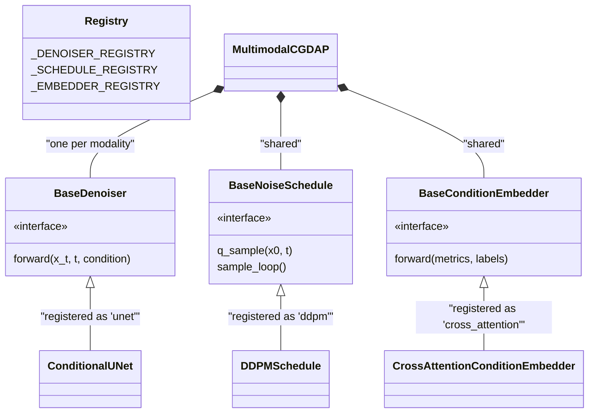

# Core Model Architecture

> **Relevant source files**
> * [cgdap/models/__init__.py](https://github.com/yashwantherukulla/IoT-Data-Aug/blob/3c2a9426/cgdap/models/__init__.py)
> * [cgdap/models/base.py](https://github.com/yashwantherukulla/IoT-Data-Aug/blob/3c2a9426/cgdap/models/base.py)
> * [cgdap/models/cgdap.py](https://github.com/yashwantherukulla/IoT-Data-Aug/blob/3c2a9426/cgdap/models/cgdap.py)
> * [configs/model/cgdap.yaml](https://github.com/yashwantherukulla/IoT-Data-Aug/blob/3c2a9426/configs/model/cgdap.yaml)

The **MultimodalCGDAP** system is a generative diffusion framework designed for high-fidelity Human Activity Recognition (HAR) sensor data synthesis. It utilizes a multimodal approach where independent denoising networks for different sensor streams (e.g., accelerometer and gyroscope) are synchronized via a shared noise schedule and a unified condition embedding space.

## System Overview

The architecture is composed of four primary functional blocks that interact during training and inference. The system is designed to be modular, allowing for different denoiser backends (e.g., U-Net or DiT) or noise schedules (e.g., DDPM or Flow Matching) to be swapped in through a registration system defined in `cgdap/models/base.py`.

### Architectural Component Interaction

The following diagram illustrates how data and noise flow through the system components during a single training step.

**Title: MultimodalCGDAP Data Flow**

```

```

**Sources:** [cgdap/models/cgdap.py L1-L24](https://github.com/yashwantherukulla/IoT-Data-Aug/blob/3c2a9426/cgdap/models/cgdap.py#L1-L24)

 [cgdap/models/base.py L1-L11](https://github.com/yashwantherukulla/IoT-Data-Aug/blob/3c2a9426/cgdap/models/base.py#L1-L11)

---

## 3.1 MultimodalCGDAP Wrapper

The `MultimodalCGDAP` class [cgdap/models/cgdap.py L54](https://github.com/yashwantherukulla/IoT-Data-Aug/blob/3c2a9426/cgdap/models/cgdap.py#L54-L54)

 acts as the top-level `nn.Module`. It manages the lifecycle of modality-specific denoisers and orchestrates the training logic, which combines standard diffusion loss ($L_G$) with a differentiable metric-consistency loss ($L_{metric}$).

* **Modality Handling**: It instantiates a separate `BaseDenoiser` for every modality defined in the configuration (e.g., `acc` and `gyr`) [cgdap/models/cgdap.py L103-L106](https://github.com/yashwantherukulla/IoT-Data-Aug/blob/3c2a9426/cgdap/models/cgdap.py#L103-L106)
* **Adaptive Weighting**: The model maintains a buffer of `metric_weights` [cgdap/models/cgdap.py L119-L122](https://github.com/yashwantherukulla/IoT-Data-Aug/blob/3c2a9426/cgdap/models/cgdap.py#L119-L122)  that dynamically balances the importance of individual metrics in the total loss function based on a `target_ratio`.

For details, see [MultimodalCGDAP Wrapper](/yashwantherukulla/IoT-Data-Aug/3.1-multimodalcgdap-wrapper).

---

## 3.2 ConditionalUNet Denoiser

The primary denoiser used in this architecture is the `ConditionalUNet`. It is responsible for predicting the noise $\epsilon$ added to a spectrogram at a specific timestep $t$.

* **Structure**: A standard U-Net with encoder, bottleneck, and decoder stages [configs/model/cgdap.yaml L33-L40](https://github.com/yashwantherukulla/IoT-Data-Aug/blob/3c2a9426/configs/model/cgdap.yaml#L33-L40)
* **Conditioning**: It uses **Adaptive Group Normalization (AdaGN)** to inject temporal information and **Cross-Attention layers** to inject the metric and label embeddings into the spatial features of the spectrogram [cgdap/models/cgdap.py L152-L162](https://github.com/yashwantherukulla/IoT-Data-Aug/blob/3c2a9426/cgdap/models/cgdap.py#L152-L162)

For details, see [ConditionalUNet Denoiser](/yashwantherukulla/IoT-Data-Aug/3.2-conditionalunet-denoiser).

---

## 3.3 DDPM Noise Schedule

The `DDPMSchedule` [cgdap/models/ddpm.py](https://github.com/yashwantherukulla/IoT-Data-Aug/blob/3c2a9426/cgdap/models/ddpm.py)

 manages the transition between clean data and Gaussian noise. It implements the standard Denoising Diffusion Probabilistic Models (DDPM) logic.

* **Forward Process (`q_sample`)**: Adds noise to the data according to a linear beta schedule [cgdap/models/base.py L33-L43](https://github.com/yashwantherukulla/IoT-Data-Aug/blob/3c2a9426/cgdap/models/base.py#L33-L43)
* **Reverse Process (`sample_loop`)**: Iteratively removes noise to generate synthetic samples from a random normal distribution [cgdap/models/base.py L55-L70](https://github.com/yashwantherukulla/IoT-Data-Aug/blob/3c2a9426/cgdap/models/base.py#L55-L70)
* **Configurability**: Supports custom `train_timesteps` (typically 1000) and accelerated inference via `num_infer_steps` [configs/model/cgdap.yaml L43-L51](https://github.com/yashwantherukulla/IoT-Data-Aug/blob/3c2a9426/configs/model/cgdap.yaml#L43-L51)

For details, see [DDPM Noise Schedule](/yashwantherukulla/IoT-Data-Aug/3.3-ddpm-noise-schedule).

---

## 3.4 Condition Embedder and Cross-Attention

The `CrossAttentionConditionEmbedder` bridges the gap between discrete metadata (labels) or scalar values (metrics) and the high-dimensional feature space of the denoiser.

* **Projection**: Scalar metrics are projected via linear layers, and activity labels are processed as one-hot tokens [cgdap/models/base.py L92-L96](https://github.com/yashwantherukulla/IoT-Data-Aug/blob/3c2a9426/cgdap/models/base.py#L92-L96)
* **Tokenization**: These inputs are transformed into a sequence of "condition tokens" [configs/model/cgdap.yaml L25-L30](https://github.com/yashwantherukulla/IoT-Data-Aug/blob/3c2a9426/configs/model/cgdap.yaml#L25-L30)  that the UNet's cross-attention blocks query to guide the generation process.

For details, see [Condition Embedder and Cross-Attention](/yashwantherukulla/IoT-Data-Aug/3.4-condition-embedder-and-cross-attention).

---

## Component Registry and Code Mapping

The system uses a registry pattern to map configuration strings to Python classes. This allows the `MultimodalCGDAP.from_config` factory [cgdap/models/cgdap.py L132](https://github.com/yashwantherukulla/IoT-Data-Aug/blob/3c2a9426/cgdap/models/cgdap.py#L132-L132)

 to instantiate the correct sub-components.

**Title: Code Entity Mapping (Registry to Implementation)**



**Sources:** [cgdap/models/base.py L130-L175](https://github.com/yashwantherukulla/IoT-Data-Aug/blob/3c2a9426/cgdap/models/base.py#L130-L175)

 [cgdap/models/cgdap.py L102-L111](https://github.com/yashwantherukulla/IoT-Data-Aug/blob/3c2a9426/cgdap/models/cgdap.py#L102-L111)