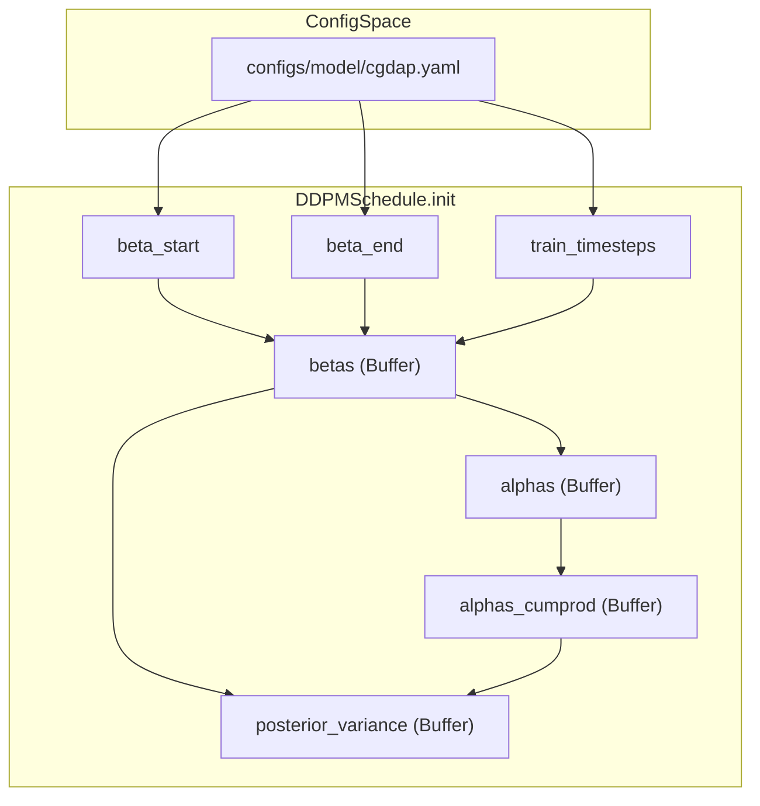
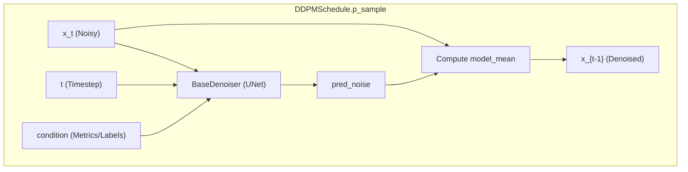

# DDPM Noise Schedule

> **Relevant source files**
> * [cgdap/models/ddpm.py](https://github.com/yashwantherukulla/IoT-Data-Aug/blob/3c2a9426/cgdap/models/ddpm.py)
> * [configs/model/cgdap.yaml](https://github.com/yashwantherukulla/IoT-Data-Aug/blob/3c2a9426/configs/model/cgdap.yaml)

The `DDPMSchedule` class manages the diffusion process for the CGDAP model. It implements a linear beta schedule and provides the mathematical framework for both the forward diffusion process (adding noise to spectrograms) and the reverse denoising process (generating samples from noise).

## Overview of DDPMSchedule

The implementation follows the "Denoising Diffusion Probabilistic Models" (Ho et al., 2020) framework. It is registered under the alias `"ddpm"` and is typically instantiated via a configuration object [cgdap/models/ddpm.py L17-L18](https://github.com/yashwantherukulla/IoT-Data-Aug/blob/3c2a9426/cgdap/models/ddpm.py#L17-L18)

 The schedule pre-computes several buffer tensors during initialization to optimize performance during training and inference [cgdap/models/ddpm.py L42-L56](https://github.com/yashwantherukulla/IoT-Data-Aug/blob/3c2a9426/cgdap/models/ddpm.py#L42-L56)

### Configuration Parameters

The schedule is configured via the `model.ddpm` section of the Hydra configuration [configs/model/cgdap.yaml L42-L50](https://github.com/yashwantherukulla/IoT-Data-Aug/blob/3c2a9426/configs/model/cgdap.yaml#L42-L50)

| Parameter | Type | Default | Description |
| --- | --- | --- | --- |
| `train_timesteps` | `int` | 1000 | Total diffusion steps $T$. |
| `beta_start` | `float` | 1e-4 | Minimum noise level at $t=0$. |
| `beta_end` | `float` | 2e-2 | Maximum noise level at $t=T$. |
| `num_train_steps` | `int` | 10 | Number of timesteps sampled per training iteration. |
| `num_infer_steps` | `int` | 100 | Number of reverse steps used during generation. |

Sources: [cgdap/models/ddpm.py L29-L40](https://github.com/yashwantherukulla/IoT-Data-Aug/blob/3c2a9426/cgdap/models/ddpm.py#L29-L40)

 [configs/model/cgdap.yaml L42-L50](https://github.com/yashwantherukulla/IoT-Data-Aug/blob/3c2a9426/configs/model/cgdap.yaml#L42-L50)

## Pre-computed Buffer Tensors

To avoid redundant calculations, the class registers several non-learnable buffers. These tensors are indexed by the timestep $t$ to retrieve coefficients for diffusion equations.

### Mathematical Constants

The following constants are computed during `__init__`:

* **Betas ($\beta_t$):** Linear space from `beta_start` to `beta_end` [cgdap/models/ddpm.py L43](https://github.com/yashwantherukulla/IoT-Data-Aug/blob/3c2a9426/cgdap/models/ddpm.py#L43-L43)
* **Alphas ($\alpha_t$):** $1 - \beta_t$ [cgdap/models/ddpm.py L44](https://github.com/yashwantherukulla/IoT-Data-Aug/blob/3c2a9426/cgdap/models/ddpm.py#L44-L44)
* **Alphas Cumprod ($\bar{\alpha}_t$):** Cumulative product of alphas $\prod_{i=1}^{t} \alpha_i$ [cgdap/models/ddpm.py L45](https://github.com/yashwantherukulla/IoT-Data-Aug/blob/3c2a9426/cgdap/models/ddpm.py#L45-L45)
* **Posterior Variance:** Used in the reverse step to calculate $p(x_{t-1}|x_t, x_0)$ [cgdap/models/ddpm.py L55-L56](https://github.com/yashwantherukulla/IoT-Data-Aug/blob/3c2a9426/cgdap/models/ddpm.py#L55-L56)

### Schedule Data Flow

The diagram below illustrates how configuration parameters are transformed into the internal buffers used by the sampling functions.

**DDPM Buffer Initialization**

Sources: [cgdap/models/ddpm.py L42-L56](https://github.com/yashwantherukulla/IoT-Data-Aug/blob/3c2a9426/cgdap/models/ddpm.py#L42-L56)

 [configs/model/cgdap.yaml L42-L50](https://github.com/yashwantherukulla/IoT-Data-Aug/blob/3c2a9426/configs/model/cgdap.yaml#L42-L50)

## Forward Process: q_sample

The `q_sample` method implements the forward diffusion process, allowing the model to sample $x_t$ at any arbitrary timestep $t$ without iterating through $1 \dots t$.

Given a clean spectrogram $x_0$ and Gaussian noise $\epsilon$, the noisy version $x_t$ is computed as:
$$x_t = \sqrt{\bar{\alpha}_t} x_0 + \sqrt{1 - \bar{\alpha}_t} \epsilon$$

The implementation uses `_extract` to gather the correct coefficients for the batch and broadcast them to the input shape [cgdap/models/ddpm.py L73-L76](https://github.com/yashwantherukulla/IoT-Data-Aug/blob/3c2a9426/cgdap/models/ddpm.py#L73-L76)

 [cgdap/models/ddpm.py L82-L93](https://github.com/yashwantherukulla/IoT-Data-Aug/blob/3c2a9426/cgdap/models/ddpm.py#L82-L93)

Sources: [cgdap/models/ddpm.py L82-L93](https://github.com/yashwantherukulla/IoT-Data-Aug/blob/3c2a9426/cgdap/models/ddpm.py#L82-L93)

## Reverse Process: p_sample and p_sample_ddim

The schedule provides two methods for the reverse denoising loop used during inference.

### 1. Standard DDPM Step (p_sample)

The `p_sample` function performs one step of the reverse Markov chain $p(x_{t-1} | x_t)$. It uses the `denoiser` (a `ConditionalUNet`) to predict the noise $\epsilon_\theta(x_t, t, condition)$ and then calculates the model mean [cgdap/models/ddpm.py L114-L138](https://github.com/yashwantherukulla/IoT-Data-Aug/blob/3c2a9426/cgdap/models/ddpm.py#L114-L138)

* **Noise Injection:** For all steps except $t=0$, Gaussian noise is added back to the sample scaled by the square root of the `posterior_variance` [cgdap/models/ddpm.py L130-L138](https://github.com/yashwantherukulla/IoT-Data-Aug/blob/3c2a9426/cgdap/models/ddpm.py#L130-L138)

### 2. DDIM Step (p_sample_ddim)

The `p_sample_ddim` method implements Denoising Diffusion Implicit Models, which allows for deterministic sampling or accelerated sampling with fewer steps (`num_infer_steps`) than the original training steps [cgdap/models/ddpm.py L141-L180](https://github.com/yashwantherukulla/IoT-Data-Aug/blob/3c2a9426/cgdap/models/ddpm.py#L141-L180)

* It supports an `eta` parameter; when `eta=0`, the process is deterministic [cgdap/models/ddpm.py L165-L178](https://github.com/yashwantherukulla/IoT-Data-Aug/blob/3c2a9426/cgdap/models/ddpm.py#L165-L178)

### Inference Data Flow

This diagram shows the interaction between the `DDPMSchedule` and the `BaseDenoiser` during a single reverse step.

**Reverse Diffusion Step**

Sources: [cgdap/models/ddpm.py L114-L138](https://github.com/yashwantherukulla/IoT-Data-Aug/blob/3c2a9426/cgdap/models/ddpm.py#L114-L138)

 [cgdap/models/ddpm.py L141-L180](https://github.com/yashwantherukulla/IoT-Data-Aug/blob/3c2a9426/cgdap/models/ddpm.py#L141-L180)

## Utility Functions

### predict_x0

The `predict_x0` method allows the model to estimate the original clean spectrogram $x_0$ from a noisy sample $x_t$ and the predicted noise [cgdap/models/ddpm.py L99-L107](https://github.com/yashwantherukulla/IoT-Data-Aug/blob/3c2a9426/cgdap/models/ddpm.py#L99-L107)

 This is critically used during training to compute the **Metric-Consistency Loss ($L_{metric}$)**, as the `MetricExtractor` requires a reconstructed $x_0$ to calculate differentiable metrics.

Sources: [cgdap/models/ddpm.py L99-L107](https://github.com/yashwantherukulla/IoT-Data-Aug/blob/3c2a9426/cgdap/models/ddpm.py#L99-L107)