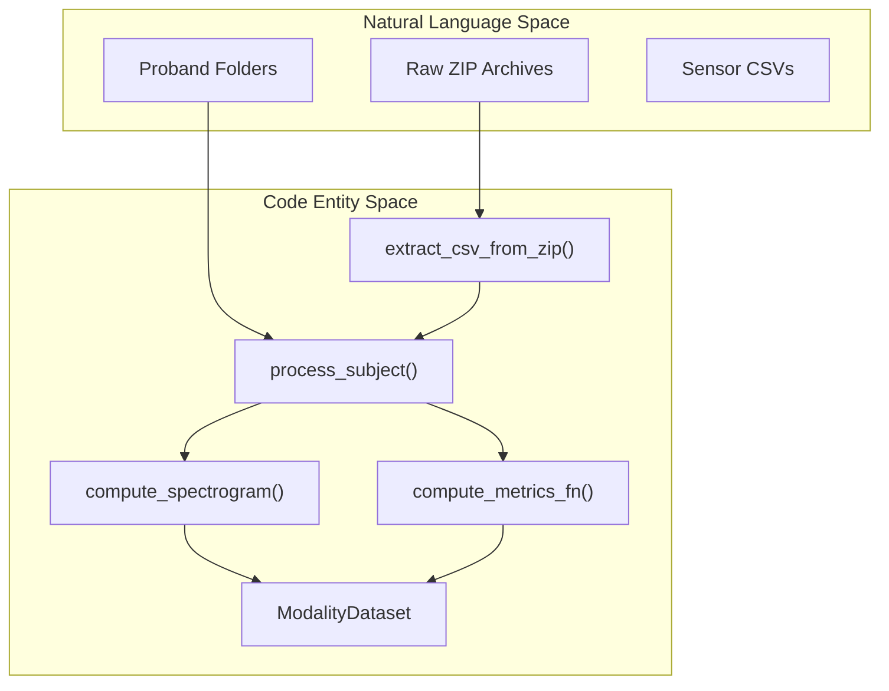
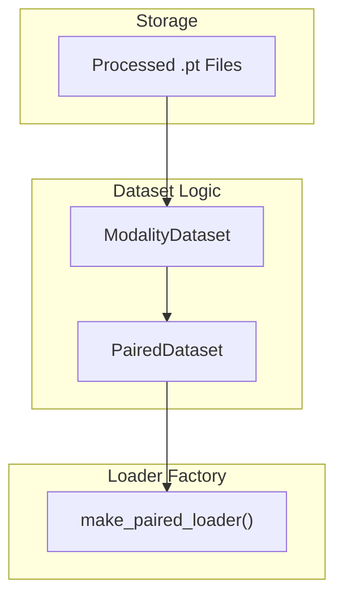

# Data Pipeline

> **Relevant source files**
> * [cgdap/augmentation/engine.py](https://github.com/yashwantherukulla/IoT-Data-Aug/blob/3c2a9426/cgdap/augmentation/engine.py)
> * [cgdap/data/preprocessing.py](https://github.com/yashwantherukulla/IoT-Data-Aug/blob/3c2a9426/cgdap/data/preprocessing.py)
> * [cgdap/data/raw_loader.py](https://github.com/yashwantherukulla/IoT-Data-Aug/blob/3c2a9426/cgdap/data/raw_loader.py)
> * [configs/dataset/har_dataset.yaml](https://github.com/yashwantherukulla/IoT-Data-Aug/blob/3c2a9426/configs/dataset/har_dataset.yaml)

The Data Pipeline is responsible for transforming raw sensor data from the RealWorld HAR dataset into a multimodal, spectrogram-based representation suitable for diffusion training. It manages the transition from time-domain CSV files to processed `.pt` archives containing log-magnitude spectrograms and pre-calculated differentiable metrics.

### High-Level Flow

The pipeline operates in three distinct phases:

1. **Ingestion**: Reading raw ZIP archives and extracting synchronized accelerometer and gyroscope signals.
2. **Transformation**: Segmenting signals into windows and performing Short-Time Fourier Transforms (STFT).
3. **Loading**: Providing an efficient interface for the trainer to access paired modalities (acc/gyr) and their associated labels/metrics.

#### Data Pipeline Architecture

The following diagram illustrates the flow from raw data entities to the code modules that process them.

**Data Flow: Raw to Processed**

**Sources:** [cgdap/data/preprocessing.py L1-L25](https://github.com/yashwantherukulla/IoT-Data-Aug/blob/3c2a9426/cgdap/data/preprocessing.py#L1-L25)

 [cgdap/data/preprocessing.py L101-L113](https://github.com/yashwantherukulla/IoT-Data-Aug/blob/3c2a9426/cgdap/data/preprocessing.py#L101-L113)

 [cgdap/data/preprocessing.py L225-L230](https://github.com/yashwantherukulla/IoT-Data-Aug/blob/3c2a9426/cgdap/data/preprocessing.py#L225-L230)

---

### Raw Data Loading and Cleaning

The pipeline consumes the RealWorld HAR dataset structure directly from compressed archives [cgdap/data/preprocessing.py L101-L103](https://github.com/yashwantherukulla/IoT-Data-Aug/blob/3c2a9426/cgdap/data/preprocessing.py#L101-L103)

 It filters data based on specific sensor placements (defaulting to `upperarm`) and activities defined in the configuration [configs/dataset/har_dataset.yaml L21-L34](https://github.com/yashwantherukulla/IoT-Data-Aug/blob/3c2a9426/configs/dataset/har_dataset.yaml#L21-L34)

 Subjects are partitioned into training and validation sets based on a configurable split [cgdap/data/preprocessing.py L207-L217](https://github.com/yashwantherukulla/IoT-Data-Aug/blob/3c2a9426/cgdap/data/preprocessing.py#L207-L217)

For details, see [Raw Data Loading and Cleaning](/yashwantherukulla/IoT-Data-Aug/2.1-raw-data-loading-and-cleaning).

**Sources:** [configs/dataset/har_dataset.yaml L10-L34](https://github.com/yashwantherukulla/IoT-Data-Aug/blob/3c2a9426/configs/dataset/har_dataset.yaml#L10-L34)

 [cgdap/data/preprocessing.py L101-L113](https://github.com/yashwantherukulla/IoT-Data-Aug/blob/3c2a9426/cgdap/data/preprocessing.py#L101-L113)

 [cgdap/data/preprocessing.py L207-L217](https://github.com/yashwantherukulla/IoT-Data-Aug/blob/3c2a9426/cgdap/data/preprocessing.py#L207-L217)

---

### Spectrogram Preprocessing

Sensor signals are transformed into the frequency domain using STFT parameters derived from the sampling rate and window requirements [cgdap/data/preprocessing.py L62-L80](https://github.com/yashwantherukulla/IoT-Data-Aug/blob/3c2a9426/cgdap/data/preprocessing.py#L62-L80)

 The pipeline generates 3-channel log-magnitude spectrograms (representing X, Y, and Z axes) [cgdap/data/preprocessing.py L135-L159](https://github.com/yashwantherukulla/IoT-Data-Aug/blob/3c2a9426/cgdap/data/preprocessing.py#L135-L159)

 During this stage, five key metrics—Temporal Range, F0 Amplitude, Contrast, Flatness, and Entropy—are extracted and cached within the processed files [cgdap/data/preprocessing.py L13-L24](https://github.com/yashwantherukulla/IoT-Data-Aug/blob/3c2a9426/cgdap/data/preprocessing.py#L13-L24)

For details, see [Spectrogram Preprocessing](/yashwantherukulla/IoT-Data-Aug/2.2-spectrogram-preprocessing).

**Sources:** [cgdap/data/preprocessing.py L13-L24](https://github.com/yashwantherukulla/IoT-Data-Aug/blob/3c2a9426/cgdap/data/preprocessing.py#L13-L24)

 [cgdap/data/preprocessing.py L62-L80](https://github.com/yashwantherukulla/IoT-Data-Aug/blob/3c2a9426/cgdap/data/preprocessing.py#L62-L80)

 [cgdap/data/preprocessing.py L135-L159](https://github.com/yashwantherukulla/IoT-Data-Aug/blob/3c2a9426/cgdap/data/preprocessing.py#L135-L159)

---

### Dataset Classes and Data Loaders

The processed data is served to the model via specialized PyTorch `Dataset` classes. `ModalityDataset` handles individual sensors, while `PairedDataset` ensures that samples from different modalities (e.g., `acc` and `gyr`) are synchronized by subject, activity, and window index [cgdap/data/dataset.py L112-L115](https://github.com/yashwantherukulla/IoT-Data-Aug/blob/3c2a9426/cgdap/data/dataset.py#L112-L115)

**Data Loading Code Entities**

**Sources:** [cgdap/data/dataset.py L26-L30](https://github.com/yashwantherukulla/IoT-Data-Aug/blob/3c2a9426/cgdap/data/dataset.py#L26-L30)

 [cgdap/data/dataset.py L112-L115](https://github.com/yashwantherukulla/IoT-Data-Aug/blob/3c2a9426/cgdap/data/dataset.py#L112-L115)

 [cgdap/data/dataset.py L176-L180](https://github.com/yashwantherukulla/IoT-Data-Aug/blob/3c2a9426/cgdap/data/dataset.py#L176-L180)

The `make_paired_loader` factory simplifies the creation of the final `DataLoader`, applying batching and shuffling as defined in the training configuration [configs/dataset/har_dataset.yaml L80-L85](https://github.com/yashwantherukulla/IoT-Data-Aug/blob/3c2a9426/configs/dataset/har_dataset.yaml#L80-L85)

For details, see [Dataset Classes and Data Loaders](/yashwantherukulla/IoT-Data-Aug/2.3-dataset-classes-and-data-loaders).

**Sources:** [cgdap/data/dataset.py L176-L180](https://github.com/yashwantherukulla/IoT-Data-Aug/blob/3c2a9426/cgdap/data/dataset.py#L176-L180)

 [configs/dataset/har_dataset.yaml L80-L85](https://github.com/yashwantherukulla/IoT-Data-Aug/blob/3c2a9426/configs/dataset/har_dataset.yaml#L80-L85)