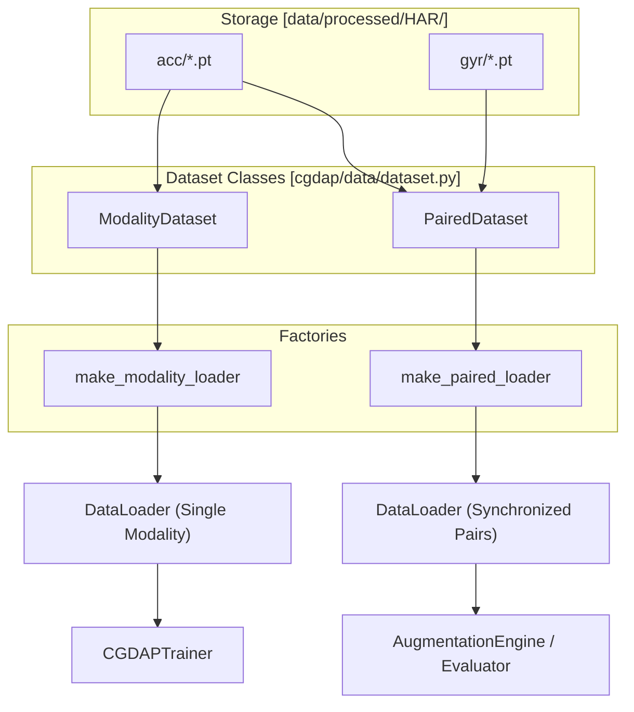

# Dataset Classes and Data Loaders

> **Relevant source files**
> * [cgdap/data/__init__.py](https://github.com/yashwantherukulla/IoT-Data-Aug/blob/3c2a9426/cgdap/data/__init__.py)
> * [cgdap/data/dataset.py](https://github.com/yashwantherukulla/IoT-Data-Aug/blob/3c2a9426/cgdap/data/dataset.py)
> * [configs/dataset/har_dataset.yaml](https://github.com/yashwantherukulla/IoT-Data-Aug/blob/3c2a9426/configs/dataset/har_dataset.yaml)
> * [utils/har_data_visualization.py](https://github.com/yashwantherukulla/IoT-Data-Aug/blob/3c2a9426/utils/har_data_visualization.py)
> * [utils/har_dataloader.py](https://github.com/yashwantherukulla/IoT-Data-Aug/blob/3c2a9426/utils/har_dataloader.py)

The CGDAP pipeline utilizes specialized PyTorch `Dataset` and `DataLoader` implementations to handle multimodal HAR (Human Activity Recognition) spectrograms. These classes are designed to interface with the processed directory structure, supporting both independent modality training and synchronized multimodal generation.

## Processed Directory Layout

The dataset expects a specific directory structure generated during the preprocessing phase [cgdap/data/dataset.py L7-L14](https://github.com/yashwantherukulla/IoT-Data-Aug/blob/3c2a9426/cgdap/data/dataset.py#L7-L14)

 Data is organized by split (train/val), then by modality (e.g., acc, gyr), and finally by activity class.

```
data/processed/HAR/├── train/│   ├── acc/│   │   ├── walking/│   │   │   └── proband11_walking_00001.pt│   │   └── ...│   └── gyr/│       ├── walking/│       │   └── proband11_walking_00001.pt│       └── ...└── val/    └── ...
```

Each `.pt` file follows the **v2.1 schema**, containing a dictionary with the following keys:

* `spectrogram`: FloatTensor of shape `[3, F, T]` (3-channel xyz axes) [cgdap/data/dataset.py L81](https://github.com/yashwantherukulla/IoT-Data-Aug/blob/3c2a9426/cgdap/data/dataset.py#L81-L81)
* `metrics`: FloatTensor of shape `[5]` (the five differentiable HAR metrics) [cgdap/data/dataset.py L82](https://github.com/yashwantherukulla/IoT-Data-Aug/blob/3c2a9426/cgdap/data/dataset.py#L82-L82)
* `label`: Integer class index [cgdap/data/dataset.py L79](https://github.com/yashwantherukulla/IoT-Data-Aug/blob/3c2a9426/cgdap/data/dataset.py#L79-L79)
* `metadata`: Including `subject`, `activity`, and `window_index` [cgdap/data/dataset.py L84-L86](https://github.com/yashwantherukulla/IoT-Data-Aug/blob/3c2a9426/cgdap/data/dataset.py#L84-L86)

Sources: [cgdap/data/dataset.py L7-L14](https://github.com/yashwantherukulla/IoT-Data-Aug/blob/3c2a9426/cgdap/data/dataset.py#L7-L14)

 [cgdap/data/dataset.py L80-L87](https://github.com/yashwantherukulla/IoT-Data-Aug/blob/3c2a9426/cgdap/data/dataset.py#L80-L87)

 [configs/dataset/har_dataset.yaml L10-L18](https://github.com/yashwantherukulla/IoT-Data-Aug/blob/3c2a9426/configs/dataset/har_dataset.yaml#L10-L18)

## Dataset Implementations

The system provides two primary dataset classes in `cgdap/data/dataset.py`.

### ModalityDataset

The `ModalityDataset` class is used for single-modality training. It loads all samples for a specific sensor type (e.g., "acc") across all activity folders within a split [cgdap/data/dataset.py L31-L42](https://github.com/yashwantherukulla/IoT-Data-Aug/blob/3c2a9426/cgdap/data/dataset.py#L31-L42)

**Key Features:**

* **Validation**: It enforces the v2.1 contract, raising a `KeyError` if `spectrogram`, `metrics`, or `label` are missing [cgdap/data/dataset.py L72-L77](https://github.com/yashwantherukulla/IoT-Data-Aug/blob/3c2a9426/cgdap/data/dataset.py#L72-L77)
* **Fallback Labels**: If a sample file lacks a label, it uses a mapping derived from the directory name [cgdap/data/dataset.py L54-L61](https://github.com/yashwantherukulla/IoT-Data-Aug/blob/3c2a9426/cgdap/data/dataset.py#L54-L61)

### PairedDataset

The `PairedDataset` class is essential for multimodal synchronization. It pairs samples from different modalities (e.g., accelerometer and gyroscope) by matching filenames across the modality subtrees [cgdap/data/dataset.py L95-L101](https://github.com/yashwantherukulla/IoT-Data-Aug/blob/3c2a9426/cgdap/data/dataset.py#L95-L101)

**Logic Flow:**

1. Iterates through the "primary" modality (usually `acc`) [cgdap/data/dataset.py L114-L115](https://github.com/yashwantherukulla/IoT-Data-Aug/blob/3c2a9426/cgdap/data/dataset.py#L114-L115)
2. For each file, it attempts to find a file with the same stem in the other modality folders [cgdap/data/dataset.py L127-L136](https://github.com/yashwantherukulla/IoT-Data-Aug/blob/3c2a9426/cgdap/data/dataset.py#L127-L136)
3. Only pairs where all configured modalities exist are included in the dataset [cgdap/data/dataset.py L138-L145](https://github.com/yashwantherukulla/IoT-Data-Aug/blob/3c2a9426/cgdap/data/dataset.py#L138-L145)

Sources: [cgdap/data/dataset.py L31-L87](https://github.com/yashwantherukulla/IoT-Data-Aug/blob/3c2a9426/cgdap/data/dataset.py#L31-L87)

 [cgdap/data/dataset.py L95-L168](https://github.com/yashwantherukulla/IoT-Data-Aug/blob/3c2a9426/cgdap/data/dataset.py#L95-L168)

## Data Loading Architecture

The following diagram illustrates the relationship between the physical storage, the dataset classes, and the training loop.

### Data Space to Code Entity Mapping

| System Component | Code Entity |
| --- | --- |
| **Physical File** | `proband_activity_index.pt` |
| **Single Modality Access** | `ModalityDataset` [cgdap/data/dataset.py L31](https://github.com/yashwantherukulla/IoT-Data-Aug/blob/3c2a9426/cgdap/data/dataset.py#L31-L31) |
| **Multimodal Synchronization** | `PairedDataset` [cgdap/data/dataset.py L95](https://github.com/yashwantherukulla/IoT-Data-Aug/blob/3c2a9426/cgdap/data/dataset.py#L95-L95) |
| **Loader Factory** | `make_paired_loader` [cgdap/data/dataset.py L211](https://github.com/yashwantherukulla/IoT-Data-Aug/blob/3c2a9426/cgdap/data/dataset.py#L211-L211) |
| **Label Mapping** | `build_label_map` [cgdap/data/dataset.py L175](https://github.com/yashwantherukulla/IoT-Data-Aug/blob/3c2a9426/cgdap/data/dataset.py#L175-L175) |

### Data Flow Diagram

Title: Dataset and Loader Data Flow



Sources: [cgdap/data/dataset.py L31-L225](https://github.com/yashwantherukulla/IoT-Data-Aug/blob/3c2a9426/cgdap/data/dataset.py#L31-L225)

 [utils/har_dataloader.py L32-L77](https://github.com/yashwantherukulla/IoT-Data-Aug/blob/3c2a9426/utils/har_dataloader.py#L32-L77)

## Factory Functions and Configuration

### Label Mapping

The `build_label_map` function scans the activity directories to create a consistent mapping between string activity names and integer indices [cgdap/data/dataset.py L175-L181](https://github.com/yashwantherukulla/IoT-Data-Aug/blob/3c2a9426/cgdap/data/dataset.py#L175-L181)

 This ensures that the `ConditionalUNet` and `CrossAttentionConditionEmbedder` receive stable one-hot class tokens.

### DataLoader Configuration

The `DataLoader` behavior is governed by the `loader` block in `configs/dataset/har_dataset.yaml`.

| Parameter | Default Value | Description |
| --- | --- | --- |
| `batch_size` | 16 | Number of samples per iteration [configs/dataset/har_dataset.yaml L81](https://github.com/yashwantherukulla/IoT-Data-Aug/blob/3c2a9426/configs/dataset/har_dataset.yaml#L81-L81) |
| `num_workers` | 4 | Parallel data loading processes [configs/dataset/har_dataset.yaml L82](https://github.com/yashwantherukulla/IoT-Data-Aug/blob/3c2a9426/configs/dataset/har_dataset.yaml#L82-L82) |
| `pin_memory` | true | Speeds up transfer to GPU [configs/dataset/har_dataset.yaml L83](https://github.com/yashwantherukulla/IoT-Data-Aug/blob/3c2a9426/configs/dataset/har_dataset.yaml#L83-L83) |
| `drop_last` | false | Whether to discard incomplete final batches [configs/dataset/har_dataset.yaml L84](https://github.com/yashwantherukulla/IoT-Data-Aug/blob/3c2a9426/configs/dataset/har_dataset.yaml#L84-L84) |

Sources: [cgdap/data/dataset.py L175-L225](https://github.com/yashwantherukulla/IoT-Data-Aug/blob/3c2a9426/cgdap/data/dataset.py#L175-L225)

 [configs/dataset/har_dataset.yaml L80-L85](https://github.com/yashwantherukulla/IoT-Data-Aug/blob/3c2a9426/configs/dataset/har_dataset.yaml#L80-L85)

## Dataset Statistics and Visualization

The repository includes utility scripts to verify dataset integrity and visualize the processed spectrograms.

* **`utils/har_dataloader.py`**: Contains `compute_split_stats`, which iterates through a `DataLoader` to calculate the mean, standard deviation, and class distribution of both spectrogram pixels and the five HAR metrics [utils/har_dataloader.py L89-L143](https://github.com/yashwantherukulla/IoT-Data-Aug/blob/3c2a9426/utils/har_dataloader.py#L89-L143)
* **`utils/har_data_visualization.py`**: Provides `plot_spectrogram`, which collapses 3-channel spectrograms into a 2D visualization and overlays the associated metric values for inspection [utils/har_data_visualization.py L55-L84](https://github.com/yashwantherukulla/IoT-Data-Aug/blob/3c2a9426/utils/har_data_visualization.py#L55-L84)

Sources: [utils/har_dataloader.py L89-L173](https://github.com/yashwantherukulla/IoT-Data-Aug/blob/3c2a9426/utils/har_dataloader.py#L89-L173)

 [utils/har_data_visualization.py L55-L127](https://github.com/yashwantherukulla/IoT-Data-Aug/blob/3c2a9426/utils/har_data_visualization.py#L55-L127)