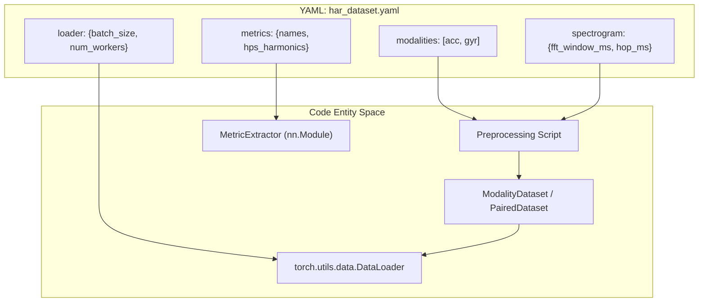
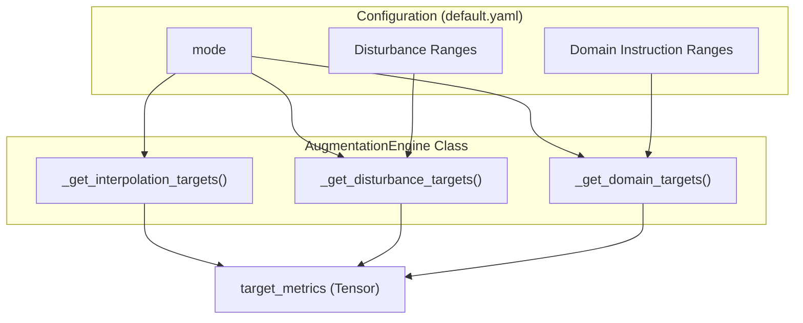

# Dataset and Augmentation Configuration

> **Relevant source files**
> * [configs/augmentation/default.yaml](https://github.com/yashwantherukulla/IoT-Data-Aug/blob/3c2a9426/configs/augmentation/default.yaml)
> * [configs/dataset/har_dataset.yaml](https://github.com/yashwantherukulla/IoT-Data-Aug/blob/3c2a9426/configs/dataset/har_dataset.yaml)

This page provides a technical reference for the configuration files governing data ingestion, spectrogram preprocessing, and the augmentation logic used to generate synthetic sensor data. The system utilizes Hydra-based YAML configurations to define the physical properties of the HAR (Human Activity Recognition) signals and the mathematical constraints of the generation process.

## 1. HAR Dataset Configuration

The file `configs/dataset/har_dataset.yaml` defines the end-to-end data pipeline, from raw CSV paths to the parameters used in Short-Time Fourier Transform (STFT) and the extraction of differentiable metrics.

### 1.1 Modalities and Activity Mapping

The system is configured for multimodal sensor fusion, specifically targeting 3-axis accelerometer and gyroscope data.

* **Modalities**: Defined as `acc` and `gyr` [configs/dataset/har_dataset.yaml L15-L17](https://github.com/yashwantherukulla/IoT-Data-Aug/blob/3c2a9426/configs/dataset/har_dataset.yaml#L15-L17)
* **Channels**: Each modality consists of 3 channels (X, Y, Z), which are processed into a 3-channel spectrogram [configs/dataset/har_dataset.yaml L18](https://github.com/yashwantherukulla/IoT-Data-Aug/blob/3c2a9426/configs/dataset/har_dataset.yaml#L18-L18)
* **Activity Map**: A mapping is provided to normalize raw dataset folder names into canonical labels (e.g., `climbingdown` to `climbing_down`) [configs/dataset/har_dataset.yaml L29-L34](https://github.com/yashwantherukulla/IoT-Data-Aug/blob/3c2a9426/configs/dataset/har_dataset.yaml#L29-L34)

### 1.2 Signal Processing and STFT

The transformation from 1D time-series signals to 2D spectrograms is governed by windowing and FFT parameters.

* **Windowing**: The pipeline uses a 2.5-second sliding window at a 100Hz sampling rate [configs/dataset/har_dataset.yaml L37-L38](https://github.com/yashwantherukulla/IoT-Data-Aug/blob/3c2a9426/configs/dataset/har_dataset.yaml#L37-L38)
* **STFT Parameters**: * `fft_window_ms`: 1500ms, which determines the frequency resolution [configs/dataset/har_dataset.yaml L42](https://github.com/yashwantherukulla/IoT-Data-Aug/blob/3c2a9426/configs/dataset/har_dataset.yaml#L42-L42) * `hop_ms`: 20ms, determining the temporal resolution of the spectrogram [configs/dataset/har_dataset.yaml L43](https://github.com/yashwantherukulla/IoT-Data-Aug/blob/3c2a9426/configs/dataset/har_dataset.yaml#L43-L43) * `log1p`: Enabled to compress the dynamic range of magnitude values [configs/dataset/har_dataset.yaml L46](https://github.com/yashwantherukulla/IoT-Data-Aug/blob/3c2a9426/configs/dataset/har_dataset.yaml#L46-L46)

### 1.3 Differentiable Metric Settings

These settings configure the `MetricExtractor` module, which computes the target conditioning values for the diffusion model.

* **HPS (Harmonic Product Spectrum)**: Uses harmonics `[1.0, 0.5, 0.25]` for fundamental frequency ($F_0$) detection [configs/dataset/har_dataset.yaml L57](https://github.com/yashwantherukulla/IoT-Data-Aug/blob/3c2a9426/configs/dataset/har_dataset.yaml#L57-L57)
* **Soft-argmax**: A temperature of `0.1` is used to maintain differentiability during peak detection [configs/dataset/har_dataset.yaml L59](https://github.com/yashwantherukulla/IoT-Data-Aug/blob/3c2a9426/configs/dataset/har_dataset.yaml#L59-L59)
* **Contrast**: Uses a tail ratio of `0.05` to calculate the difference between the top and bottom energy percentiles [configs/dataset/har_dataset.yaml L61](https://github.com/yashwantherukulla/IoT-Data-Aug/blob/3c2a9426/configs/dataset/har_dataset.yaml#L61-L61)

### Dataset Configuration Flow

The following diagram illustrates how `har_dataset.yaml` parameters are consumed by the system entities.

**Diagram: Dataset Configuration to Code Mapping**

**Sources:** [configs/dataset/har_dataset.yaml L15-L85](https://github.com/yashwantherukulla/IoT-Data-Aug/blob/3c2a9426/configs/dataset/har_dataset.yaml#L15-L85)

---

## 2. Augmentation Configuration

The file `configs/augmentation/default.yaml` controls the `AugmentationEngine`. It defines how the system generates synthetic "target metrics" that the diffusion model must satisfy during the generation phase.

### 2.1 Augmentation Modes

The system supports three distinct modes of synthetic target generation [configs/augmentation/default.yaml L6](https://github.com/yashwantherukulla/IoT-Data-Aug/blob/3c2a9426/configs/augmentation/default.yaml#L6-L6)

:

| Mode | Description | Key Parameters |
| --- | --- | --- |
| `interpolation` | Mixes metrics from two real samples of the same activity. | `beta_mean`, `beta_std` |
| `disturbance` | Adds random uniform noise to real metric values. | Per-metric ranges (e.g., `temporal_range: 0.10`) |
| `domain_instruction` | Samples metrics from expert-defined ranges per activity. | `domain_instruction` dictionary |

### 2.2 Interpolation and Disturbance

* **Interpolation**: Uses a truncated normal distribution to sample a mixing coefficient $\beta$. This ensures synthetic samples stay within the convex hull of real data distributions [configs/augmentation/default.yaml L9-L14](https://github.com/yashwantherukulla/IoT-Data-Aug/blob/3c2a9426/configs/augmentation/default.yaml#L9-L14)
* **Disturbance**: Applies a uniform perturbation ($\pm r$) to existing metrics. For example, `flatness` and `entropy` are constrained to a `0.05` (5%) disturbance to preserve the structural integrity of the signal [configs/augmentation/default.yaml L17-L23](https://github.com/yashwantherukulla/IoT-Data-Aug/blob/3c2a9426/configs/augmentation/default.yaml#L17-L23)

### 2.3 Domain Instruction (Expert Ranges)

This mode allows for "out-of-distribution" exploration by defining valid physical ranges for each metric across different activities and modalities [configs/augmentation/default.yaml L27](https://github.com/yashwantherukulla/IoT-Data-Aug/blob/3c2a9426/configs/augmentation/default.yaml#L27-L27)

For instance, the `walking` activity for the `acc` modality defines a `temporal_range` of `[0.5, 2.0]` and an `entropy` range of `[5.0, 11.0]` [configs/augmentation/default.yaml L28-L34](https://github.com/yashwantherukulla/IoT-Data-Aug/blob/3c2a9426/configs/augmentation/default.yaml#L28-L34)

 These ranges represent the physical bounds of human movement as captured by the sensors.

### Augmentation Logic Flow

The diagram below shows how the `AugmentationEngine` utilizes the configuration to produce the `target_metrics` tensor used by the generator.

**Diagram: Augmentation Engine Logic**

**Sources:** [configs/augmentation/default.yaml L1-L93](https://github.com/yashwantherukulla/IoT-Data-Aug/blob/3c2a9426/configs/augmentation/default.yaml#L1-L93)

---

## 3. Configuration Summary Table

| Config Category | Parameter | Value/Range | Purpose |
| --- | --- | --- | --- |
| **Dataset** | `window_seconds` | 2.5 | Length of input signal window [configs/dataset/har_dataset.yaml L37](https://github.com/yashwantherukulla/IoT-Data-Aug/blob/3c2a9426/configs/dataset/har_dataset.yaml#L37-L37) |
| **Dataset** | `split` | 10 Train / 5 Val | Subject-wise data partitioning [configs/dataset/har_dataset.yaml L67-L68](https://github.com/yashwantherukulla/IoT-Data-Aug/blob/3c2a9426/configs/dataset/har_dataset.yaml#L67-L68) |
| **Augmentation** | `beta_mean` | 0.5 | Central tendency for metric mixing [configs/augmentation/default.yaml L11](https://github.com/yashwantherukulla/IoT-Data-Aug/blob/3c2a9426/configs/augmentation/default.yaml#L11-L11) |
| **Augmentation** | `f0_amplitude` (Dist) | 0.10 | 10% max perturbation for HPS amplitude [configs/augmentation/default.yaml L20](https://github.com/yashwantherukulla/IoT-Data-Aug/blob/3c2a9426/configs/augmentation/default.yaml#L20-L20) |
| **Domain** | `running` (acc) | `[1.0, 4.0]` | Physical range for temporal energy in running [configs/augmentation/default.yaml L43](https://github.com/yashwantherukulla/IoT-Data-Aug/blob/3c2a9426/configs/augmentation/default.yaml#L43-L43) |

**Sources:** [configs/dataset/har_dataset.yaml L1-L85](https://github.com/yashwantherukulla/IoT-Data-Aug/blob/3c2a9426/configs/dataset/har_dataset.yaml#L1-L85)

 [configs/augmentation/default.yaml L1-L93](https://github.com/yashwantherukulla/IoT-Data-Aug/blob/3c2a9426/configs/augmentation/default.yaml#L1-L93)