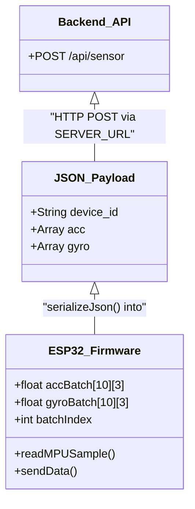

# ESP32 Firmware

> **Relevant source files**
> * [esp32-sensor-stream/esp32_strem/esp32_strem.ino](https://github.com/yashwantherukulla/IoT-Data-Aug/blob/3c2a9426/esp32-sensor-stream/esp32_strem/esp32_strem.ino)
> * [esp32-sensor-stream/frontend/app.py](https://github.com/yashwantherukulla/IoT-Data-Aug/blob/3c2a9426/esp32-sensor-stream/frontend/app.py)

The ESP32 firmware is a C++ Arduino sketch designed to transform an ESP32 microcontroller and an MPU-6050 Inertial Measurement Unit (IMU) into a real-time IoT sensor node. It handles high-frequency hardware sampling, local data batching, and reliable transmission of motion data to the project's backend via HTTP.

## System Architecture and Data Flow

The firmware operates as a continuous loop that balances precise sensor timing with the overhead of network communication. It uses a batching strategy to reduce the number of HTTP requests, ensuring the ~50 Hz sampling rate remains stable.

### Firmware Logic Flow

"The following diagram illustrates the relationship between hardware initialization, the sampling loop, and the network transmission logic."

```mermaid
flowchart TD

I1["StaticJsonDocument doc"]
I2["serializeJson(doc, payload)"]
I3["http.POST(payload)"]
I4["Blink LED_PIN2"]
E["readMPUSample()"]
F["Update accBatch & gyroBatch"]
G["batchIndex >= BATCH_SIZE?"]
H["delay(20ms)"]
I["sendData()"]
J["Reset batchIndex"]
A["Serial.begin()"]
B["WiFi.begin()"]
C["initMPU6050()"]
D["pinMode(LED_PINS)"]

subgraph subGraph2 ["Network Transmission [sendData]"]
    I1
    I2
    I3
    I4
    I1 --> I2
    I2 --> I3
    I3 --> I4
end

subgraph subGraph1 ["Main Loop [loop]"]
    E
    F
    G
    H
    I
    J
    E --> F
    F --> G
    G --> H
    G --> I
    I --> J
    J --> H
end

subgraph subGraph0 ["Initialization [setup]"]
    A
    B
    C
    D
    A --> B
    B --> C
    C --> D
end
```

**Sources:** [esp32-sensor-stream/esp32_strem/esp32_strem.ino L24-L55](https://github.com/yashwantherukulla/IoT-Data-Aug/blob/3c2a9426/esp32-sensor-stream/esp32_strem/esp32_strem.ino#L24-L55)

 [esp32-sensor-stream/esp32_strem/esp32_strem.ino L99-L137](https://github.com/yashwantherukulla/IoT-Data-Aug/blob/3c2a9426/esp32-sensor-stream/esp32_strem/esp32_strem.ino#L99-L137)

---

## Hardware Configuration and Initialization

The firmware targets the **MPU-6050** sensor connected via the I2C bus (`Wire` library). The initialization process configures the sensor's sensitivity ranges to accommodate high-intensity human activity data.

### MPU-6050 Settings

The `initMPU6050()` function configures the device with the following parameters:

* **Power Management:** Wakes the sensor from sleep mode [esp32-sensor-stream/esp32_strem/esp32_strem.ino L58-L61](https://github.com/yashwantherukulla/IoT-Data-Aug/blob/3c2a9426/esp32-sensor-stream/esp32_strem/esp32_strem.ino#L58-L61)
* **Accelerometer Scale:** Set to **±16 g** to prevent clipping during vigorous movement [esp32-sensor-stream/esp32_strem/esp32_strem.ino L63-L66](https://github.com/yashwantherukulla/IoT-Data-Aug/blob/3c2a9426/esp32-sensor-stream/esp32_strem/esp32_strem.ino#L63-L66)
* **Gyroscope Scale:** Set to **±2000°/s** for maximum angular velocity capture [esp32-sensor-stream/esp32_strem/esp32_strem.ino L68-L71](https://github.com/yashwantherukulla/IoT-Data-Aug/blob/3c2a9426/esp32-sensor-stream/esp32_strem/esp32_strem.ino#L68-L71)

### Visual Status Indicators

The firmware uses two onboard LEDs to provide real-time feedback:

* `LED_PIN` (D18): Remains HIGH once a WiFi connection is established [esp32-sensor-stream/esp32_strem/esp32_strem.ino L40](https://github.com/yashwantherukulla/IoT-Data-Aug/blob/3c2a9426/esp32-sensor-stream/esp32_strem/esp32_strem.ino#L40-L40)
* `LED_PIN2` (D19): Blinks during the execution of the `sendData()` function to indicate active transmission [esp32-sensor-stream/esp32_strem/esp32_strem.ino L100-L136](https://github.com/yashwantherukulla/IoT-Data-Aug/blob/3c2a9426/esp32-sensor-stream/esp32_strem/esp32_strem.ino#L100-L136)

**Sources:** [esp32-sensor-stream/esp32_strem/esp32_strem.ino L13-L16](https://github.com/yashwantherukulla/IoT-Data-Aug/blob/3c2a9426/esp32-sensor-stream/esp32_strem/esp32_strem.ino#L13-L16)

 [esp32-sensor-stream/esp32_strem/esp32_strem.ino L57-L72](https://github.com/yashwantherukulla/IoT-Data-Aug/blob/3c2a9426/esp32-sensor-stream/esp32_strem/esp32_strem.ino#L57-L72)

---

## Data Acquisition and Batching

To maintain a sampling frequency of approximately **50 Hz**, the `loop()` function introduces a 20ms delay between samples [esp32-sensor-stream/esp32_strem/esp32_strem.ino L54-L55](https://github.com/yashwantherukulla/IoT-Data-Aug/blob/3c2a9426/esp32-sensor-stream/esp32_strem/esp32_strem.ino#L54-L55)

### Sensor Reading (readMPUSample)

The `readMPUSample()` function performs raw byte-shifting to reconstruct 16-bit integers from the MPU-6050 registers [esp32-sensor-stream/esp32_strem/esp32_strem.ino L82-L88](https://github.com/yashwantherukulla/IoT-Data-Aug/blob/3c2a9426/esp32-sensor-stream/esp32_strem/esp32_strem.ino#L82-L88)

 These raw values are then converted into standard units:

* **Accelerometer:** Converted to $m/s^2$ using a factor derived from the ±16g scale ($raw / 2048.0 \times 9.81$) [esp32-sensor-stream/esp32_strem/esp32_strem.ino L90-L92](https://github.com/yashwantherukulla/IoT-Data-Aug/blob/3c2a9426/esp32-sensor-stream/esp32_strem/esp32_strem.ino#L90-L92)
* **Gyroscope:** Converted to degrees per second ($raw / 16.4$) [esp32-sensor-stream/esp32_strem/esp32_strem.ino L94-L96](https://github.com/yashwantherukulla/IoT-Data-Aug/blob/3c2a9426/esp32-sensor-stream/esp32_strem/esp32_strem.ino#L94-L96)

### Batching Strategy

Rather than sending every individual sample (which would overwhelm the network stack), the firmware stores readings in two-dimensional arrays: `accBatch[BATCH_SIZE][3]` and `gyroBatch[BATCH_SIZE][3]` [esp32-sensor-stream/esp32_strem/esp32_strem.ino L19-L21](https://github.com/yashwantherukulla/IoT-Data-Aug/blob/3c2a9426/esp32-sensor-stream/esp32_strem/esp32_strem.ino#L19-L21)

* **BATCH_SIZE:** Set to 10 samples per transmission [esp32-sensor-stream/esp32_strem/esp32_strem.ino L19](https://github.com/yashwantherukulla/IoT-Data-Aug/blob/3c2a9426/esp32-sensor-stream/esp32_strem/esp32_strem.ino#L19-L19)
* **Buffer Management:** The `batchIndex` tracks the current position in the buffer and triggers `sendData()` when full [esp32-sensor-stream/esp32_strem/esp32_strem.ino L48-L52](https://github.com/yashwantherukulla/IoT-Data-Aug/blob/3c2a9426/esp32-sensor-stream/esp32_strem/esp32_strem.ino#L48-L52)

**Sources:** [esp32-sensor-stream/esp32_strem/esp32_strem.ino L74-L97](https://github.com/yashwantherukulla/IoT-Data-Aug/blob/3c2a9426/esp32-sensor-stream/esp32_strem/esp32_strem.ino#L74-L97)

---

## Network Communication

The firmware uses the `ArduinoJson` library to construct a structured payload for the backend API.

### JSON Payload Structure

The `sendData()` function builds a `StaticJsonDocument` containing the device identifier and nested arrays for both sensor modalities [esp32-sensor-stream/esp32_strem/esp32_strem.ino L107-L123](https://github.com/yashwantherukulla/IoT-Data-Aug/blob/3c2a9426/esp32-sensor-stream/esp32_strem/esp32_strem.ino#L107-L123)

| Key | Type | Description |
| --- | --- | --- |
| `device_id` | String | Unique identifier (e.g., "ESP32-NODE-1") |
| `acc` | Array[Array[float]] | List of 10 [x, y, z] accelerometer readings |
| `gyro` | Array[Array[float]] | List of 10 [x, y, z] gyroscope readings |

### HTTP POST Implementation

The serialized JSON string is sent via an HTTP POST request to the `SERVER_URL` [esp32-sensor-stream/esp32_strem/esp32_strem.ino L125-L128](https://github.com/yashwantherukulla/IoT-Data-Aug/blob/3c2a9426/esp32-sensor-stream/esp32_strem/esp32_strem.ino#L125-L128)

 The firmware utilizes `WiFiClient` and `HTTPClient` to manage the connection, including setting the `Content-Type` header to `application/json` [esp32-sensor-stream/esp32_strem/esp32_strem.ino L102-L105](https://github.com/yashwantherukulla/IoT-Data-Aug/blob/3c2a9426/esp32-sensor-stream/esp32_strem/esp32_strem.ino#L102-L105)

### Code Entity Mapping

"This diagram maps the logical data structures in the firmware to the communication protocol used to interact with the backend."

**Sources:** [esp32-sensor-stream/esp32_strem/esp32_strem.ino L7-L11](https://github.com/yashwantherukulla/IoT-Data-Aug/blob/3c2a9426/esp32-sensor-stream/esp32_strem/esp32_strem.ino#L7-L11)

 [esp32-sensor-stream/esp32_strem/esp32_strem.ino L99-L137](https://github.com/yashwantherukulla/IoT-Data-Aug/blob/3c2a9426/esp32-sensor-stream/esp32_strem/esp32_strem.ino#L99-L137)