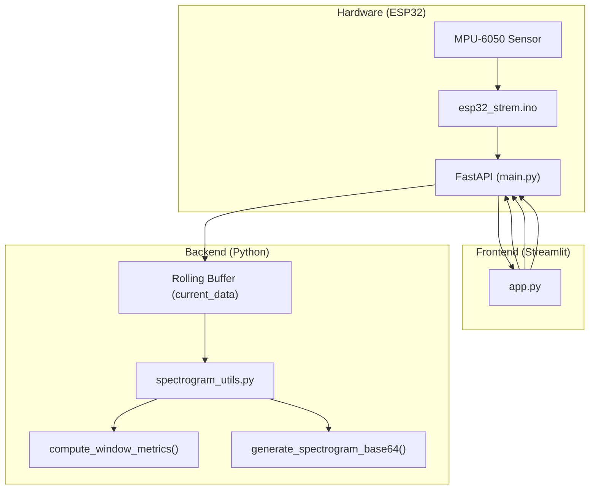

# ESP32 Sensor Stream

> **Relevant source files**
> * [esp32-sensor-stream/backend/main.py](https://github.com/yashwantherukulla/IoT-Data-Aug/blob/3c2a9426/esp32-sensor-stream/backend/main.py)
> * [esp32-sensor-stream/backend/spectrogram_utils.py](https://github.com/yashwantherukulla/IoT-Data-Aug/blob/3c2a9426/esp32-sensor-stream/backend/spectrogram_utils.py)
> * [esp32-sensor-stream/esp32_strem/esp32_strem.ino](https://github.com/yashwantherukulla/IoT-Data-Aug/blob/3c2a9426/esp32-sensor-stream/esp32_strem/esp32_strem.ino)
> * [esp32-sensor-stream/frontend/app.py](https://github.com/yashwantherukulla/IoT-Data-Aug/blob/3c2a9426/esp32-sensor-stream/frontend/app.py)

The **ESP32 Sensor Stream** sub-project provides a real-time hardware-in-the-loop demonstration of the CGDAP data pipeline. It bridges physical motion sensing with the project's spectrogram and metric extraction logic, allowing for live visualization of HAR (Human Activity Recognition) signals.

The system consists of three primary tiers:

1. **Edge (Firmware):** An ESP32 microcontroller with an MPU-6050 sensor reading accelerometer and gyroscope data.
2. **Backend (FastAPI):** A Python server that buffers raw data, computes metrics using NumPy-based mirrors of the core project logic, and generates spectrogram images.
3. **Frontend (Streamlit):** A web dashboard for real-time plotting of time-series data, metric tiles, and recent spectrogram history.

### System Architecture

The following diagram illustrates the data flow from the physical sensor to the web dashboard, mapping logical components to their implementations in the codebase.

**Data Flow: Physical Sensor to Dashboard**

**Sources:**

* [esp32-sensor-stream/esp32_strem/esp32_strem.ino L6-L11](https://github.com/yashwantherukulla/IoT-Data-Aug/blob/3c2a9426/esp32-sensor-stream/esp32_strem/esp32_strem.ino#L6-L11)
* [esp32-sensor-stream/backend/main.py L38-L40](https://github.com/yashwantherukulla/IoT-Data-Aug/blob/3c2a9426/esp32-sensor-stream/backend/main.py#L38-L40)
* [esp32-sensor-stream/frontend/app.py L38-L41](https://github.com/yashwantherukulla/IoT-Data-Aug/blob/3c2a9426/esp32-sensor-stream/frontend/app.py#L38-L41)

---

### ESP32 Firmware

The firmware is responsible for high-frequency sensor sampling and batched network transmission. It utilizes an MPU-6050 IMU connected via I2C to capture 6-axis motion data.

* **Sampling:** The loop runs at approximately 50Hz [esp32-sensor-stream/esp32_strem/esp32_strem.ino L54-L55](https://github.com/yashwantherukulla/IoT-Data-Aug/blob/3c2a9426/esp32-sensor-stream/esp32_strem/esp32_strem.ino#L54-L55)
* **Batching:** To reduce network overhead, samples are collected into a local buffer of size 10 before being transmitted [esp32-sensor-stream/esp32_strem/esp32_strem.ino L19-L22](https://github.com/yashwantherukulla/IoT-Data-Aug/blob/3c2a9426/esp32-sensor-stream/esp32_strem/esp32_strem.ino#L19-L22)
* **Transmission:** Data is serialized into a JSON payload containing `acc` and `gyro` arrays and sent via an HTTP POST request to the `/api/sensor` endpoint [esp32-sensor-stream/esp32_strem/esp32_strem.ino L99-L128](https://github.com/yashwantherukulla/IoT-Data-Aug/blob/3c2a9426/esp32-sensor-stream/esp32_strem/esp32_strem.ino#L99-L128)

For detailed documentation on hardware wiring and MPU-6050 register configuration, see **[ESP32 Firmware](/yashwantherukulla/IoT-Data-Aug/8.1-esp32-firmware)**.

**Sources:**

* [esp32-sensor-stream/esp32_strem/esp32_strem.ino L19-L22](https://github.com/yashwantherukulla/IoT-Data-Aug/blob/3c2a9426/esp32-sensor-stream/esp32_strem/esp32_strem.ino#L19-L22)
* [esp32-sensor-stream/esp32_strem/esp32_strem.ino L99-L128](https://github.com/yashwantherukulla/IoT-Data-Aug/blob/3c2a9426/esp32-sensor-stream/esp32_strem/esp32_strem.ino#L99-L128)

---

### Backend and Frontend

The software stack processes incoming raw samples into the same feature space used by the generative model (spectrograms and metrics).

#### FastAPI Backend

The backend maintains a rolling memory buffer of the last 1000 samples [esp32-sensor-stream/backend/main.py L16-L20](https://github.com/yashwantherukulla/IoT-Data-Aug/blob/3c2a9426/esp32-sensor-stream/backend/main.py#L16-L20)

 It uses the project's global Hydra configuration to ensure that the real-time STFT parameters match the training data pipeline [esp32-sensor-stream/backend/spectrogram_utils.py L118-L126](https://github.com/yashwantherukulla/IoT-Data-Aug/blob/3c2a9426/esp32-sensor-stream/backend/spectrogram_utils.py#L118-L126)

* **Metric Computation:** Implements pure-NumPy versions of the five core metrics: `temporal_range`, `f0_amplitude`, `contrast`, `flatness`, and `entropy` [esp32-sensor-stream/backend/spectrogram_utils.py L12-L73](https://github.com/yashwantherukulla/IoT-Data-Aug/blob/3c2a9426/esp32-sensor-stream/backend/spectrogram_utils.py#L12-L73)
* **Spectrogram Generation:** Converts windows of size `WINDOW_SIZE` (defined by config) into base64-encoded PNG images for the frontend [esp32-sensor-stream/backend/spectrogram_utils.py L187-L202](https://github.com/yashwantherukulla/IoT-Data-Aug/blob/3c2a9426/esp32-sensor-stream/backend/spectrogram_utils.py#L187-L202)

#### Streamlit Dashboard

The dashboard provides a live view of the sensor state. It polls the backend every 0.5 seconds [esp32-sensor-stream/frontend/app.py L139](https://github.com/yashwantherukulla/IoT-Data-Aug/blob/3c2a9426/esp32-sensor-stream/frontend/app.py#L139-L139)

 to update:

* **Time-Series Charts:** Interactive line charts for Acc and Gyro axes [esp32-sensor-stream/frontend/app.py L58-L59](https://github.com/yashwantherukulla/IoT-Data-Aug/blob/3c2a9426/esp32-sensor-stream/frontend/app.py#L58-L59)
* **Metric Tiles:** Real-time values for the 5 HAR metrics per modality [esp32-sensor-stream/frontend/app.py L82-L90](https://github.com/yashwantherukulla/IoT-Data-Aug/blob/3c2a9426/esp32-sensor-stream/frontend/app.py#L82-L90)
* **Spectrogram Gallery:** A history of the 3 most recent generated spectrogram windows [esp32-sensor-stream/frontend/app.py L105-L118](https://github.com/yashwantherukulla/IoT-Data-Aug/blob/3c2a9426/esp32-sensor-stream/frontend/app.py#L105-L118)

For implementation details on the API endpoints and the visualization logic, see **[Backend and Frontend](/yashwantherukulla/IoT-Data-Aug/8.2-backend-and-frontend)**.

**Entity Mapping: API to Code**

| Endpoint | Function / Variable | Role |
| --- | --- | --- |
| `POST /api/sensor` | `receive_sensor_data` | Ingests `SensorBatch` from ESP32 |
| `GET /api/data` | `current_data` | Returns raw rolling buffer |
| `GET /api/spectrograms` | `recent_spectrograms` | Returns list of b64 PNGs |
| `GET /api/metrics` | `recent_metrics` | Returns latest computed HAR metrics |

**Sources:**

* [esp32-sensor-stream/backend/main.py L38-L106](https://github.com/yashwantherukulla/IoT-Data-Aug/blob/3c2a9426/esp32-sensor-stream/backend/main.py#L38-L106)
* [esp32-sensor-stream/backend/spectrogram_utils.py L12-L116](https://github.com/yashwantherukulla/IoT-Data-Aug/blob/3c2a9426/esp32-sensor-stream/backend/spectrogram_utils.py#L12-L116)
* [esp32-sensor-stream/frontend/app.py L61-L135](https://github.com/yashwantherukulla/IoT-Data-Aug/blob/3c2a9426/esp32-sensor-stream/frontend/app.py#L61-L135)