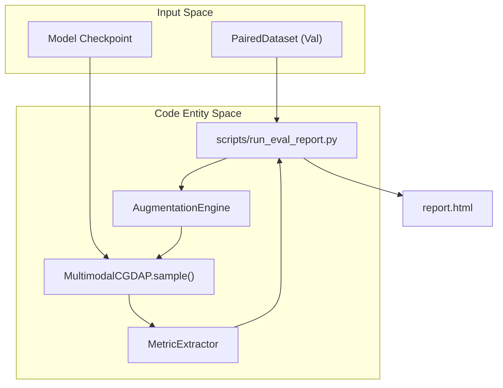

# Evaluation Report Generation

> **Relevant source files**
> * [cgdap/evaluation/product_eval.py](https://github.com/yashwantherukulla/IoT-Data-Aug/blob/3c2a9426/cgdap/evaluation/product_eval.py)
> * [configs/evaluation/default.yaml](https://github.com/yashwantherukulla/IoT-Data-Aug/blob/3c2a9426/configs/evaluation/default.yaml)
> * [scripts/run_eval_report.py](https://github.com/yashwantherukulla/IoT-Data-Aug/blob/3c2a9426/scripts/run_eval_report.py)

The Evaluation Report Generation system provides a comprehensive diagnostic pipeline for assessing the fidelity, diversity, and metric-consistency of synthetic sensor data. It automates the generation of synthetic samples for an entire validation split and compiles the results into a self-contained HTML report featuring statistical analysis and visual galleries.

## Overview and Purpose

The primary entry point is `scripts/run_eval_report.py`, which orchestrates the transition from raw model weights to a human-readable performance audit. Unlike the live `ProductEvaluator` used during training, this script performs a full-scale evaluation, computing aggregate metrics across all activities and modalities defined in the dataset configuration.

### Key Capabilities

* **Full-Split Generation**: Generates synthetic spectrograms for every sample in the validation set (or a capped subset) using the `AugmentationEngine` [scripts/run_eval_report.py L89-L109](https://github.com/yashwantherukulla/IoT-Data-Aug/blob/3c2a9426/scripts/run_eval_report.py#L89-L109)
* **Metric Extraction**: Uses the `MetricExtractor` to calculate the realized HAR metrics of generated samples [scripts/run_eval_report.py L159-L164](https://github.com/yashwantherukulla/IoT-Data-Aug/blob/3c2a9426/scripts/run_eval_report.py#L159-L164)
* **Statistical Analysis**: Computes RMSE, Mean Absolute Error (MAE), and standard deviation ratios between target and generated metrics [scripts/run_eval_report.py L221-L255](https://github.com/yashwantherukulla/IoT-Data-Aug/blob/3c2a9426/scripts/run_eval_report.py#L221-L255)
* **Visual Diagnostics**: Generates seven distinct figure types, including radar charts for activity fidelity and spectrogram galleries for qualitative inspection [scripts/run_eval_report.py L12-L21](https://github.com/yashwantherukulla/IoT-Data-Aug/blob/3c2a9426/scripts/run_eval_report.py#L12-L21)

Sources: [scripts/run_eval_report.py L1-L21](https://github.com/yashwantherukulla/IoT-Data-Aug/blob/3c2a9426/scripts/run_eval_report.py#L1-L21)

 [scripts/run_eval_report.py L89-L109](https://github.com/yashwantherukulla/IoT-Data-Aug/blob/3c2a9426/scripts/run_eval_report.py#L89-L109)

 [scripts/run_eval_report.py L159-L164](https://github.com/yashwantherukulla/IoT-Data-Aug/blob/3c2a9426/scripts/run_eval_report.py#L159-L164)

## System Architecture

The evaluation pipeline bridges the generative model's output space with the analytical metric space. It relies on the `AugmentationEngine` to provide conditioning targets and the `MultimodalCGDAP` model to perform diffusion sampling.

### Data Flow Diagram

The following diagram illustrates how data moves from the validation dataset through the model and into the final report.

**Report Generation Pipeline**



Sources: [scripts/run_eval_report.py L112-L113](https://github.com/yashwantherukulla/IoT-Data-Aug/blob/3c2a9426/scripts/run_eval_report.py#L112-L113)

 [scripts/run_eval_report.py L148-L156](https://github.com/yashwantherukulla/IoT-Data-Aug/blob/3c2a9426/scripts/run_eval_report.py#L148-L156)

 [scripts/run_eval_report.py L163-L164](https://github.com/yashwantherukulla/IoT-Data-Aug/blob/3c2a9426/scripts/run_eval_report.py#L163-L164)

## Data Collection Pipeline

The `collect_eval_data` function is the core data gathering loop. It iterates through the `PairedDataset` and performs the following steps for each sample:

1. **Target Generation**: Depending on the `augmentation.mode` (interpolation, disturbance, or domain_instruction), the `AugmentationEngine` provides a set of target metrics [scripts/run_eval_report.py L130-L135](https://github.com/yashwantherukulla/IoT-Data-Aug/blob/3c2a9426/scripts/run_eval_report.py#L130-L135)
2. **Diffusion Sampling**: The model's `sample` method is called to generate a synthetic spectrogram matching the target metrics and label [scripts/run_eval_report.py L148-L156](https://github.com/yashwantherukulla/IoT-Data-Aug/blob/3c2a9426/scripts/run_eval_report.py#L148-L156)
3. **Post-Generation Extraction**: The `MetricExtractor` processes the generated [B, C, F, T] tensor to determine the actual metrics achieved by the model [scripts/run_eval_report.py L161-L164](https://github.com/yashwantherukulla/IoT-Data-Aug/blob/3c2a9426/scripts/run_eval_report.py#L161-L164)
4. **Record Compilation**: Stores targets, extracted metrics, generated spectrograms, and reference spectrograms for later visualization [scripts/run_eval_report.py L166-L174](https://github.com/yashwantherukulla/IoT-Data-Aug/blob/3c2a9426/scripts/run_eval_report.py#L166-L174)

Sources: [scripts/run_eval_report.py L89-L179](https://github.com/yashwantherukulla/IoT-Data-Aug/blob/3c2a9426/scripts/run_eval_report.py#L89-L179)

## Metric Computation and Diagnostics

The system evaluates the generator using several statistical lenses to ensure the synthetic data is both accurate to its conditioning and representative of the real data distribution.

### Aggregate Metrics

The function `compute_aggregate_metrics` processes the collected records to produce:

* **Pair RMSE**: The root mean square error between the target metric vector and the extracted metric vector [scripts/run_eval_report.py L237-L238](https://github.com/yashwantherukulla/IoT-Data-Aug/blob/3c2a9426/scripts/run_eval_report.py#L237-L238)
* **MAE**: Mean absolute error per metric [scripts/run_eval_report.py L240-L241](https://github.com/yashwantherukulla/IoT-Data-Aug/blob/3c2a9426/scripts/run_eval_report.py#L240-L241)
* **Std-Ratio**: The ratio of the standard deviation of generated metrics to the standard deviation of real metrics, indicating if the model is "collapsing" to mean values or maintaining natural variance [scripts/run_eval_report.py L246-L248](https://github.com/yashwantherukulla/IoT-Data-Aug/blob/3c2a9426/scripts/run_eval_report.py#L246-L248)
* **NN Distance**: The Euclidean distance in standardized metric space to the nearest neighbor in the training set, used to detect overfitting or "copy-pasting" of training samples [cgdap/evaluation/product_eval.py L214-L222](https://github.com/yashwantherukulla/IoT-Data-Aug/blob/3c2a9426/cgdap/evaluation/product_eval.py#L214-L222)

### Visual Diagnostic Figures

The report embeds seven figures to provide a multi-faceted view of model performance:

| Figure | Code Entity / Logic | Description |
| --- | --- | --- |
| **Metric Scatter** | `_plot_metric_scatter` | Plots target vs. extracted values for each of the 5 metrics. Ideal performance follows the y=x line. |
| **Radar Chart** | `_plot_radar_chart` | Shows per-activity metric fidelity, highlighting which activities (e.g., "Walking" vs "Climbing Stairs") are harder for the model to synthesize. |
| **NN Distance Hist** | `_plot_nn_distance_hist` | Histograms of distances to the training bank to ensure synthetic samples aren't just memorized training data. |
| **Spectrogram Gallery** | `_plot_spectrogram_gallery` | Side-by-side visual comparison of real reference samples and their synthetic counterparts. |
| **Std-Ratio Bars** | `_plot_std_ratio_bars` | Visualizes the variance preservation per metric across the dataset. |

Sources: [scripts/run_eval_report.py L12-L21](https://github.com/yashwantherukulla/IoT-Data-Aug/blob/3c2a9426/scripts/run_eval_report.py#L12-L21)

 [scripts/run_eval_report.py L221-L255](https://github.com/yashwantherukulla/IoT-Data-Aug/blob/3c2a9426/scripts/run_eval_report.py#L221-L255)

 [cgdap/evaluation/product_eval.py L214-L222](https://github.com/yashwantherukulla/IoT-Data-Aug/blob/3c2a9426/cgdap/evaluation/product_eval.py#L214-L222)

## Configuration and Usage

The report generator uses the Hydra configuration system, allowing overrides for specific evaluation needs such as reducing diffusion steps for faster reporting.

**Evaluation Configuration Schema**
The behavior is governed by `configs/evaluation/default.yaml`:

* `product_eval.samples_per_activity`: Controls the number of samples used for stratified diagnostics [configs/evaluation/default.yaml L31](https://github.com/yashwantherukulla/IoT-Data-Aug/blob/3c2a9426/configs/evaluation/default.yaml#L31-L31)
* `product_eval.num_steps`: The number of DDPM reverse steps for evaluation (overrides training defaults if set) [configs/evaluation/default.yaml L34](https://github.com/yashwantherukulla/IoT-Data-Aug/blob/3c2a9426/configs/evaluation/default.yaml#L34-L34)
* `augmentation.checkpoint_path`: Path to the `.pt` model weights to evaluate [configs/evaluation/default.yaml L23](https://github.com/yashwantherukulla/IoT-Data-Aug/blob/3c2a9426/configs/evaluation/default.yaml#L23-L23)

### Execution Example

To generate a report for a specific experiment:

```
uv run python scripts/run_eval_report.py \    experiment_name=har_v2 \    evaluation.augmentation.checkpoint_path=outputs/checkpoints/har_v2/best_model.pt \    evaluation.product_eval.num_steps=50
```

Sources: [configs/evaluation/default.yaml L27-L38](https://github.com/yashwantherukulla/IoT-Data-Aug/blob/3c2a9426/configs/evaluation/default.yaml#L27-L38)

 [scripts/run_eval_report.py L7-L10](https://github.com/yashwantherukulla/IoT-Data-Aug/blob/3c2a9426/scripts/run_eval_report.py#L7-L10)

## HTML Report Generation

The final output is a self-contained HTML file. All generated figures are converted to Base64 strings using `_fig_to_b64` and embedded directly into the HTML source [scripts/run_eval_report.py L60-L65](https://github.com/yashwantherukulla/IoT-Data-Aug/blob/3c2a9426/scripts/run_eval_report.py#L60-L65)

 This ensures the report can be shared as a single file without external image dependencies.

The report structure includes:

1. **Summary Header**: Metadata about the experiment and timestamp [scripts/run_eval_report.py L388-L395](https://github.com/yashwantherukulla/IoT-Data-Aug/blob/3c2a9426/scripts/run_eval_report.py#L388-L395)
2. **Global Metrics Table**: Aggregated RMSE and NN-distance stats.
3. **Visual Panels**: Grid layout of the seven diagnostic figures [scripts/run_eval_report.py L408-L420](https://github.com/yashwantherukulla/IoT-Data-Aug/blob/3c2a9426/scripts/run_eval_report.py#L408-L420)

Sources: [scripts/run_eval_report.py L60-L73](https://github.com/yashwantherukulla/IoT-Data-Aug/blob/3c2a9426/scripts/run_eval_report.py#L60-L73)

 [scripts/run_eval_report.py L385-L425](https://github.com/yashwantherukulla/IoT-Data-Aug/blob/3c2a9426/scripts/run_eval_report.py#L385-L425)