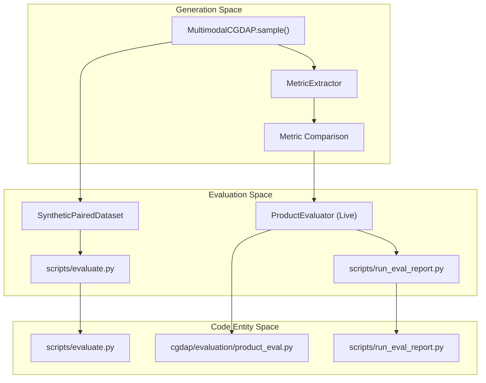

# Evaluation

> **Relevant source files**
> * [cgdap/evaluation/__init__.py](https://github.com/yashwantherukulla/IoT-Data-Aug/blob/3c2a9426/cgdap/evaluation/__init__.py)
> * [configs/evaluation/default.yaml](https://github.com/yashwantherukulla/IoT-Data-Aug/blob/3c2a9426/configs/evaluation/default.yaml)
> * [scripts/evaluate.py](https://github.com/yashwantherukulla/IoT-Data-Aug/blob/3c2a9426/scripts/evaluate.py)
> * [scripts/run_eval_report.py](https://github.com/yashwantherukulla/IoT-Data-Aug/blob/3c2a9426/scripts/run_eval_report.py)

The evaluation system in CGDAP follows a two-track approach designed to measure both the **fidelity** of the generated spectrograms (how well they match target metrics) and their **utility** (how much they improve downstream classifier performance). This is implemented through a live diagnostic system used during training and an offline suite for rigorous benchmarking.

### High-Level Evaluation Architecture

The system bridges the gap between the diffusion model's internal loss and the actual quality of the generated sensor data.

| Component | Purpose | Frequency | Key Entities |
| --- | --- | --- | --- |
| **Product Evaluator** | Real-time fidelity diagnostics. | Per-epoch | `ProductEvaluator`, `select_stratified_indices` |
| **Classifier Eval** | Utility benchmarking for HAR. | Post-training | `DeepSenseClassifier`, `HATransformerClassifier` |
| **Report Generator** | Visual and statistical auditing. | On-demand | `run_eval_report.py`, `MetricExtractor` |

#### Data Flow: Generation to Evaluation

This diagram illustrates how code entities interact to transform generated samples into evaluation metrics.

**Sources:** [cgdap/evaluation/product_eval.py L1-L10](https://github.com/yashwantherukulla/IoT-Data-Aug/blob/3c2a9426/cgdap/evaluation/product_eval.py#L1-L10)

 [scripts/evaluate.py L1-L20](https://github.com/yashwantherukulla/IoT-Data-Aug/blob/3c2a9426/scripts/evaluate.py#L1-L20)

 [scripts/run_eval_report.py L1-L21](https://github.com/yashwantherukulla/IoT-Data-Aug/blob/3c2a9426/scripts/run_eval_report.py#L1-L21)

---

### Product Evaluator

The `ProductEvaluator` class is integrated directly into the `CGDAPTrainer` loop. It monitors the training progress by generating a fixed set of "probe" samples at the end of each epoch and comparing their extracted metrics against the requested targets.

* **Stratified Probing**: Uses `select_stratified_indices` to ensure evaluation covers all activities equally [cgdap/evaluation/product_eval.py L46-L47](https://github.com/yashwantherukulla/IoT-Data-Aug/blob/3c2a9426/cgdap/evaluation/product_eval.py#L46-L47)
* **Fidelity Metrics**: Computes `pair_rmse` (how close generated metrics are to targets) and `std_ratio` (checking for mode collapse or variance drift) [scripts/run_eval_report.py L214-L220](https://github.com/yashwantherukulla/IoT-Data-Aug/blob/3c2a9426/scripts/run_eval_report.py#L214-L220)
* **Generalization Metrics**: Measures `nn_distance_gap_val_minus_train` to detect if the model is memorizing training samples rather than generalizing [scripts/run_eval_report.py L245-L250](https://github.com/yashwantherukulla/IoT-Data-Aug/blob/3c2a9426/scripts/run_eval_report.py#L245-L250)

For details on implementation and metric definitions, see [Product Evaluator](/yashwantherukulla/IoT-Data-Aug/7.1-product-evaluator).

---

### Classifier Evaluation (DeepSense & Transformer)

The utility of the generated data is validated by training Human Activity Recognition (HAR) classifiers. The `scripts/evaluate.py` entry point automates a comparison between models trained on "Real Only" data vs. "Real + Synthetic" data.

* **Classifiers**: Supports `DeepSenseClassifier` (CNN-RNN hybrid) and `HATransformerClassifier` (Attention-based) [scripts/evaluate.py L170-L182](https://github.com/yashwantherukulla/IoT-Data-Aug/blob/3c2a9426/scripts/evaluate.py#L170-L182)
* **SyntheticPairedDataset**: An in-memory dataset that wraps generated spectrograms, allowing them to be concatenated with the original `PairedDataset` using `ConcatDataset` [scripts/evaluate.py L32-L53](https://github.com/yashwantherukulla/IoT-Data-Aug/blob/3c2a9426/scripts/evaluate.py#L32-L53)
* **Pipeline**: Resolves the best checkpoint from a training run, generates a synthetic corpus via `AugmentationEngine`, and performs a full training/validation cycle for the chosen classifiers [scripts/evaluate.py L202-L230](https://github.com/yashwantherukulla/IoT-Data-Aug/blob/3c2a9426/scripts/evaluate.py#L202-L230)

For details on the classifier architectures and the evaluation pipeline, see [Classifier Evaluation (DeepSense & Transformer)](/yashwantherukulla/IoT-Data-Aug/7.2-classifier-evaluation-(deepsense-and-transformer)).

---

### Evaluation Report Generation

The `scripts/run_eval_report.py` script provides a comprehensive visual audit of a trained model. It generates a self-contained HTML report that aggregates statistical tables with qualitative visualizations.

* **Metric Scatter Plots**: Visualizes Target vs. Generated values for all five metrics (temporal range, f0 amplitude, etc.) [scripts/run_eval_report.py L15-L16](https://github.com/yashwantherukulla/IoT-Data-Aug/blob/3c2a9426/scripts/run_eval_report.py#L15-L16)
* **Radar Charts**: Displays per-activity metric fidelity, highlighting which activities the model struggles to reconstruct [scripts/run_eval_report.py L17](https://github.com/yashwantherukulla/IoT-Data-Aug/blob/3c2a9426/scripts/run_eval_report.py#L17-L17)
* **Spectrogram Gallery**: Side-by-side comparison of reference samples and generated samples to verify structural integrity [scripts/run_eval_report.py L19](https://github.com/yashwantherukulla/IoT-Data-Aug/blob/3c2a9426/scripts/run_eval_report.py#L19-L19)

For details on the reporting pipeline and figure generation, see [Evaluation Report Generation](/yashwantherukulla/IoT-Data-Aug/7.3-evaluation-report-generation).

---

### Configuration Reference

The evaluation behavior is controlled via `configs/evaluation/default.yaml`.

| Parameter | Type | Description |
| --- | --- | --- |
| `product_eval.enabled` | bool | Whether to run diagnostics during training [configs/evaluation/default.yaml L28](https://github.com/yashwantherukulla/IoT-Data-Aug/blob/3c2a9426/configs/evaluation/default.yaml#L28-L28) |
| `product_eval.samples_per_activity` | int | Number of probes to select per label [configs/evaluation/default.yaml L31](https://github.com/yashwantherukulla/IoT-Data-Aug/blob/3c2a9426/configs/evaluation/default.yaml#L31-L31) |
| `augmentation.samples_per_real` | int | Multiplier for synthetic data generation in offline eval [configs/evaluation/default.yaml L22](https://github.com/yashwantherukulla/IoT-Data-Aug/blob/3c2a9426/configs/evaluation/default.yaml#L22-L22) |
| `classifiers` | list | List of models to train (`deepsense`, `transformer`) [configs/evaluation/default.yaml L5-L7](https://github.com/yashwantherukulla/IoT-Data-Aug/blob/3c2a9426/configs/evaluation/default.yaml#L5-L7) |

**Sources:** [configs/evaluation/default.yaml L1-L52](https://github.com/yashwantherukulla/IoT-Data-Aug/blob/3c2a9426/configs/evaluation/default.yaml#L1-L52)

 [scripts/evaluate.py L138-L158](https://github.com/yashwantherukulla/IoT-Data-Aug/blob/3c2a9426/scripts/evaluate.py#L138-L158)

 [scripts/run_eval_report.py L89-L109](https://github.com/yashwantherukulla/IoT-Data-Aug/blob/3c2a9426/scripts/run_eval_report.py#L89-L109)