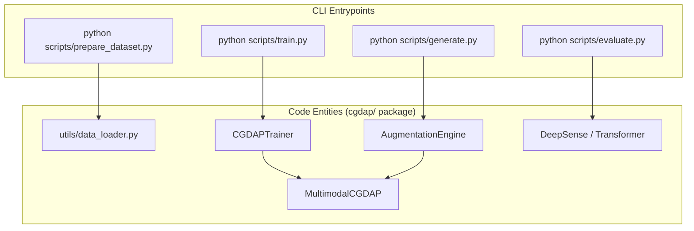
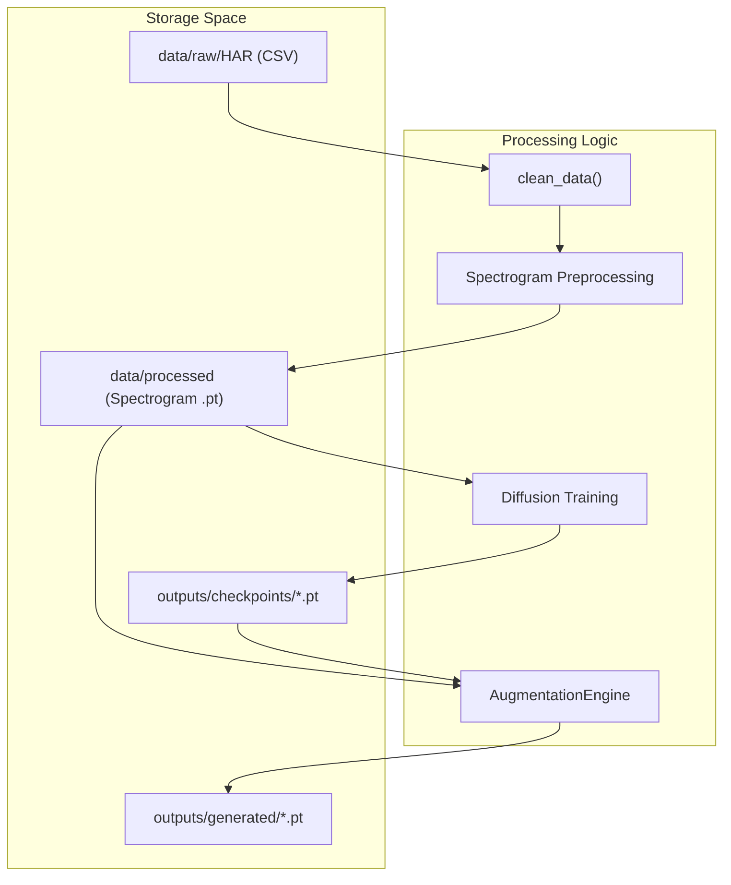

# Getting Started

> **Relevant source files**
> * [.gitignore](https://github.com/yashwantherukulla/IoT-Data-Aug/blob/3c2a9426/.gitignore)
> * [.python-version](https://github.com/yashwantherukulla/IoT-Data-Aug/blob/3c2a9426/.python-version)
> * [main.py](https://github.com/yashwantherukulla/IoT-Data-Aug/blob/3c2a9426/main.py)
> * [pyproject.toml](https://github.com/yashwantherukulla/IoT-Data-Aug/blob/3c2a9426/pyproject.toml)
> * [utils/data_loader.py](https://github.com/yashwantherukulla/IoT-Data-Aug/blob/3c2a9426/utils/data_loader.py)
> * [uv.lock](https://github.com/yashwantherukulla/IoT-Data-Aug/blob/3c2a9426/uv.lock)

This page provides the technical requirements and procedural steps to initialize the **CGDAP (Conditional Generative Data Augmentation Pipeline)** environment. It covers the dependency management system, the configuration of the Python environment, and the end-to-end command sequence required to transform raw sensor data into synthetic augmented samples.

## Environment Requirements

The project is built on **Python 3.12** [.python-version L1](https://github.com/yashwantherukulla/IoT-Data-Aug/blob/3c2a9426/ .python-version#L1-L1)

 It utilizes `uv` as the primary package manager and runtime executor to ensure deterministic builds and high-performance dependency resolution.

### Key Dependencies

The project dependencies are defined in `pyproject.toml` [pyproject.toml L11-L20](https://github.com/yashwantherukulla/IoT-Data-Aug/blob/3c2a9426/ pyproject.toml#L11-L20)

 and include:

* **Deep Learning**: `torch >= 2.6.0` (with CUDA 12.4 support) [pyproject.toml L19-L20](https://github.com/yashwantherukulla/IoT-Data-Aug/blob/3c2a9426/ pyproject.toml#L19-L20)  [pyproject.toml L28-L31](https://github.com/yashwantherukulla/IoT-Data-Aug/blob/3c2a9426/ pyproject.toml#L28-L31)
* **Configuration**: `hydra-core >= 1.3` and `omegaconf >= 2.3` [pyproject.toml L12-L13](https://github.com/yashwantherukulla/IoT-Data-Aug/blob/3c2a9426/ pyproject.toml#L12-L13)
* **Experiment Tracking**: `wandb >= 0.21` [pyproject.toml L14](https://github.com/yashwantherukulla/IoT-Data-Aug/blob/3c2a9426/ pyproject.toml#L14-L14)
* **Data Science**: `numpy`, `pandas`, `matplotlib` [pyproject.toml L15-L17](https://github.com/yashwantherukulla/IoT-Data-Aug/blob/3c2a9426/ pyproject.toml#L15-L17)

## Installation

To set up the environment, ensure `uv` is installed on your system, then run:

```sql
# Sync dependencies and create virtual environmentuv sync
```

This command reads the `uv.lock` file to install the exact versions of all sub-dependencies [uv.lock L1-L57](https://github.com/yashwantherukulla/IoT-Data-Aug/blob/3c2a9426/ uv.lock#L1-L57)

## Quick-Start Command Sequence

The pipeline follows a linear data flow from raw signal ingestion to synthetic evaluation. The `main.py` entrypoint documentation [main.py L1-L18](https://github.com/yashwantherukulla/IoT-Data-Aug/blob/3c2a9426/ main.py#L1-L18)

 outlines the standard execution order:

### 1. Data Preparation

Converts raw HAR (Human Activity Recognition) CSV archives into processed `.pt` spectrogram tensors.

```markdown
# First time: includes cleaning and splittinguv run python scripts/prepare_dataset.py dataset.pipeline.run_clean=true
```

**Data Flow (Preparation):**

1. **Clean**: Removes non-essential files (images/videos) [utils/data_loader.py L9-L36](https://github.com/yashwantherukulla/IoT-Data-Aug/blob/3c2a9426/ utils/data_loader.py#L9-L36)
2. **Filter**: Isolates specific activities (e.g., walking, running) [utils/data_loader.py L102-L127](https://github.com/yashwantherukulla/IoT-Data-Aug/blob/3c2a9426/ utils/data_loader.py#L102-L127)
3. **Metadata**: Extracts sampling frequencies from `readMe.txt` into `info.json` [utils/data_loader.py L161-L188](https://github.com/yashwantherukulla/IoT-Data-Aug/blob/3c2a9426/ utils/data_loader.py#L161-L188)
4. **Split**: Partitions probands into `train` and `val` sets [utils/data_loader.py L60-L84](https://github.com/yashwantherukulla/IoT-Data-Aug/blob/3c2a9426/ utils/data_loader.py#L60-L84)

### 2. Model Training

Trains the `MultimodalCGDAP` model using the processed spectrograms.

```
uv run python scripts/train.py
```

This initializes the `CGDAPTrainer` which handles the diffusion forward/reverse processes and the metric-consistency loss.

### 3. Synthetic Generation

Generates augmented samples by conditioning on a reference `.pt` file and a specific augmentation mode (interpolation, disturbance, or domain instruction).

```
uv run python scripts/generate.py \    generation.reference_pt="data/processed/HAR/train/acc/walking/example.pt" \    generation.checkpoint_path="outputs/checkpoints/test_run/ckpt_epoch0000.pt"
```

### 4. Evaluation

Evaluates the utility of the generated data by training downstream classifiers (DeepSense/Transformer) on "Real" vs "Real + Synthetic" data.

```
uv run python scripts/evaluate.py
```

---

## System Architecture: Entrypoints and Data Flow

The following diagrams illustrate how the command-line entrypoints interact with the underlying code entities and the flow of data through the system.

### Entrypoint to Code Entity Mapping

This diagram maps the `Quick Start` commands to their respective script implementations and the core classes they instantiate.



**Sources:** [main.py L1-L18](https://github.com/yashwantherukulla/IoT-Data-Aug/blob/3c2a9426/ main.py#L1-L18)

 [utils/data_loader.py L9-L188](https://github.com/yashwantherukulla/IoT-Data-Aug/blob/3c2a9426/ utils/data_loader.py#L9-L188)

 [pyproject.toml L25-L26](https://github.com/yashwantherukulla/IoT-Data-Aug/blob/3c2a9426/ pyproject.toml#L25-L26)

### Data State Transition Flow

This diagram tracks the transformation of data from raw sensor files to the final evaluation report.



**Sources:** [utils/data_loader.py L9-L60](https://github.com/yashwantherukulla/IoT-Data-Aug/blob/3c2a9426/ utils/data_loader.py#L9-L60)

 [main.py L4-L14](https://github.com/yashwantherukulla/IoT-Data-Aug/blob/3c2a9426/ main.py#L4-L14)

 [.gitignore L14-L17](https://github.com/yashwantherukulla/IoT-Data-Aug/blob/3c2a9426/ .gitignore#L14-L17)

## Project Configuration

The project uses Hydra for configuration management. The primary settings are located in `configs/`, but can be overridden via the CLI as seen in the `generate.py` example above.

| Config Component | File/Directory | Purpose |
| --- | --- | --- |
| **Project Root** | `pyproject.toml` | Metadata and dependencies [pyproject.toml L1-L20](https://github.com/yashwantherukulla/IoT-Data-Aug/blob/3c2a9426/ pyproject.toml#L1-L20) |
| **Python Version** | `.python-version` | Specifies Python 3.12 [.python-version L1](https://github.com/yashwantherukulla/IoT-Data-Aug/blob/3c2a9426/ .python-version#L1-L1) |
| **Build System** | `hatchling` | Backend for building the `cgdap` package [pyproject.toml L1-L3](https://github.com/yashwantherukulla/IoT-Data-Aug/blob/3c2a9426/ pyproject.toml#L1-L3) |

**Sources:**

* Environment and Dependencies: [pyproject.toml L1-L31](https://github.com/yashwantherukulla/IoT-Data-Aug/blob/3c2a9426/ pyproject.toml#L1-L31)  [.python-version L1](https://github.com/yashwantherukulla/IoT-Data-Aug/blob/3c2a9426/ .python-version#L1-L1)  [uv.lock L1-L57](https://github.com/yashwantherukulla/IoT-Data-Aug/blob/3c2a9426/ uv.lock#L1-L57)
* Execution Flow: [main.py L1-L18](https://github.com/yashwantherukulla/IoT-Data-Aug/blob/3c2a9426/ main.py#L1-L18)
* Data Handling Utilities: [utils/data_loader.py L1-L188](https://github.com/yashwantherukulla/IoT-Data-Aug/blob/3c2a9426/ utils/data_loader.py#L1-L188)
* File Exclusions: [.gitignore L1-L20](https://github.com/yashwantherukulla/IoT-Data-Aug/blob/3c2a9426/ .gitignore#L1-L20)