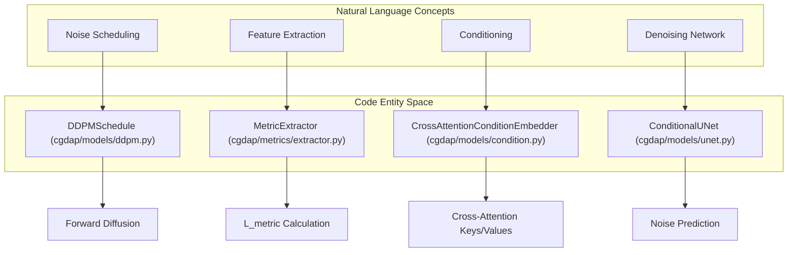
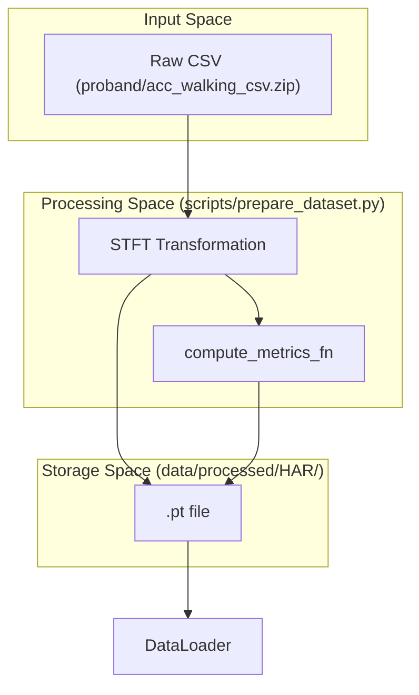

# Glossary

> **Relevant source files**
> * [README.md](https://github.com/yashwantherukulla/IoT-Data-Aug/blob/3c2a9426/README.md?plain=1)
> * [cgdap/__init__.py](https://github.com/yashwantherukulla/IoT-Data-Aug/blob/3c2a9426/cgdap/__init__.py)
> * [cgdap/augmentation/__init__.py](https://github.com/yashwantherukulla/IoT-Data-Aug/blob/3c2a9426/cgdap/augmentation/__init__.py)
> * [cgdap/evaluation/product_eval.py](https://github.com/yashwantherukulla/IoT-Data-Aug/blob/3c2a9426/cgdap/evaluation/product_eval.py)
> * [cgdap/metrics/extractor.py](https://github.com/yashwantherukulla/IoT-Data-Aug/blob/3c2a9426/cgdap/metrics/extractor.py)
> * [cgdap/models/cgdap.py](https://github.com/yashwantherukulla/IoT-Data-Aug/blob/3c2a9426/cgdap/models/cgdap.py)
> * [cgdap/models/ddpm.py](https://github.com/yashwantherukulla/IoT-Data-Aug/blob/3c2a9426/cgdap/models/ddpm.py)
> * [configs/dataset/har_dataset.yaml](https://github.com/yashwantherukulla/IoT-Data-Aug/blob/3c2a9426/configs/dataset/har_dataset.yaml)

This page provides definitions for codebase-specific terms, abbreviations, and domain concepts used in the IoT-Data-Aug (CGDAP v2.1) project. It serves as a technical reference for onboarding engineers to understand the mapping between theoretical concepts and their implementation in code.

## Core System Concepts

### CGDAP (Conditional Generative Data Augmentation Pipeline)

The overarching framework designed to augment Human Activity Recognition (HAR) datasets using diffusion models. It uses differentiable metrics to ensure that synthetic spectrograms maintain the physical characteristics of the target activities [cgdap/__init__.py L1-L3](https://github.com/yashwantherukulla/IoT-Data-Aug/blob/3c2a9426/cgdap/__init__.py#L1-L3)

### Multimodal Diffusion

A generative approach where multiple sensor streams (e.g., accelerometer and gyroscope) are generated simultaneously. In this codebase, it is implemented by the `MultimodalCGDAP` class, which manages independent denoisers for each modality while sharing a condition embedder and noise schedule [cgdap/models/cgdap.py L54-L127](https://github.com/yashwantherukulla/IoT-Data-Aug/blob/3c2a9426/cgdap/models/cgdap.py#L54-L127)

### Metric-Consistency Loss ($L_{metric}$)

A secondary training loss that enforces physical consistency. The model reconstructs an estimate of the clean spectrogram ($\hat{x}_0$), extracts metrics using the `MetricExtractor`, and computes the Mean Squared Error (MSE) against the target metrics [cgdap/models/cgdap.py L16-L19](https://github.com/yashwantherukulla/IoT-Data-Aug/blob/3c2a9426/cgdap/models/cgdap.py#L16-L19)

## Technical Terms & Abbreviations

| Term | Definition | Code Reference |
| --- | --- | --- |
| **Acc / Gyr** | Accelerometer and Gyroscope sensor modalities. | [configs/dataset/har_dataset.yaml L15-L17](https://github.com/yashwantherukulla/IoT-Data-Aug/blob/3c2a9426/configs/dataset/har_dataset.yaml#L15-L17) |
| **AdaGN** | Adaptive Group Normalization; used to inject timestep embeddings into the UNet. | [cgdap/models/unet.py L14-L25](https://github.com/yashwantherukulla/IoT-Data-Aug/blob/3c2a9426/cgdap/models/unet.py#L14-L25) |
| **F0 Amplitude** | Fundamental frequency amplitude calculated via Harmonic Product Spectrum (HPS). | [cgdap/metrics/extractor.py L43-L81](https://github.com/yashwantherukulla/IoT-Data-Aug/blob/3c2a9426/cgdap/metrics/extractor.py#L43-L81) |
| **HPS** | Harmonic Product Spectrum; a technique for pitch detection used in metric extraction. | [cgdap/metrics/extractor.py L49-L56](https://github.com/yashwantherukulla/IoT-Data-Aug/blob/3c2a9426/cgdap/metrics/extractor.py#L49-L56) |
| **L_G** | Generation Loss; the standard diffusion MSE between predicted and actual noise. | [cgdap/models/cgdap.py L15](https://github.com/yashwantherukulla/IoT-Data-Aug/blob/3c2a9426/cgdap/models/cgdap.py#L15-L15) |
| **Proband** | A subject or participant in the RealWorld HAR dataset. | [README.md L89-L93](https://github.com/yashwantherukulla/IoT-Data-Aug/blob/3c2a9426/README.md?plain=1#L89-L93) |
| **x0 / xt** | $x_0$ refers to the clean data; $x_t$ refers to data at noise scale $t$. | [cgdap/models/ddpm.py L82-L93](https://github.com/yashwantherukulla/IoT-Data-Aug/blob/3c2a9426/cgdap/models/ddpm.py#L82-L93) |

**Sources:** [cgdap/models/cgdap.py L1-L127](https://github.com/yashwantherukulla/IoT-Data-Aug/blob/3c2a9426/cgdap/models/cgdap.py#L1-L127)

 [cgdap/metrics/extractor.py L1-L81](https://github.com/yashwantherukulla/IoT-Data-Aug/blob/3c2a9426/cgdap/metrics/extractor.py#L1-L81)

 [README.md L1-L100](https://github.com/yashwantherukulla/IoT-Data-Aug/blob/3c2a9426/README.md?plain=1#L1-L100)

## Architecture & Data Flow Diagrams

### Natural Language to Code Entity Mapping: Training Logic

The following diagram maps high-level training concepts to the specific classes and functions that implement them.

**Sources:** [cgdap/models/cgdap.py L36-L50](https://github.com/yashwantherukulla/IoT-Data-Aug/blob/3c2a9426/cgdap/models/cgdap.py#L36-L50)

 [cgdap/models/ddpm.py L18-L36](https://github.com/yashwantherukulla/IoT-Data-Aug/blob/3c2a9426/cgdap/models/ddpm.py#L18-L36)

 [cgdap/metrics/extractor.py L148-L182](https://github.com/yashwantherukulla/IoT-Data-Aug/blob/3c2a9426/cgdap/metrics/extractor.py#L148-L182)

### Data Flow: From Raw Sensor to Processed Spectrogram

This diagram illustrates how raw CSV data is transformed into the `.pt` files used by the `PairedDataset`.

**Sources:** [README.md L107-L135](https://github.com/yashwantherukulla/IoT-Data-Aug/blob/3c2a9426/README.md?plain=1#L107-L135)

 [configs/dataset/har_dataset.yaml L40-L47](https://github.com/yashwantherukulla/IoT-Data-Aug/blob/3c2a9426/configs/dataset/har_dataset.yaml#L40-L47)

 [cgdap/metrics/extractor.py L127-L141](https://github.com/yashwantherukulla/IoT-Data-Aug/blob/3c2a9426/cgdap/metrics/extractor.py#L127-L141)

## Domain Concepts

### Augmentation Modes

The system supports three distinct methods for generating target metrics for synthetic samples:

1. **Interpolation**: Mixes metrics from two real samples of the same activity using a Beta distribution [cgdap/evaluation/product_eval.py L101-L102](https://github.com/yashwantherukulla/IoT-Data-Aug/blob/3c2a9426/cgdap/evaluation/product_eval.py#L101-L102)
2. **Disturbance**: Applies uniform random noise to the metrics of a reference sample [README.md L192-L195](https://github.com/yashwantherukulla/IoT-Data-Aug/blob/3c2a9426/README.md?plain=1#L192-L195)
3. **Domain Instruction**: Uses expert-defined metric ranges for specific activities [README.md L200-L201](https://github.com/yashwantherukulla/IoT-Data-Aug/blob/3c2a9426/README.md?plain=1#L200-L201)

### Metric Extraction (Differentiable)

The `MetricExtractor` implements five metrics designed to be differentiable to allow backpropagation through the $L_{metric}$ loss:

* **Temporal Range**: Difference between max and min of frequency-mean amplitude [cgdap/metrics/extractor.py L34-L40](https://github.com/yashwantherukulla/IoT-Data-Aug/blob/3c2a9426/cgdap/metrics/extractor.py#L34-L40)
* **F0 Amplitude**: Weighted average amplitude at the fundamental frequency using soft-argmax [cgdap/metrics/extractor.py L76-L80](https://github.com/yashwantherukulla/IoT-Data-Aug/blob/3c2a9426/cgdap/metrics/extractor.py#L76-L80)
* **Contrast**: Difference between the top and bottom 5% of frequency bins [cgdap/metrics/extractor.py L83-L98](https://github.com/yashwantherukulla/IoT-Data-Aug/blob/3c2a9426/cgdap/metrics/extractor.py#L83-L98)
* **Flatness**: Ratio of geometric mean to arithmetic mean [cgdap/metrics/extractor.py L101-L109](https://github.com/yashwantherukulla/IoT-Data-Aug/blob/3c2a9426/cgdap/metrics/extractor.py#L101-L109)
* **Entropy**: Shannon entropy of the normalized spectrogram [cgdap/metrics/extractor.py L112-L119](https://github.com/yashwantherukulla/IoT-Data-Aug/blob/3c2a9426/cgdap/metrics/extractor.py#L112-L119)

### Product Evaluator

A diagnostic tool (`ProductEvaluator`) that runs during training to track the quality of synthetic data. It calculates metrics such as `pair_rmse` (how well the model follows metric targets) and `nn_distance` (how close synthetic samples are to the real training manifold) [cgdap/evaluation/product_eval.py L63-L109](https://github.com/yashwantherukulla/IoT-Data-Aug/blob/3c2a9426/cgdap/evaluation/product_eval.py#L63-L109)

**Sources:** [cgdap/metrics/extractor.py L1-L120](https://github.com/yashwantherukulla/IoT-Data-Aug/blob/3c2a9426/cgdap/metrics/extractor.py#L1-L120)

 [cgdap/evaluation/product_eval.py L1-L109](https://github.com/yashwantherukulla/IoT-Data-Aug/blob/3c2a9426/cgdap/evaluation/product_eval.py#L1-L109)

 [README.md L190-L205](https://github.com/yashwantherukulla/IoT-Data-Aug/blob/3c2a9426/README.md?plain=1#L190-L205)