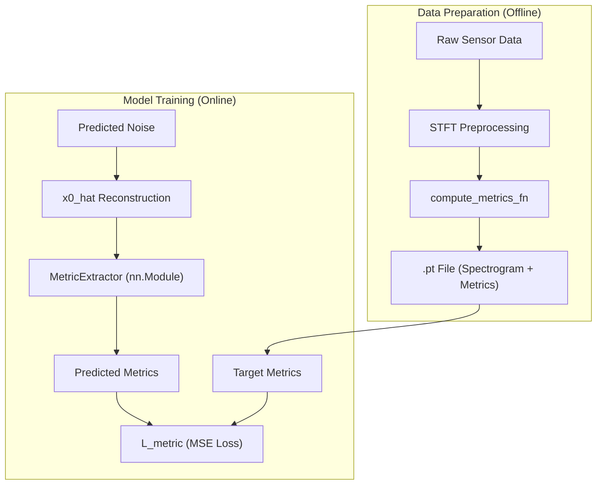
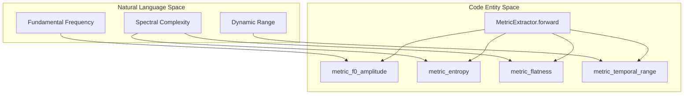

# Metric Extraction

> **Relevant source files**
> * [cgdap/metrics/__init__.py](https://github.com/yashwantherukulla/IoT-Data-Aug/blob/3c2a9426/cgdap/metrics/__init__.py)
> * [cgdap/metrics/extractor.py](https://github.com/yashwantherukulla/IoT-Data-Aug/blob/3c2a9426/cgdap/metrics/extractor.py)
> * [configs/dataset/har_dataset.yaml](https://github.com/yashwantherukulla/IoT-Data-Aug/blob/3c2a9426/configs/dataset/har_dataset.yaml)

The Metric Extraction system is a critical component of the CGDAP framework, providing a bridge between raw signal characteristics and the generative model's conditioning space. It defines five differentiable metrics that capture the physical and statistical properties of Human Activity Recognition (HAR) signals. These metrics are used in two distinct phases: during **preprocessing** to label real data, and during **training** to calculate the Metric-Consistency Loss ($L_{metric}$).

### High-Level Metric Overview

The system extracts five specific metrics from log-magnitude spectrograms. These metrics are designed to be differentiable, allowing gradients to flow from the loss function back through the metric extraction process to the denoiser network.

| Metric | Code Entity | Description |
| --- | --- | --- |
| **Temporal Range** | `metric_temporal_range` | Measures the dynamic range of the signal's mean amplitude over time. |
| **F0 Amplitude** | `metric_f0_amplitude` | Captures the strength of the fundamental frequency using Harmonic Product Spectrum (HPS). |
| **Contrast** | `metric_contrast` | The difference between the highest and lowest energy peaks in the spectrogram. |
| **Flatness** | `metric_flatness` | Spectral flatness (Wiener entropy), indicating how noise-like or resonant the signal is. |
| **Entropy** | `metric_entropy` | Shannon entropy of the normalized spectrogram bins, measuring information complexity. |

**Sources:**

* [cgdap/metrics/extractor.py L11-L17](https://github.com/yashwantherukulla/IoT-Data-Aug/blob/3c2a9426/cgdap/metrics/extractor.py#L11-L17)
* [cgdap/metrics/extractor.py L158](https://github.com/yashwantherukulla/IoT-Data-Aug/blob/3c2a9426/cgdap/metrics/extractor.py#L158-L158)

### System Architecture: Preprocessing vs. Training

The metric extraction logic is implemented in two ways: a functional API for efficient offline preprocessing and a batched `nn.Module` for integration into the PyTorch training graph.

#### Metric Extraction Flow

**Sources:**

* [cgdap/metrics/extractor.py L127-L140](https://github.com/yashwantherukulla/IoT-Data-Aug/blob/3c2a9426/cgdap/metrics/extractor.py#L127-L140)
* [cgdap/metrics/extractor.py L148-L191](https://github.com/yashwantherukulla/IoT-Data-Aug/blob/3c2a9426/cgdap/metrics/extractor.py#L148-L191)

### Functional API and Preprocessing

During the initial data pipeline execution, the `compute_metrics_fn` is used to extract ground-truth metrics for every real spectrogram. This function operates on 2D tensors `[F, T]` and utilizes configuration parameters defined in `har_dataset.yaml`, such as HPS harmonics and soft-argmax temperatures.

For details on how these metrics are stored in the dataset, see [Spectrogram Preprocessing](/yashwantherukulla/IoT-Data-Aug/2.2-spectrogram-preprocessing).

**Sources:**

* [cgdap/metrics/extractor.py L127-L140](https://github.com/yashwantherukulla/IoT-Data-Aug/blob/3c2a9426/cgdap/metrics/extractor.py#L127-L140)
* [configs/dataset/har_dataset.yaml L49-L64](https://github.com/yashwantherukulla/IoT-Data-Aug/blob/3c2a9426/configs/dataset/har_dataset.yaml#L49-L64)

### MetricExtractor Module

The `MetricExtractor` class is a wrapper that enables batched processing of 4D spectrogram tensors `[B, 3, F, T]`. It averages the three sensor axes (X, Y, Z) into a single 2D representation before calculating the five metrics for each sample in the batch. This module is instantiated within the `MultimodalCGDAP` wrapper to facilitate the $L_{metric}$ calculation.

For details on the batched implementation and differentiability, see [MetricExtractor Module](/yashwantherukulla/IoT-Data-Aug/4.1-metricextractor-module).

**Sources:**

* [cgdap/metrics/extractor.py L148-L183](https://github.com/yashwantherukulla/IoT-Data-Aug/blob/3c2a9426/cgdap/metrics/extractor.py#L148-L183)
* [cgdap/metrics/extractor.py L192-L200](https://github.com/yashwantherukulla/IoT-Data-Aug/blob/3c2a9426/cgdap/metrics/extractor.py#L192-L200)

### Metric-Consistency Loss ($L_{metric}$)

The $L_{metric}$ ensures that the synthetic data generated by the model actually possesses the physical characteristics requested by the conditioning input. By re-extracting metrics from the reconstructed sample ($\hat{x}_0$) during the diffusion process, the model is penalized if the generated "walking" signal, for instance, lacks the expected "Temporal Range" or "F0 Amplitude" of a real walking signal.

For details on the loss calculation and adaptive weighting, see [Metric-Consistency Loss (L_metric)](/yashwantherukulla/IoT-Data-Aug/4.2-metric-consistency-loss-(l_metric)).

### Code Entity Mapping

The following diagram maps the logical metric concepts to their specific implementations within the `cgdap.metrics.extractor` module.

#### Metric Logic to Code Mapping

**Sources:**

* [cgdap/metrics/extractor.py L34-L120](https://github.com/yashwantherukulla/IoT-Data-Aug/blob/3c2a9426/cgdap/metrics/extractor.py#L34-L120)
* [cgdap/metrics/extractor.py L183-L200](https://github.com/yashwantherukulla/IoT-Data-Aug/blob/3c2a9426/cgdap/metrics/extractor.py#L183-L200)