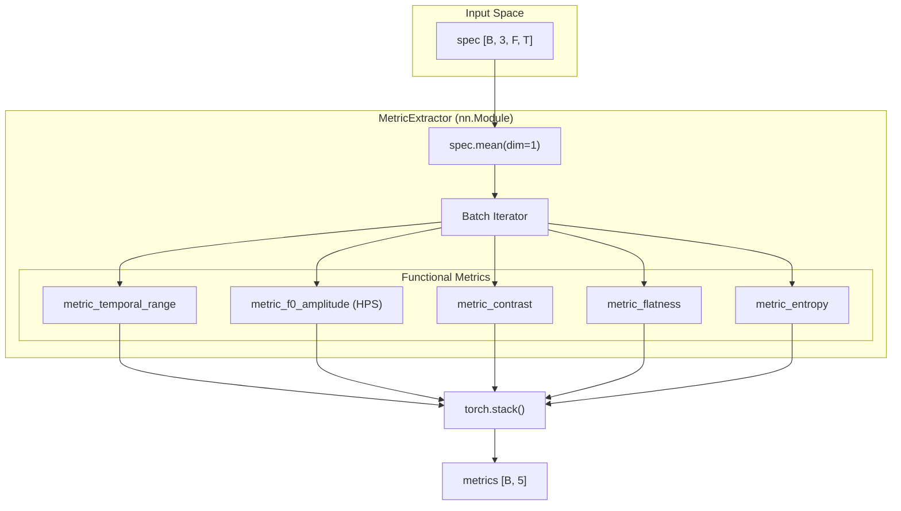
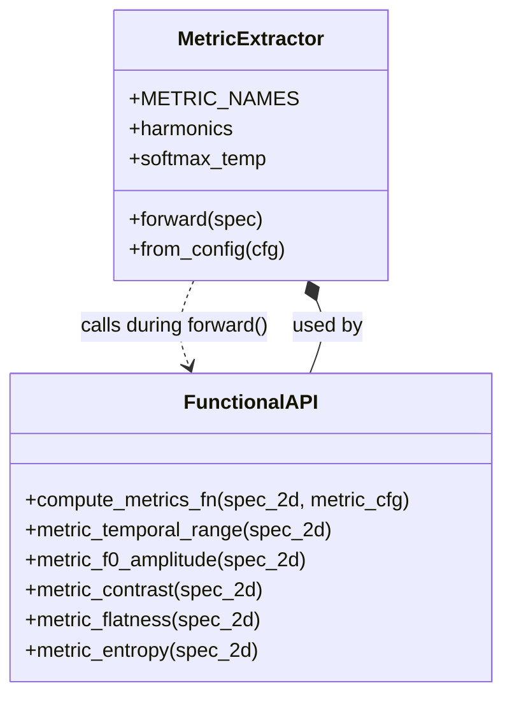

# MetricExtractor Module

> **Relevant source files**
> * [cgdap/metrics/__init__.py](https://github.com/yashwantherukulla/IoT-Data-Aug/blob/3c2a9426/cgdap/metrics/__init__.py)
> * [cgdap/metrics/extractor.py](https://github.com/yashwantherukulla/IoT-Data-Aug/blob/3c2a9426/cgdap/metrics/extractor.py)

The `MetricExtractor` module provides a differentiable pipeline for calculating five key physical metrics from Human Activity Recognition (HAR) spectrograms. It is designed to bridge the gap between raw signal features and high-level conditioning, supporting both static preprocessing and dynamic loss calculation during model training.

### Purpose and Scope

The module serves two primary roles:

1. **Preprocessing**: A functional API (`compute_metrics_fn`) extracts ground-truth metrics from raw sensor data during the STFT pipeline [cgdap/metrics/extractor.py L7-L142](https://github.com/yashwantherukulla/IoT-Data-Aug/blob/3c2a9426/cgdap/metrics/extractor.py#L7-L142)
2. **Training**: An `nn.Module` wrapper (`MetricExtractor`) allows for a batched, differentiable forward pass. This enables the calculation of the Metric-Consistency Loss ($L_{metric}$), where the gradient can flow from the extracted metrics back through the denoiser to improve generative fidelity [cgdap/metrics/extractor.py L3-L191](https://github.com/yashwantherukulla/IoT-Data-Aug/blob/3c2a9426/cgdap/metrics/extractor.py#L3-L191)

---

### Architecture and Data Flow

The `MetricExtractor` operates on 4D spectrogram tensors. It first collapses the channel dimension (e.g., X, Y, Z axes of an accelerometer) via averaging before computing the specific metrics for each sample in the batch.

#### Data Flow Diagram

"Metric Extraction Pipeline"

**Sources:** [cgdap/metrics/extractor.py L183-L205](https://github.com/yashwantherukulla/IoT-Data-Aug/blob/3c2a9426/cgdap/metrics/extractor.py#L183-L205)

---

### Metric Implementations

The module implements five specific metrics derived from audio and signal processing literature, adapted for HAR data.

| Metric | Definition | Implementation Detail |
| --- | --- | --- |
| **Temporal Range** | $max(A_t) - min(A_t)$ | Computes max-min of frequency-mean amplitude across the time axis [cgdap/metrics/extractor.py L34-L40](https://github.com/yashwantherukulla/IoT-Data-Aug/blob/3c2a9426/cgdap/metrics/extractor.py#L34-L40) |
| **F0 Amplitude** | Harmonic Product Spectrum | Uses bilinear downsampling for harmonic ratios and soft-argmax for differentiable peak finding [cgdap/metrics/extractor.py L43-L80](https://github.com/yashwantherukulla/IoT-Data-Aug/blob/3c2a9426/cgdap/metrics/extractor.py#L43-L80) |
| **Contrast** | Peak-to-Valley ratio | Mean of the top 5% minus the mean of the bottom 5% of all spectrogram bins [cgdap/metrics/extractor.py L83-L98](https://github.com/yashwantherukulla/IoT-Data-Aug/blob/3c2a9426/cgdap/metrics/extractor.py#L83-L98) |
| **Flatness** | $G_{mean} / A_{mean}$ | Ratio of the geometric mean to the arithmetic mean of the spectrum [cgdap/metrics/extractor.py L101-L109](https://github.com/yashwantherukulla/IoT-Data-Aug/blob/3c2a9426/cgdap/metrics/extractor.py#L101-L109) |
| **Entropy** | Shannon Entropy | Normalized bin distribution entropy: $-\sum p \log_2(p)$ [cgdap/metrics/extractor.py L112-L119](https://github.com/yashwantherukulla/IoT-Data-Aug/blob/3c2a9426/cgdap/metrics/extractor.py#L112-L119) |

#### F0 Amplitude via Harmonic Product Spectrum (HPS)

The `metric_f0_amplitude` function is the most complex component. It ensures differentiability by using `F.interpolate` with `mode="bilinear"` to downsample the spectrum for harmonic alignment [cgdap/metrics/extractor.py L67-L72](https://github.com/yashwantherukulla/IoT-Data-Aug/blob/3c2a9426/cgdap/metrics/extractor.py#L67-L72)

 A `softmax` with a configurable temperature (`softmax_temp`) acts as a soft-argmax to select the dominant frequency peak without breaking the gradient chain [cgdap/metrics/extractor.py L77-L80](https://github.com/yashwantherukulla/IoT-Data-Aug/blob/3c2a9426/cgdap/metrics/extractor.py#L77-L80)

**Sources:** [cgdap/metrics/extractor.py L43-L81](https://github.com/yashwantherukulla/IoT-Data-Aug/blob/3c2a9426/cgdap/metrics/extractor.py#L43-L81)

 [cgdap/metrics/extractor.py L12-L16](https://github.com/yashwantherukulla/IoT-Data-Aug/blob/3c2a9426/cgdap/metrics/extractor.py#L12-L16)

---

### Code Entity Map

This diagram maps the logical metric concepts to the specific functions and classes within the `cgdap/metrics/extractor.py` file.

"Metric System Code Map"

**Sources:** [cgdap/metrics/extractor.py L127-L142](https://github.com/yashwantherukulla/IoT-Data-Aug/blob/3c2a9426/cgdap/metrics/extractor.py#L127-L142)

 [cgdap/metrics/extractor.py L148-L205](https://github.com/yashwantherukulla/IoT-Data-Aug/blob/3c2a9426/cgdap/metrics/extractor.py#L148-L205)

---

### Configuration and Initialization

The `MetricExtractor` is typically instantiated via the `from_config` factory method, which pulls parameters from the `dataset.metrics` block of the Hydra configuration [cgdap/metrics/extractor.py L174-L181](https://github.com/yashwantherukulla/IoT-Data-Aug/blob/3c2a9426/cgdap/metrics/extractor.py#L174-L181)

**Key Parameters:**

* `harmonics`: Ratios for HPS (default: `[1.0, 0.5, 0.25]`) [cgdap/metrics/extractor.py L168](https://github.com/yashwantherukulla/IoT-Data-Aug/blob/3c2a9426/cgdap/metrics/extractor.py#L168-L168)
* `softmax_temp`: Controls the sharpness of the F0 peak selection (default: `0.1`) [cgdap/metrics/extractor.py L169](https://github.com/yashwantherukulla/IoT-Data-Aug/blob/3c2a9426/cgdap/metrics/extractor.py#L169-L169)
* `contrast_tail_ratio`: Fraction of bins used for contrast calculation (default: `0.05`) [cgdap/metrics/extractor.py L170](https://github.com/yashwantherukulla/IoT-Data-Aug/blob/3c2a9426/cgdap/metrics/extractor.py#L170-L170)
* `eps`: Numerical stability epsilon for `log` and division operations (default: `1e-10`) [cgdap/metrics/extractor.py L26-L171](https://github.com/yashwantherukulla/IoT-Data-Aug/blob/3c2a9426/cgdap/metrics/extractor.py#L26-L171)

**Sources:** [cgdap/metrics/extractor.py L160-L181](https://github.com/yashwantherukulla/IoT-Data-Aug/blob/3c2a9426/cgdap/metrics/extractor.py#L160-L181)