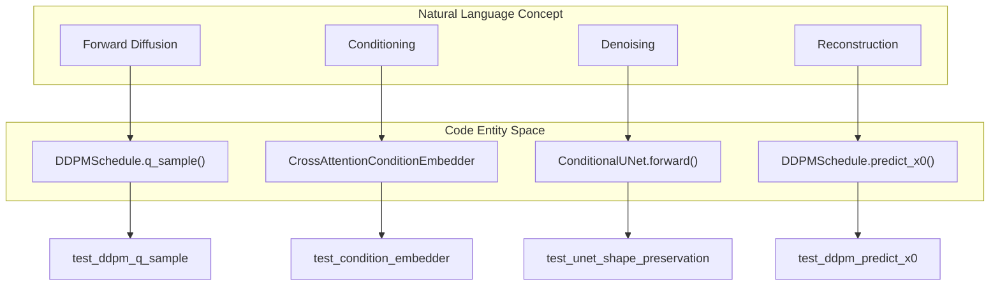
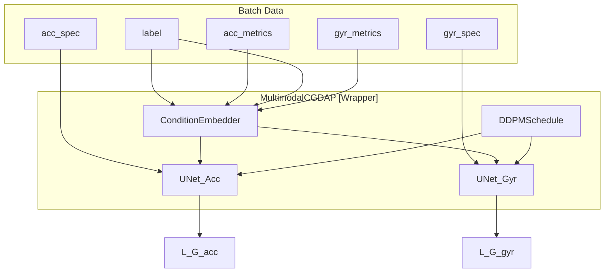

# Model and Metrics Tests

> **Relevant source files**
> * [cgdap/models/base.py](https://github.com/yashwantherukulla/IoT-Data-Aug/blob/3c2a9426/cgdap/models/base.py)
> * [tests/test_metrics.py](https://github.com/yashwantherukulla/IoT-Data-Aug/blob/3c2a9426/tests/test_metrics.py)
> * [tests/test_models.py](https://github.com/yashwantherukulla/IoT-Data-Aug/blob/3c2a9426/tests/test_models.py)

This page documents the unit and integration tests for the core generative architecture and the differentiable metric extraction system. These tests ensure that the diffusion components (UNet, Schedule, Embedder) maintain mathematical correctness, shape preservation, and differentiability, while verifying the multi-modal synchronization logic in the `MultimodalCGDAP` wrapper.

## Model Component Tests

The tests in `tests/test_models.py` focus on the structural integrity of the diffusion pipeline. They verify that each sub-component (Noise Schedule, Condition Embedder, and Denoiser) adheres to the interfaces defined in `cgdap/models/base.py` [cgdap/models/base.py L26-L125](https://github.com/yashwantherukulla/IoT-Data-Aug/blob/3c2a9426/cgdap/models/base.py#L26-L125)

### Diffusion Building Blocks

The suite validates individual components of the generative system:

* **`CrossAttentionBlock`**: Ensures that spatial features and condition tokens are correctly fused without altering the spatial feature dimensions [tests/test_models.py L17-L22](https://github.com/yashwantherukulla/IoT-Data-Aug/blob/3c2a9426/tests/test_models.py#L17-L22)
* **`CrossAttentionConditionEmbedder`**: Verifies that the concatenation of projected metrics and one-hot labels results in the expected sequence of condition tokens [tests/test_models.py L25-L31](https://github.com/yashwantherukulla/IoT-Data-Aug/blob/3c2a9426/tests/test_models.py#L25-L31)
* **`ConditionalUNet`**: A shape-preservation test that confirms the output noise prediction matches the input spectrogram dimensions [B, C, F, T] across various channel multipliers and attention depths [tests/test_models.py L34-L40](https://github.com/yashwantherukulla/IoT-Data-Aug/blob/3c2a9426/tests/test_models.py#L34-L40)
* **`DDPMSchedule`**: Validates the forward diffusion process (`q_sample`) and the ability to reconstruct an $x_0$ estimate from noisy samples and predicted noise (`predict_x0`) [tests/test_models.py L43-L59](https://github.com/yashwantherukulla/IoT-Data-Aug/blob/3c2a9426/tests/test_models.py#L43-L59)

### Natural Language to Code Entity Mapping: Diffusion Components

The following diagram maps the conceptual diffusion steps to the specific classes and methods tested in the suite.

**Figure 1: Diffusion Entity Mapping**

Sources: [tests/test_models.py L25-L59](https://github.com/yashwantherukulla/IoT-Data-Aug/blob/3c2a9426/tests/test_models.py#L25-L59)

 [cgdap/models/base.py L26-L125](https://github.com/yashwantherukulla/IoT-Data-Aug/blob/3c2a9426/cgdap/models/base.py#L26-L125)

## Multimodal Integration Tests

The integration tests verify the `MultimodalCGDAP` wrapper, which orchestrates multiple denoisers (e.g., one for Accelerometer, one for Gyroscope) and a shared condition embedder.

### Training Pass and Loss Computation

The `test_cgdap_forward_backward` function performs a full smoke test of the training step. It passes a mock batch containing multiple modalities through the model to ensure:

1. The generator loss ($L_G$) is computed for every modality [tests/test_models.py L84-L85](https://github.com/yashwantherukulla/IoT-Data-Aug/blob/3c2a9426/tests/test_models.py#L84-L85)
2. The metric-consistency loss ($L_{metric}$) is computed for every individual metric [tests/test_models.py L86-L87](https://github.com/yashwantherukulla/IoT-Data-Aug/blob/3c2a9426/tests/test_models.py#L86-L87)
3. The total loss is differentiable and backpropagation does not result in `NaN` gradients [tests/test_models.py L89-L90](https://github.com/yashwantherukulla/IoT-Data-Aug/blob/3c2a9426/tests/test_models.py#L89-L90)

### Deterministic Multi-Modality Sampling

A critical requirement for multimodal synchronization is that both modalities (Acc and Gyr) receive the same noise seed during generation if intended, or specific offsets to maintain variety. `test_cgdap_sample_offsets_seeds_per_modality` uses a `monkeypatch` to intercept the sampling loop and verify that seeds are incremented correctly across modalities (e.g., seed 123 for Acc, 124 for Gyr) to ensure reproducible but distinct noise patterns [tests/test_models.py L122-L155](https://github.com/yashwantherukulla/IoT-Data-Aug/blob/3c2a9426/tests/test_models.py#L122-L155)

### Entity Association: Multimodal Logic

The diagram below illustrates how the `MultimodalCGDAP` class manages the data flow between its sub-modules during a test execution.

**Figure 2: Multimodal Logic Flow**

Sources: [tests/test_models.py L61-L91](https://github.com/yashwantherukulla/IoT-Data-Aug/blob/3c2a9426/tests/test_models.py#L61-L91)

 [cgdap/models/cgdap.py](https://github.com/yashwantherukulla/IoT-Data-Aug/blob/3c2a9426/cgdap/models/cgdap.py)

## Metric Extraction Tests

The tests in `tests/test_metrics.py` validate the differentiable implementation of the five HAR metrics (temporal range, f0 amplitude, contrast, flatness, and entropy).

### Differentiability and Stability

Because the metrics are used as a loss function ($L_{metric}$), they must be differentiable. `test_metric_extractor_gradients` verifies that `backward()` can be called on the extractor output and that the resulting gradients for the input spectrogram are valid [tests/test_metrics.py L25-L32](https://github.com/yashwantherukulla/IoT-Data-Aug/blob/3c2a9426/tests/test_metrics.py#L25-L32)

Additionally, `test_metric_extractor_no_nan_low_energy` ensures numerical stability by passing near-zero energy spectrograms through the extractor, checking that epsilon-padding prevents division-by-zero or `log(0)` errors in entropy and flatness calculations [tests/test_metrics.py L17-L23](https://github.com/yashwantherukulla/IoT-Data-Aug/blob/3c2a9426/tests/test_metrics.py#L17-L23)

### Functional vs. Module API

The suite verifies both the `MetricExtractor` `nn.Module` (used during training) and the `compute_metrics_fn` functional API (used during preprocessing).

* **Module**: Validates batched processing [B, C, F, T] and returns a tensor of shape [B, 5] [tests/test_metrics.py L10-L15](https://github.com/yashwantherukulla/IoT-Data-Aug/blob/3c2a9426/tests/test_metrics.py#L10-L15)
* **Functional**: Validates single-channel 2D spectrogram processing [F, T] and returns a vector of size 5 [tests/test_metrics.py L34-L41](https://github.com/yashwantherukulla/IoT-Data-Aug/blob/3c2a9426/tests/test_metrics.py#L34-L41)

| Test Case | Target | Verification |
| --- | --- | --- |
| `test_metric_extractor_output_shape` | `MetricExtractor` | Confirms `[B, 5]` output for `[B, 3, F, T]` input |
| `test_metric_extractor_gradients` | Autograd | Checks `spec.grad` is not `None` or `NaN` |
| `test_metric_extractor_no_nan` | Stability | Handles low-energy inputs without `Inf` or `NaN` |
| `test_compute_metrics_fn` | Functional API | Validates 2D input processing for preprocessing |

Sources: [tests/test_metrics.py L1-L41](https://github.com/yashwantherukulla/IoT-Data-Aug/blob/3c2a9426/tests/test_metrics.py#L1-L41)

 [cgdap/metrics/extractor.py](https://github.com/yashwantherukulla/IoT-Data-Aug/blob/3c2a9426/cgdap/metrics/extractor.py)