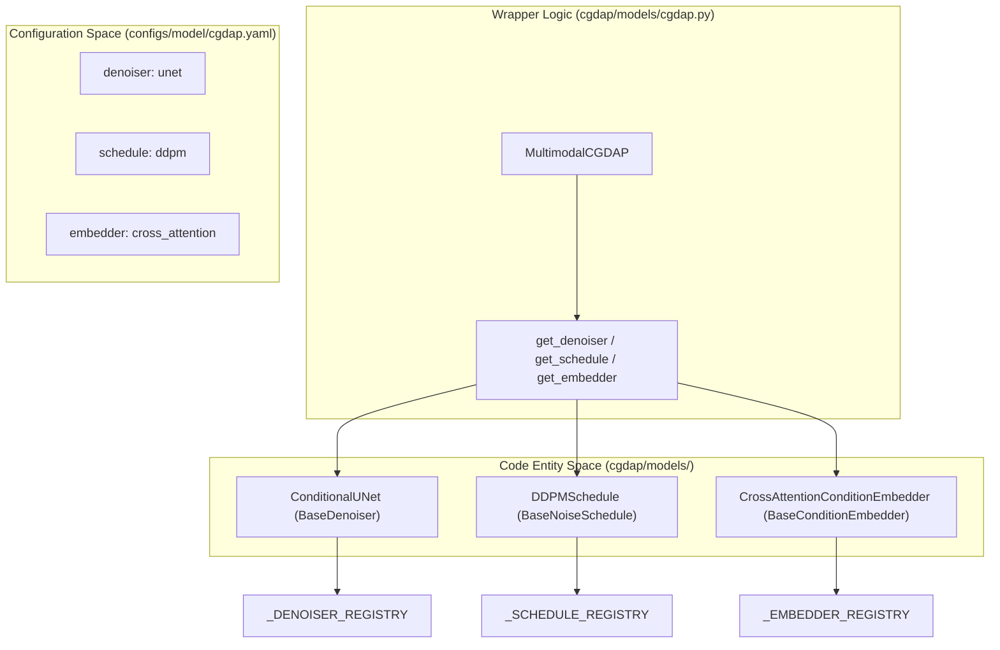
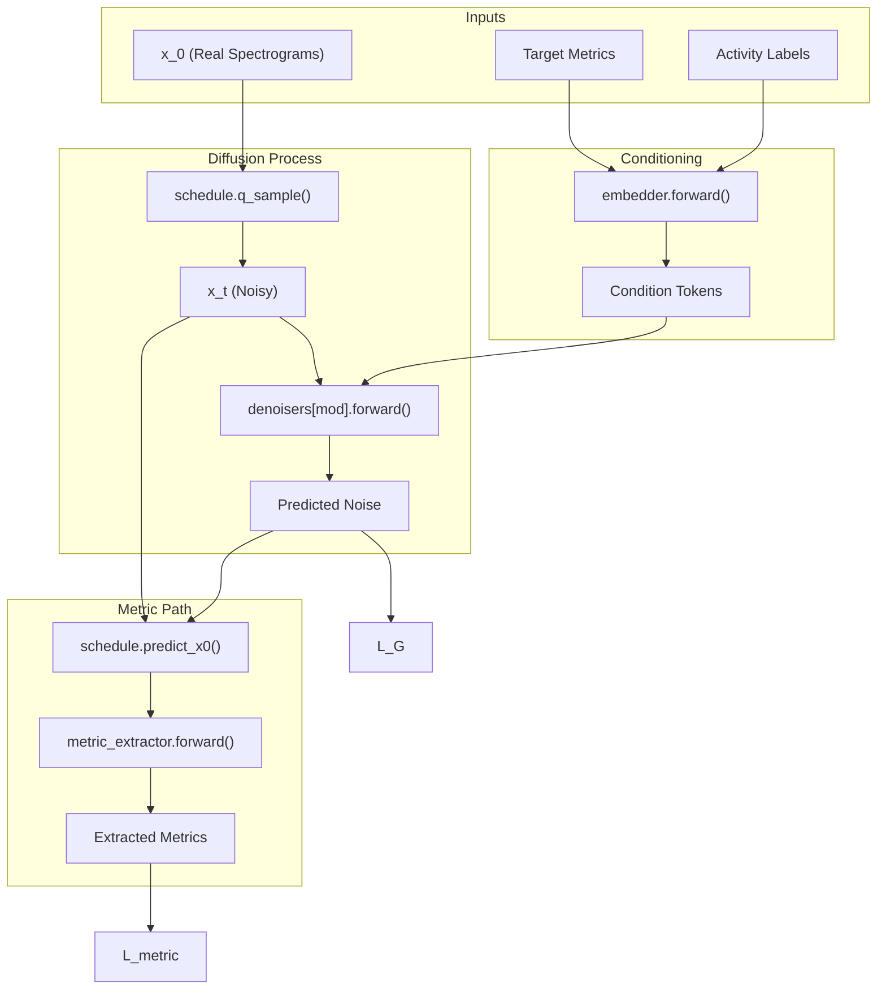

# MultimodalCGDAP Wrapper

> **Relevant source files**
> * [cgdap/models/base.py](https://github.com/yashwantherukulla/IoT-Data-Aug/blob/3c2a9426/cgdap/models/base.py)
> * [cgdap/models/cgdap.py](https://github.com/yashwantherukulla/IoT-Data-Aug/blob/3c2a9426/cgdap/models/cgdap.py)
> * [configs/model/cgdap.yaml](https://github.com/yashwantherukulla/IoT-Data-Aug/blob/3c2a9426/configs/model/cgdap.yaml)

The `MultimodalCGDAP` class serves as the top-level orchestrator for the generative system. It encapsulates multiple modality-specific denoisers while sharing a single noise schedule, condition embedder, and metric extractor. Its primary responsibility is to manage the multimodal diffusion process, compute the joint training loss ($L_{total} = L_G + L_{metric}$), and handle adaptive weighting of metric consistency terms.

## System Architecture

The wrapper is designed to be architecture-agnostic by utilizing abstract base classes defined in `cgdap/models/base.py`. It composes several key components into a unified `nn.Module`.

### Component Composition

* **Denoisers**: A `nn.ModuleDict` containing one `BaseDenoiser` instance per modality (e.g., "acc" and "gyr"). These instances do **not** share weights, allowing the model to learn modality-specific features [cgdap/models/cgdap.py L102-L106](https://github.com/yashwantherukulla/IoT-Data-Aug/blob/3c2a9426/cgdap/models/cgdap.py#L102-L106)
* **Shared Schedule**: A single `BaseNoiseSchedule` (typically `DDPMSchedule`) that governs the forward and reverse diffusion processes for all modalities [cgdap/models/cgdap.py L109](https://github.com/yashwantherukulla/IoT-Data-Aug/blob/3c2a9426/cgdap/models/cgdap.py#L109-L109)
* **Shared Embedder**: A `BaseConditionEmbedder` that transforms input metrics and activity labels into a conditioning representation (e.g., cross-attention tokens) [cgdap/models/cgdap.py L110](https://github.com/yashwantherukulla/IoT-Data-Aug/blob/3c2a9426/cgdap/models/cgdap.py#L110-L110)
* **Metric Extractor**: A `MetricExtractor` used during the training forward pass to compute differentiable metrics from reconstructed spectrograms ($x_0$ estimates) [cgdap/models/cgdap.py L113-L116](https://github.com/yashwantherukulla/IoT-Data-Aug/blob/3c2a9426/cgdap/models/cgdap.py#L113-L116)

### Code Entity Relationship

The following diagram illustrates how the `MultimodalCGDAP` wrapper bridges the high-level configuration to the specific implementation classes.

**MultimodalCGDAP Component Mapping**

Sources: [cgdap/models/cgdap.py L133-L150](https://github.com/yashwantherukulla/IoT-Data-Aug/blob/3c2a9426/cgdap/models/cgdap.py#L133-L150)

 [cgdap/models/base.py L130-L156](https://github.com/yashwantherukulla/IoT-Data-Aug/blob/3c2a9426/cgdap/models/base.py#L130-L156)

## Training Forward Pass

The `forward` method implements the dual-objective loss function. For a given batch of paired modalities, the following sequence occurs:

1. **Timestep Sampling**: A shared timestep $t$ is sampled for the entire batch to ensure temporal synchronization across modalities [cgdap/models/cgdap.py L228](https://github.com/yashwantherukulla/IoT-Data-Aug/blob/3c2a9426/cgdap/models/cgdap.py#L228-L228)
2. **Conditioning**: Activity labels and target metrics are passed through the `embedder` to create condition tokens [cgdap/models/cgdap.py L231](https://github.com/yashwantherukulla/IoT-Data-Aug/blob/3c2a9426/cgdap/models/cgdap.py#L231-L231)
3. **Noise Injection ($q$-sampling)**: For each modality $m$, Gaussian noise $\epsilon$ is added to the clean spectrogram $x_0$ to produce $x_t$ [cgdap/models/cgdap.py L241](https://github.com/yashwantherukulla/IoT-Data-Aug/blob/3c2a9426/cgdap/models/cgdap.py#L241-L241)
4. **Diffusion Loss ($L_G$)**: The modality-specific denoiser predicts the added noise. $L_G$ is the Mean Squared Error (MSE) between the predicted and actual noise [cgdap/models/cgdap.py L244-L245](https://github.com/yashwantherukulla/IoT-Data-Aug/blob/3c2a9426/cgdap/models/cgdap.py#L244-L245)
5. **Metric Consistency Loss ($L_{metric}$)**: * The model reconstructs an estimate of the original signal $\hat{x}_0$ using the `schedule.predict_x0` method [cgdap/models/cgdap.py L248](https://github.com/yashwantherukulla/IoT-Data-Aug/blob/3c2a9426/cgdap/models/cgdap.py#L248-L248) * The `metric_extractor` calculates metrics from $\hat{x}_0$ [cgdap/models/cgdap.py L251](https://github.com/yashwantherukulla/IoT-Data-Aug/blob/3c2a9426/cgdap/models/cgdap.py#L251-L251) * $L_{metric}$ is computed as the MSE between extracted metrics and target metrics [cgdap/models/cgdap.py L254](https://github.com/yashwantherukulla/IoT-Data-Aug/blob/3c2a9426/cgdap/models/cgdap.py#L254-L254)

### Data Flow Diagram

This diagram traces the flow of data through the `MultimodalCGDAP.forward` call.

**Training Forward Pass Data Flow**

Sources: [cgdap/models/cgdap.py L218-L265](https://github.com/yashwantherukulla/IoT-Data-Aug/blob/3c2a9426/cgdap/models/cgdap.py#L218-L265)

 [cgdap/models/base.py L33-L52](https://github.com/yashwantherukulla/IoT-Data-Aug/blob/3c2a9426/cgdap/models/base.py#L33-L52)

## Adaptive Metric Weighting

To balance the diffusion loss and the five distinct metric loss terms, `MultimodalCGDAP` employs an adaptive weighting scheme. This prevents any single metric from dominating the gradient or being ignored.

### EMA and Weight Updates

The model maintains two internal buffers: `metric_weights` (the active multipliers for $L_{metric}$) and `metric_loss_ema` (an Exponential Moving Average of the observed loss for each metric) [cgdap/models/cgdap.py L119-L126](https://github.com/yashwantherukulla/IoT-Data-Aug/blob/3c2a9426/cgdap/models/cgdap.py#L119-L126)

The update logic, triggered via `update_metric_weights()`, follows these steps:

1. **EMA Update**: Updates the moving average of the raw metric losses [cgdap/models/cgdap.py L326-L328](https://github.com/yashwantherukulla/IoT-Data-Aug/blob/3c2a9426/cgdap/models/cgdap.py#L326-L328)
2. **Target Calculation**: Computes the desired weight for each metric $i$ such that: $$w_i = \frac{L_G}{L_{metric, i} \cdot \text{target_ratio}}$$ where `target_ratio` (default: 10.0) defines the desired scale of $L_G$ relative to each metric term [cgdap/models/cgdap.py L334](https://github.com/yashwantherukulla/IoT-Data-Aug/blob/3c2a9426/cgdap/models/cgdap.py#L334-L334)
3. **Clamping**: Weights are clamped between `weight_min` and `weight_max` to ensure training stability [cgdap/models/cgdap.py L335](https://github.com/yashwantherukulla/IoT-Data-Aug/blob/3c2a9426/cgdap/models/cgdap.py#L335-L335)

Sources: [cgdap/models/cgdap.py L311-L336](https://github.com/yashwantherukulla/IoT-Data-Aug/blob/3c2a9426/cgdap/models/cgdap.py#L311-L336)

## Factory Initialization

The `from_config` class method is the standard way to instantiate the model using Hydra configurations. It maps configuration keys to internal constructor arguments.

| Config Key | Internal Parameter | Purpose |
| --- | --- | --- |
| `model.modalities` | `modalities` | Defines the keys for the denoiser dictionary. |
| `model.unet` | `denoiser_kwargs` | Hyperparameters for the `ConditionalUNet`. |
| `model.ddpm` | `schedule_kwargs` | Timesteps and beta schedule for `DDPMSchedule`. |
| `model.condition` | `embedder_kwargs` | Embedding dimensions and token counts. |
| `training.loss` | `metric_weight_init`, etc. | Parameters for the adaptive loss controller. |

Sources: [cgdap/models/cgdap.py L133-L196](https://github.com/yashwantherukulla/IoT-Data-Aug/blob/3c2a9426/cgdap/models/cgdap.py#L133-L196)

 [configs/model/cgdap.yaml L1-L51](https://github.com/yashwantherukulla/IoT-Data-Aug/blob/3c2a9426/configs/model/cgdap.yaml#L1-L51)