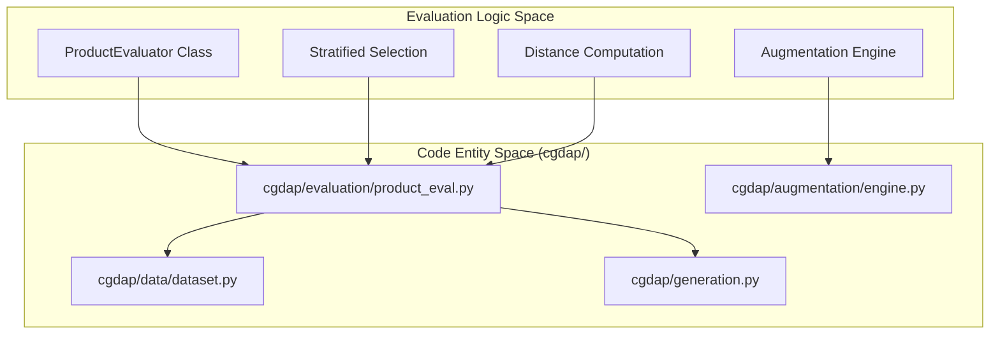
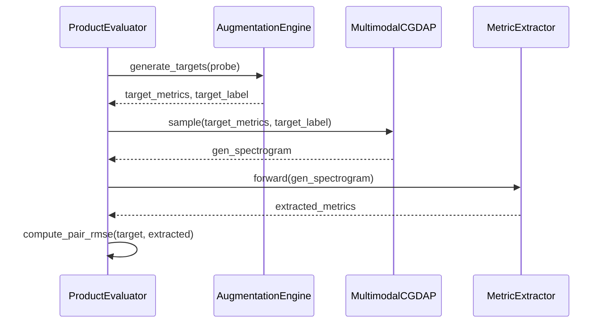

# Product Evaluator

> **Relevant source files**
> * [cgdap/evaluation/product_eval.py](https://github.com/yashwantherukulla/IoT-Data-Aug/blob/3c2a9426/cgdap/evaluation/product_eval.py)
> * [configs/evaluation/default.yaml](https://github.com/yashwantherukulla/IoT-Data-Aug/blob/3c2a9426/configs/evaluation/default.yaml)
> * [scripts/run_eval_report.py](https://github.com/yashwantherukulla/IoT-Data-Aug/blob/3c2a9426/scripts/run_eval_report.py)
> * [tests/test_product_eval.py](https://github.com/yashwantherukulla/IoT-Data-Aug/blob/3c2a9426/tests/test_product_eval.py)

The `ProductEvaluator` is a diagnostic tool designed for live monitoring of generative quality during the training lifecycle. Unlike downstream classifier-based evaluation, it provides per-epoch metrics that measure the fidelity of synthetic samples relative to their conditioning targets and their statistical alignment with the real data distribution.

### Overview and Purpose

The primary goal of the `ProductEvaluator` is to provide a "product-level" view of the model's performance without requiring a full downstream training run. It achieves this by:

1. **Stratified Probing**: Selecting a deterministic subset of validation data to ensure consistent cross-epoch comparisons [cgdap/evaluation/product_eval.py L21-L42](https://github.com/yashwantherukulla/IoT-Data-Aug/blob/3c2a9426/cgdap/evaluation/product_eval.py#L21-L42)
2. **Synthetic Generation**: Using the current state of the generator to produce samples based on three augmentation modes: interpolation, disturbance, or domain instruction [cgdap/evaluation/product_eval.py L100-L102](https://github.com/yashwantherukulla/IoT-Data-Aug/blob/3c2a9426/cgdap/evaluation/product_eval.py#L100-L102)
3. **Fidelity & Diversity Analysis**: Computing distance metrics in the "metric space" (the 5-dimensional HAR feature space) rather than the raw pixel/spectrogram space.

### System Architecture

The following diagram illustrates how the `ProductEvaluator` bridges the gap between the high-level evaluation requirements and the specific code entities responsible for data handling and generation.

**Figure 1: Product Evaluator Code-Entity Mapping**



Sources: [cgdap/evaluation/product_eval.py L63-L72](https://github.com/yashwantherukulla/IoT-Data-Aug/blob/3c2a9426/cgdap/evaluation/product_eval.py#L63-L72)

 [cgdap/augmentation/engine.py L1-L20](https://github.com/yashwantherukulla/IoT-Data-Aug/blob/3c2a9426/cgdap/augmentation/engine.py#L1-L20)

 [cgdap/generation.py L1-L50](https://github.com/yashwantherukulla/IoT-Data-Aug/blob/3c2a9426/cgdap/generation.py#L1-L50)

---

### Implementation Details

#### 1. Stratified Probe Selection

To ensure that per-epoch metrics are comparable, the evaluator selects a fixed set of "probes" from the validation split. The function `select_stratified_indices` groups the dataset by activity and samples a fixed number of indices (`samples_per_activity`) using a deterministic seed [cgdap/evaluation/product_eval.py L21-L42](https://github.com/yashwantherukulla/IoT-Data-Aug/blob/3c2a9426/cgdap/evaluation/product_eval.py#L21-L42)

#### 2. Real Data Banks

Upon initialization, the evaluator builds "Real Banks" for both training and validation sets. These banks contain:

* **Standardized Pairs**: Concatenated metrics from all modalities, standardized using global mean and variance [cgdap/evaluation/product_eval.py L145-L149](https://github.com/yashwantherukulla/IoT-Data-Aug/blob/3c2a9426/cgdap/evaluation/product_eval.py#L145-L149)
* **Centroids**: Per-activity means in the standardized metric space, used for drift detection [cgdap/evaluation/product_eval.py L155-L161](https://github.com/yashwantherukulla/IoT-Data-Aug/blob/3c2a9426/cgdap/evaluation/product_eval.py#L155-L161)

#### 3. Generation Workflow

During each evaluation call (typically every epoch), the evaluator:

1. Iterates through `probe_samples`.
2. Invokes `AugmentationEngine.generate_targets()` to create conditioning vectors [cgdap/evaluation/product_eval.py L213-L220](https://github.com/yashwantherukulla/IoT-Data-Aug/blob/3c2a9426/cgdap/evaluation/product_eval.py#L213-L220)
3. Calls `model.sample()` to generate synthetic spectrograms [cgdap/evaluation/product_eval.py L230-L241](https://github.com/yashwantherukulla/IoT-Data-Aug/blob/3c2a9426/cgdap/evaluation/product_eval.py#L230-L241)
4. Extracts metrics from the generated output using the `MetricExtractor` [cgdap/evaluation/product_eval.py L246-L250](https://github.com/yashwantherukulla/IoT-Data-Aug/blob/3c2a9426/cgdap/evaluation/product_eval.py#L246-L250)

**Figure 2: Data Flow for Metric Computation**



Sources: [cgdap/evaluation/product_eval.py L213-L250](https://github.com/yashwantherukulla/IoT-Data-Aug/blob/3c2a9426/cgdap/evaluation/product_eval.py#L213-L250)

 [cgdap/augmentation/engine.py L120-L140](https://github.com/yashwantherukulla/IoT-Data-Aug/blob/3c2a9426/cgdap/augmentation/engine.py#L120-L140)

---

### Core Metrics

The evaluator computes several key diagnostics to assess the quality of the generative process:

| Metric | Definition | Purpose |
| --- | --- | --- |
| **pair_rmse** | Root Mean Square Error between target metrics and extracted metrics [cgdap/evaluation/product_eval.py L321](https://github.com/yashwantherukulla/IoT-Data-Aug/blob/3c2a9426/cgdap/evaluation/product_eval.py#L321-L321) | Measures how well the model follows the specific conditioning values. |
| **nn_distance_val_mean** | Average L2 distance between synthetic samples and their nearest neighbor in the validation bank [cgdap/evaluation/product_eval.py L330](https://github.com/yashwantherukulla/IoT-Data-Aug/blob/3c2a9426/cgdap/evaluation/product_eval.py#L330-L330) | Measures fidelity to the real data distribution. |
| **nn_distance_gap** | `nn_dist_val - nn_dist_train` [cgdap/evaluation/product_eval.py L331](https://github.com/yashwantherukulla/IoT-Data-Aug/blob/3c2a9426/cgdap/evaluation/product_eval.py#L331-L331) | Detects "memorization" (overfitting) if the synthetic samples are significantly closer to train than val. |
| **coverage_unique_nn_ratio** | Ratio of unique real samples that are the nearest neighbor to at least one synthetic sample [cgdap/evaluation/product_eval.py L333](https://github.com/yashwantherukulla/IoT-Data-Aug/blob/3c2a9426/cgdap/evaluation/product_eval.py#L333-L333) | Measures diversity and detects mode collapse. |
| **std_ratio** | Ratio of synthetic metric standard deviation to real metric standard deviation [cgdap/evaluation/product_eval.py L334](https://github.com/yashwantherukulla/IoT-Data-Aug/blob/3c2a9426/cgdap/evaluation/product_eval.py#L334-L334) | Checks if the model is capturing the full variance of the data. |
| **drift** | L2 distance between the centroid of synthetic samples and real samples for a given activity [cgdap/evaluation/product_eval.py L341](https://github.com/yashwantherukulla/IoT-Data-Aug/blob/3c2a9426/cgdap/evaluation/product_eval.py#L341-L341) | Detects systematic bias in the generated distribution. |

Sources: [cgdap/evaluation/product_eval.py L315-L350](https://github.com/yashwantherukulla/IoT-Data-Aug/blob/3c2a9426/cgdap/evaluation/product_eval.py#L315-L350)

---

### Configuration Reference

The behavior of the `ProductEvaluator` is controlled via the `evaluation.product_eval` block in `configs/evaluation/default.yaml`.

```css
product_eval:  enabled: true  every_n_epochs: 1  split: val                  # Split to use for probes (val or test)  samples_per_activity: 8     # Number of unique activities to probe  samples_per_probe: 1        # Generations per probe sample  seed: ${seed}               # Ensures deterministic probe selection  num_steps: null             # DDPM steps (null defaults to config value)  z_score_threshold: 2.0      # Threshold for outlier detection in plots
```

Sources: [configs/evaluation/default.yaml L27-L38](https://github.com/yashwantherukulla/IoT-Data-Aug/blob/3c2a9426/configs/evaluation/default.yaml#L27-L38)

### Integration with Training and Reporting

* **Trainer Integration**: The `CGDAPTrainer` calls `ProductEvaluator.evaluate()` at the end of epochs defined by `every_n_epochs`. The results are logged to the console and tracking providers (W&B) [cgdap/evaluation/product_eval.py L187-L200](https://github.com/yashwantherukulla/IoT-Data-Aug/blob/3c2a9426/cgdap/evaluation/product_eval.py#L187-L200)
* **Offline Reporting**: The script `scripts/run_eval_report.py` uses the same logic to generate a comprehensive HTML report, including scatter plots of Target vs. Generated metrics and radar charts for activity fidelity [scripts/run_eval_report.py L1-L21](https://github.com/yashwantherukulla/IoT-Data-Aug/blob/3c2a9426/scripts/run_eval_report.py#L1-L21)

Sources: [cgdap/evaluation/product_eval.py L187-L200](https://github.com/yashwantherukulla/IoT-Data-Aug/blob/3c2a9426/cgdap/evaluation/product_eval.py#L187-L200)

 [scripts/run_eval_report.py L1-L21](https://github.com/yashwantherukulla/IoT-Data-Aug/blob/3c2a9426/scripts/run_eval_report.py#L1-L21)