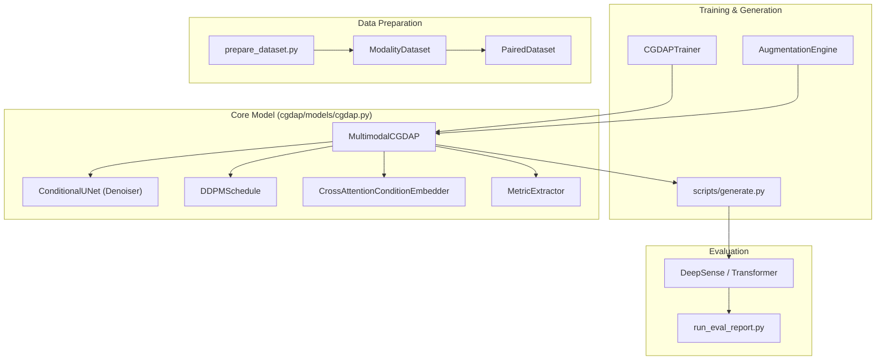
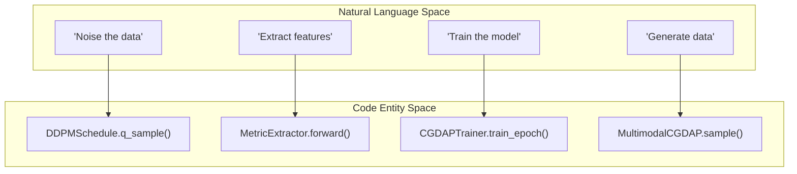

# Project Overview

> **Relevant source files**
> * [.python-version](https://github.com/yashwantherukulla/IoT-Data-Aug/blob/3c2a9426/.python-version)
> * [README.md](https://github.com/yashwantherukulla/IoT-Data-Aug/blob/3c2a9426/README.md?plain=1)
> * [configs/config.yaml](https://github.com/yashwantherukulla/IoT-Data-Aug/blob/3c2a9426/configs/config.yaml)
> * [main.py](https://github.com/yashwantherukulla/IoT-Data-Aug/blob/3c2a9426/main.py)
> * [pyproject.toml](https://github.com/yashwantherukulla/IoT-Data-Aug/blob/3c2a9426/pyproject.toml)
> * [utils/data_loader.py](https://github.com/yashwantherukulla/IoT-Data-Aug/blob/3c2a9426/utils/data_loader.py)

The **IoT-Data-Aug (CGDAP v2.1)** project is a conditional generative pipeline designed for **Human Activity Recognition (HAR)**. It addresses the challenge of limited and imbalanced sensor datasets by synthesizing high-fidelity, multi-modal sensor data (accelerometer and gyroscope) that adheres to specific physical and statistical properties (metrics).

At its core, the system uses a **Multimodal Conditional Generative Diffusion Augmentation Pipeline (CGDAP)**. Unlike standard GANs or Diffusion models that only condition on class labels, CGDAP conditions on both **activity labels** and **differentiable sensor metrics** (e.g., temporal range, entropy), allowing for precise control over the characteristics of the generated synthetic data [README.md L1-L11](https://github.com/yashwantherukulla/IoT-Data-Aug/blob/3c2a9426/README.md?plain=1#L1-L11)

## System Architecture

The project is structured as a modular pipeline that spans from raw data ingestion to downstream classifier evaluation. The primary flow involves transforming time-series sensor data into the frequency domain (spectrograms) for diffusion-based generation.

### High-Level Component Relationship

The following diagram illustrates how the core Python classes and modules interact to form the generation and training loops.

**Diagram: System Entity Relationship**

**Sources:** [README.md L35-L67](https://github.com/yashwantherukulla/IoT-Data-Aug/blob/3c2a9426/README.md?plain=1#L35-L67)

 [cgdap/models/cgdap.py L163-L180](https://github.com/yashwantherukulla/IoT-Data-Aug/blob/3c2a9426/cgdap/models/cgdap.py#L163-L180)

---

## Key Components

### 1. Data Pipeline

The pipeline processes raw RealWorld HAR archives into structured `.pt` files containing log-magnitude spectrograms and pre-computed metrics [README.md L105-L132](https://github.com/yashwantherukulla/IoT-Data-Aug/blob/3c2a9426/README.md?plain=1#L105-L132)

* **Modality Alignment:** The `PairedDataset` ensures that accelerometer (`acc`) and gyroscope (`gyr`) streams are synchronized by matching activity and window indices [README.md L134-L135](https://github.com/yashwantherukulla/IoT-Data-Aug/blob/3c2a9426/README.md?plain=1#L134-L135)
* **For details, see [Data Pipeline](/yashwantherukulla/IoT-Data-Aug/2-data-pipeline).**

### 2. Multimodal Diffusion Model

The `MultimodalCGDAP` class acts as a wrapper that manages independent denoisers for each sensor modality while sharing a conditioning context [cgdap/models/cgdap.py L163-L170](https://github.com/yashwantherukulla/IoT-Data-Aug/blob/3c2a9426/cgdap/models/cgdap.py#L163-L170)

* **Conditioning:** Uses `CrossAttentionConditionEmbedder` to inject activity labels and metric targets into the diffusion process [README.md L171-L175](https://github.com/yashwantherukulla/IoT-Data-Aug/blob/3c2a9426/README.md?plain=1#L171-L175)
* **Consistency Loss:** A differentiable `MetricExtractor` computes $L_{metric}$ during training to ensure the generated spectrograms match the target physical properties [README.md L157-L160](https://github.com/yashwantherukulla/IoT-Data-Aug/blob/3c2a9426/README.md?plain=1#L157-L160)
* **For details, see [Core Model Architecture](/yashwantherukulla/IoT-Data-Aug/3-core-model-architecture).**

### 3. Augmentation Engine

The `AugmentationEngine` defines how new "target" metrics are sampled to guide the generation of synthetic samples. It supports three modes: `interpolation`, `disturbance`, and `domain_instruction` [README.md L190-L201](https://github.com/yashwantherukulla/IoT-Data-Aug/blob/3c2a9426/README.md?plain=1#L190-L201)

* **For details, see [Augmentation Engine](/yashwantherukulla/IoT-Data-Aug/5-augmentation-engine).**

---

## Natural Language to Code Mapping

To assist developers in navigating the codebase, the following diagram maps conceptual system requirements to their specific implementation entities in the `cgdap/` package.

**Diagram: Conceptual to Entity Mapping**

**Sources:** [cgdap/models/cgdap.py L163-L189](https://github.com/yashwantherukulla/IoT-Data-Aug/blob/3c2a9426/cgdap/models/cgdap.py#L163-L189)

 [README.md L157-L160](https://github.com/yashwantherukulla/IoT-Data-Aug/blob/3c2a9426/README.md?plain=1#L157-L160)

---

## Getting Started & Project Structure

The project uses `Hydra` for configuration management and `uv` for dependency handling. The standard workflow follows a sequence of scripts located in the `scripts/` directory.

| Phase | Script | Description |
| --- | --- | --- |
| **Prepare** | `scripts/prepare_dataset.py` | Transforms raw CSVs to processed `.pt` spectrograms [main.py L4-L5](https://github.com/yashwantherukulla/IoT-Data-Aug/blob/3c2a9426/main.py#L4-L5) |
| **Train** | `scripts/train.py` | Runs the diffusion training loop with metric-consistency loss [main.py L7-L8](https://github.com/yashwantherukulla/IoT-Data-Aug/blob/3c2a9426/main.py#L7-L8) |
| **Generate** | `scripts/generate.py` | Produces synthetic samples using a trained checkpoint [main.py L10-L11](https://github.com/yashwantherukulla/IoT-Data-Aug/blob/3c2a9426/main.py#L10-L11) |
| **Evaluate** | `scripts/evaluate.py` | Trains downstream classifiers on augmented data [main.py L13-L14](https://github.com/yashwantherukulla/IoT-Data-Aug/blob/3c2a9426/main.py#L13-L14) |

* For setup and installation, see **[Getting Started](/yashwantherukulla/IoT-Data-Aug/1.1-getting-started)**.
* For a detailed file-by-file map, see **[Repository Structure](/yashwantherukulla/IoT-Data-Aug/1.2-repository-structure)**.

**Sources:** [main.py L1-L18](https://github.com/yashwantherukulla/IoT-Data-Aug/blob/3c2a9426/main.py#L1-L18)

 [pyproject.toml L1-L31](https://github.com/yashwantherukulla/IoT-Data-Aug/blob/3c2a9426/pyproject.toml#L1-L31)

 [configs/config.yaml L1-L34](https://github.com/yashwantherukulla/IoT-Data-Aug/blob/3c2a9426/configs/config.yaml#L1-L34)