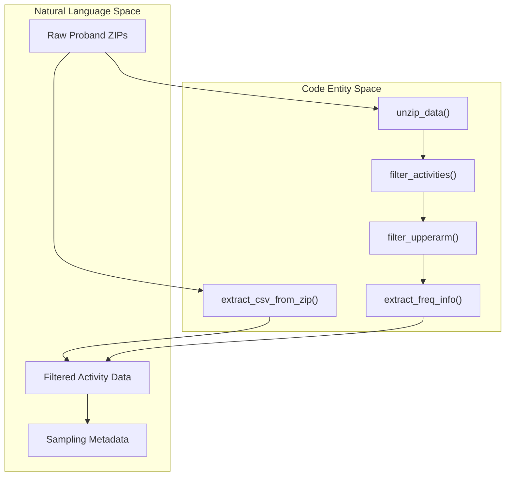
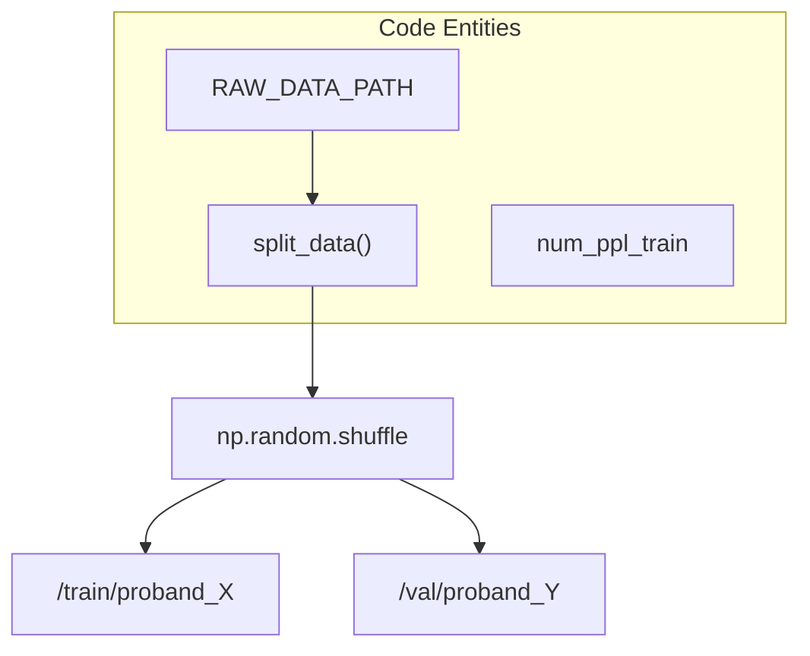

# Raw Data Loading and Cleaning

> **Relevant source files**
> * [.python-version](https://github.com/yashwantherukulla/IoT-Data-Aug/blob/3c2a9426/.python-version)
> * [cgdap/augmentation/engine.py](https://github.com/yashwantherukulla/IoT-Data-Aug/blob/3c2a9426/cgdap/augmentation/engine.py)
> * [cgdap/data/raw_loader.py](https://github.com/yashwantherukulla/IoT-Data-Aug/blob/3c2a9426/cgdap/data/raw_loader.py)
> * [pyproject.toml](https://github.com/yashwantherukulla/IoT-Data-Aug/blob/3c2a9426/pyproject.toml)
> * [utils/data_loader.py](https://github.com/yashwantherukulla/IoT-Data-Aug/blob/3c2a9426/utils/data_loader.py)
> * [utils/har_dataloader.py](https://github.com/yashwantherukulla/IoT-Data-Aug/blob/3c2a9426/utils/har_dataloader.py)
> * [utils/prepare_dataset.py](https://github.com/yashwantherukulla/IoT-Data-Aug/blob/3c2a9426/utils/prepare_dataset.py)

This page details the utilities responsible for ingesting, cleaning, and organizing the raw Human Activity Recognition (HAR) sensor data. The pipeline handles the transition from compressed proband archives to a structured format ready for spectrogram transformation.

## Overview of Data Ingestion

The system supports two ingestion paths: a legacy cleaning pipeline that reorganizes local directories, and a modern in-place extraction utility used by the primary preprocessing scripts. The primary goal is to isolate specific sensor placements (e.g., `upperarm`) and activities (e.g., `walking`, `running`) while extracting critical metadata like sampling frequency.

### Data Flow: Raw to Structured

The following diagram illustrates the flow from the initial raw `.zip` archives to the filtered directory structure.

**Figure 1: Data Ingestion and Filtering Flow**

Sources: [utils/data_loader.py L85-L100](https://github.com/yashwantherukulla/IoT-Data-Aug/blob/3c2a9426/utils/data_loader.py#L85-L100)

 [utils/data_loader.py L102-L127](https://github.com/yashwantherukulla/IoT-Data-Aug/blob/3c2a9426/utils/data_loader.py#L102-L127)

 [utils/data_loader.py L129-L160](https://github.com/yashwantherukulla/IoT-Data-Aug/blob/3c2a9426/utils/data_loader.py#L129-L160)

 [utils/prepare_dataset.py L91-L108](https://github.com/yashwantherukulla/IoT-Data-Aug/blob/3c2a9426/utils/prepare_dataset.py#L91-L108)

## Key Utilities and Implementation

### Archive Handling and Extraction

The system utilizes `unzip_data` to recursively unpack proband archives [utils/data_loader.py L85-L100](https://github.com/yashwantherukulla/IoT-Data-Aug/blob/3c2a9426/utils/data_loader.py#L85-L100)

 For the modern pipeline, `extract_csv_from_zip` allows reading sensor data directly from nested ZIP structures without full disk extraction, utilizing `zipfile.ZipFile` and `io.BytesIO` [utils/prepare_dataset.py L91-L108](https://github.com/yashwantherukulla/IoT-Data-Aug/blob/3c2a9426/utils/prepare_dataset.py#L91-L108)

### Activity and Placement Filtering

To reduce noise in the dataset, the loader implements strict filtering:

* **Activity Filtering**: `filter_activities` retains only a subset of labels: `climbingup`, `climbingdown`, `jumping`, `running`, and `walking` [utils/data_loader.py L102-L127](https://github.com/yashwantherukulla/IoT-Data-Aug/blob/3c2a9426/utils/data_loader.py#L102-L127)
* **Sensor Placement**: `filter_upperarm` (and the `placement` argument in `_find_csv`) ensures only sensors mounted on the upper arm are processed [utils/data_loader.py L129-L160](https://github.com/yashwantherukulla/IoT-Data-Aug/blob/3c2a9426/utils/data_loader.py#L129-L160)  [utils/prepare_dataset.py L111-L116](https://github.com/yashwantherukulla/IoT-Data-Aug/blob/3c2a9426/utils/prepare_dataset.py#L111-L116)

### Metadata Extraction

Sampling frequency is not constant across all HAR trials. The `extract_freq_info` function parses `readMe.txt` files within activity directories using regular expressions to capture the frequency (Hz) for the specific sensor CSV [utils/data_loader.py L161-L188](https://github.com/yashwantherukulla/IoT-Data-Aug/blob/3c2a9426/utils/data_loader.py#L161-L188)

 This frequency is stored in a local `info.json` for downstream STFT windowing calculations.

| Function | File | Purpose |
| --- | --- | --- |
| `unzip_data` | `utils/data_loader.py` | Unpacks proband-level ZIP archives. |
| `filter_activities` | `utils/data_loader.py` | Deletes directories not matching the allowed activity set. |
| `extract_csv_from_zip` | `utils/prepare_dataset.py` | In-memory extraction of `(N, 3)` sensor arrays from ZIPs. |
| `_parse_csv` | `utils/prepare_dataset.py` | Converts raw CSV bytes into `np.float32` arrays. |

Sources: [utils/data_loader.py L85-L188](https://github.com/yashwantherukulla/IoT-Data-Aug/blob/3c2a9426/utils/data_loader.py#L85-L188)

 [utils/prepare_dataset.py L91-L125](https://github.com/yashwantherukulla/IoT-Data-Aug/blob/3c2a9426/utils/prepare_dataset.py#L91-L125)

## Subject Splitting (Train/Val)

To ensure model generalization, the dataset is split by subject (proband) rather than by individual samples. This prevents data leakage where the model might memorize the specific movement patterns of a single person.

**Figure 2: Subject-Based Data Splitting**

The `split_data` utility takes a parameter `num_ppl_train` to define the split boundary [utils/data_loader.py L60-L83](https://github.com/yashwantherukulla/IoT-Data-Aug/blob/3c2a9426/utils/data_loader.py#L60-L83)

 It physically moves proband directories into `train` and `val` subdirectories under the raw data root.

Sources: [utils/data_loader.py L60-L83](https://github.com/yashwantherukulla/IoT-Data-Aug/blob/3c2a9426/utils/data_loader.py#L60-L83)

## Legacy Cleaning Shim

The project maintains a deprecated cleaning shim in `cgdap/data/raw_loader.py`. The function `run_cleaning_pipeline` is kept as a no-op to prevent breaking older configuration files that might still reference a separate "cleaning" stage [cgdap/data/raw_loader.py L17-L31](https://github.com/yashwantherukulla/IoT-Data-Aug/blob/3c2a9426/cgdap/data/raw_loader.py#L17-L31)

 The modern pipeline performs these operations on-the-fly or via the `utils/prepare_dataset.py` script.

Sources: [cgdap/data/raw_loader.py L1-L31](https://github.com/yashwantherukulla/IoT-Data-Aug/blob/3c2a9426/cgdap/data/raw_loader.py#L1-L31)