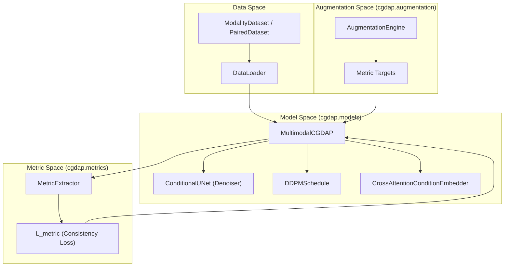
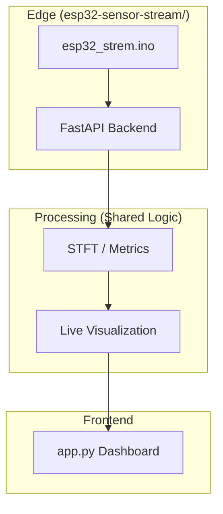

# Repository Structure

> **Relevant source files**
> * [README.md](https://github.com/yashwantherukulla/IoT-Data-Aug/blob/3c2a9426/README.md?plain=1)
> * [cgdap/__init__.py](https://github.com/yashwantherukulla/IoT-Data-Aug/blob/3c2a9426/cgdap/__init__.py)
> * [cgdap/augmentation/__init__.py](https://github.com/yashwantherukulla/IoT-Data-Aug/blob/3c2a9426/cgdap/augmentation/__init__.py)
> * [cgdap/data/__init__.py](https://github.com/yashwantherukulla/IoT-Data-Aug/blob/3c2a9426/cgdap/data/__init__.py)
> * [cgdap/data/dataset.py](https://github.com/yashwantherukulla/IoT-Data-Aug/blob/3c2a9426/cgdap/data/dataset.py)
> * [configs/config.yaml](https://github.com/yashwantherukulla/IoT-Data-Aug/blob/3c2a9426/configs/config.yaml)

This page provides a technical map of the CGDAP (Conditional Generative Data Augmentation Pipeline) repository. It describes the organization of the source code, configuration files, and utility scripts, as well as the specialized `esp32-sensor-stream` sub-project.

## High-Level Layout

The repository is organized into a core library (`cgdap/`), an orchestration layer (`scripts/` and `main.py`), and a hierarchical configuration system (`configs/`).

### Directory Roles

| Directory | Role |
| --- | --- |
| `cgdap/` | Core Python package containing the diffusion model, data logic, and metrics. |
| `configs/` | Hydra configuration files for models, datasets, and training hyperparameters. |
| `scripts/` | Standalone execution scripts for the pipeline stages (prepare, train, generate, evaluate). |
| `tests/` | Pytest suite for unit and integration testing of core components. |
| `data/` | Local storage for raw sensor archives and processed `.pt` spectrogram files. |
| `outputs/` | Default destination for training checkpoints, logs, and generated samples. |
| `esp32-sensor-stream/` | Sub-project for real-time IoT streaming and visualization. |

**Sources:** [README.md L35-L67](https://github.com/yashwantherukulla/IoT-Data-Aug/blob/3c2a9426/README.md?plain=1#L35-L67)

 [configs/config.yaml L5-L20](https://github.com/yashwantherukulla/IoT-Data-Aug/blob/3c2a9426/configs/config.yaml#L5-L20)

---

## The cgdap/ Package

The `cgdap/` directory contains the implementation of the generative pipeline. It is structured to separate data concerns from model architecture and evaluation logic.

### Package Components and Data Flow

The following diagram illustrates how entities within the `cgdap/` package interact during a training or generation cycle.

**Diagram: CGDAP Internal Logic Flow**

**Sources:** [README.md L39-L45](https://github.com/yashwantherukulla/IoT-Data-Aug/blob/3c2a9426/README.md?plain=1#L39-L45)

 [cgdap/data/dataset.py L31-L168](https://github.com/yashwantherukulla/IoT-Data-Aug/blob/3c2a9426/cgdap/data/dataset.py#L31-L168)

 [README.md L161-L189](https://github.com/yashwantherukulla/IoT-Data-Aug/blob/3c2a9426/README.md?plain=1#L161-L189)

### Sub-package Details

* **`augmentation/`**: Contains the `AugmentationEngine` which generates synthetic metric targets using modes like `interpolation`, `disturbance`, or `domain_instruction` [cgdap/augmentation/__init__.py L1](https://github.com/yashwantherukulla/IoT-Data-Aug/blob/3c2a9426/cgdap/augmentation/__init__.py#L1-L1)  [README.md L190-L202](https://github.com/yashwantherukulla/IoT-Data-Aug/blob/3c2a9426/README.md?plain=1#L190-L202)
* **`data/`**: Implements `ModalityDataset` for single-stream loading and `PairedDataset` for synchronized `acc` and `gyr` samples [cgdap/data/dataset.py L31-L168](https://github.com/yashwantherukulla/IoT-Data-Aug/blob/3c2a9426/cgdap/data/dataset.py#L31-L168)
* **`metrics/`**: Contains the `MetricExtractor` module and `compute_metrics_fn` functional API, responsible for calculating the five core HAR metrics: temporal range, f0 amplitude, contrast, flatness, and entropy [README.md L150-L160](https://github.com/yashwantherukulla/IoT-Data-Aug/blob/3c2a9426/README.md?plain=1#L150-L160)
* **`models/`**: The core architecture. `MultimodalCGDAP` acts as a wrapper that composes modality-specific `ConditionalUNet` denoisers with a shared `DDPMSchedule` [README.md L161-L189](https://github.com/yashwantherukulla/IoT-Data-Aug/blob/3c2a9426/README.md?plain=1#L161-L189)
* **`training/`**: Contains the `CGDAPTrainer` which manages the optimization loop, EMA updates for metric weights, and checkpointing.

---

## Configuration and Scripts

The project uses **Hydra** for configuration management, allowing for modular overrides without modifying source code.

### Configuration Hierarchy

The `configs/` directory mirrors the package structure:

* **`dataset/`**: STFT parameters, sampling rates, and activity maps [configs/config.yaml L8-L9](https://github.com/yashwantherukulla/IoT-Data-Aug/blob/3c2a9426/configs/config.yaml#L8-L9)
* **`model/`**: Hyperparameters for the UNet (channels, attention depth) and Diffusion (beta schedules) [configs/config.yaml L10-L12](https://github.com/yashwantherukulla/IoT-Data-Aug/blob/3c2a9426/configs/config.yaml#L10-L12)
* **`training/`**: Optimizer settings, batch sizes, and loss weighting [configs/config.yaml L13-L14](https://github.com/yashwantherukulla/IoT-Data-Aug/blob/3c2a9426/configs/config.yaml#L13-L14)

### Script Execution Layer

The `scripts/` directory provides the entry points for the pipeline stages:

1. `prepare_dataset.py`: Transforms raw CSVs into v2.1 `.pt` files [README.md L55](https://github.com/yashwantherukulla/IoT-Data-Aug/blob/3c2a9426/README.md?plain=1#L55-L55)
2. `train.py`: Executes the training loop via `CGDAPTrainer` [README.md L56](https://github.com/yashwantherukulla/IoT-Data-Aug/blob/3c2a9426/README.md?plain=1#L56-L56)
3. `generate.py`: Uses a trained checkpoint to produce synthetic spectrograms [README.md L57](https://github.com/yashwantherukulla/IoT-Data-Aug/blob/3c2a9426/README.md?plain=1#L57-L57)
4. `evaluate.py`: Trains downstream classifiers (`DeepSense`, `Transformer`) to validate data utility [README.md L58](https://github.com/yashwantherukulla/IoT-Data-Aug/blob/3c2a9426/README.md?plain=1#L58-L58)
5. `run_eval_report.py`: Aggregates results into a self-contained HTML diagnostic report [README.md L59](https://github.com/yashwantherukulla/IoT-Data-Aug/blob/3c2a9426/README.md?plain=1#L59-L59)

**Sources:** [configs/config.yaml L1-L34](https://github.com/yashwantherukulla/IoT-Data-Aug/blob/3c2a9426/configs/config.yaml#L1-L34)

 [README.md L69-L80](https://github.com/yashwantherukulla/IoT-Data-Aug/blob/3c2a9426/README.md?plain=1#L69-L80)

---

## ESP32 Sensor Stream Sub-project

The `esp32-sensor-stream/` directory is a standalone ecosystem designed for real-time inference and visualization of the models developed in the main package.

**Diagram: IoT Stream Architecture**

### Components

* **Firmware**: Arduino-based C++ code for sampling MPU-6050 sensors and streaming over WiFi.
* **Backend**: A FastAPI server that processes incoming raw streams into spectrograms using the same parameters defined in the main `configs/dataset/` [README.md L138-L149](https://github.com/yashwantherukulla/IoT-Data-Aug/blob/3c2a9426/README.md?plain=1#L138-L149)
* **Frontend**: A Streamlit dashboard for real-time monitoring of sensor metrics and generated spectrograms.

**Sources:** [README.md L5-L10](https://github.com/yashwantherukulla/IoT-Data-Aug/blob/3c2a9426/README.md?plain=1#L5-L10)

 [cgdap/metrics/extractor.py L157-L160](https://github.com/yashwantherukulla/IoT-Data-Aug/blob/3c2a9426/cgdap/metrics/extractor.py#L157-L160)