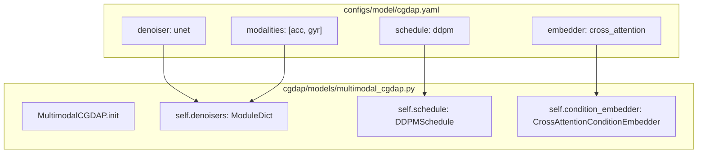
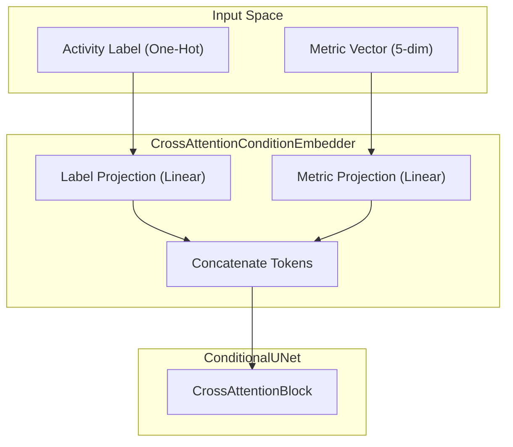

# Root and Model Configuration

> **Relevant source files**
> * [configs/config.yaml](https://github.com/yashwantherukulla/IoT-Data-Aug/blob/3c2a9426/configs/config.yaml)
> * [configs/model/cgdap.yaml](https://github.com/yashwantherukulla/IoT-Data-Aug/blob/3c2a9426/configs/model/cgdap.yaml)

The configuration system for the CGDAP (Conditional Generative Diffusion for Activity Patches) project is built on **Hydra**, allowing for modular, hierarchical settings that govern everything from global experiment seeds to specific neural network hyperparameters. This page details the root configuration and the specific model-level settings used to instantiate the `MultimodalCGDAP` system.

## Root Configuration (config.yaml)

The root configuration file serves as the primary entry point for the system. it defines the default composition of the experiment and global variables used across training and generation scripts.

### Default Composition

The `defaults` list specifies which sub-configs are loaded into the main configuration object. This allows users to swap out entire components (e.g., changing from `console` logging to `wandb`) via the command line.

| Config Group | Default File | Description |
| --- | --- | --- |
| `dataset` | `har_dataset` | Paths, activity maps, and STFT parameters. |
| `model` | `cgdap` | Architecture selection and hyperparams. |
| `training` | `default` | Optimizer, scheduler, and loss weights. |
| `augmentation` | `default` | Generation modes (interpolation, disturbance). |
| `evaluation` | `default` | Metrics and diagnostic probe settings. |
| `logging` | `console` | Output formatting and remote logging toggle. |

**Sources:** [configs/config.yaml L27-L34](https://github.com/yashwantherukulla/IoT-Data-Aug/blob/3c2a9426/configs/config.yaml#L27-L34)

### Global and Generation Settings

The root config also manages the `seed` for reproducibility and the `experiment_name` for output organization. A specialized `generation` block controls the behavior of standalone inference scripts (e.g., `scripts/generate.py`).

* **`seed`**: Integer used to initialize RNG for PyTorch and NumPy [configs/config.yaml L39](https://github.com/yashwantherukulla/IoT-Data-Aug/blob/3c2a9426/configs/config.yaml#L39-L39)
* **`generation.reference_pt`**: Path to a specific processed `.pt` file to use as a condition source [configs/config.yaml L46](https://github.com/yashwantherukulla/IoT-Data-Aug/blob/3c2a9426/configs/config.yaml#L46-L46)
* **`generation.num_steps`**: The number of diffusion sampling steps used during inference [configs/config.yaml L52](https://github.com/yashwantherukulla/IoT-Data-Aug/blob/3c2a9426/configs/config.yaml#L52-L52)
* **`generation.save_bundle`**: Boolean flag to save paired modalities (acc + gyr) as a single synchronized object [configs/config.yaml L56](https://github.com/yashwantherukulla/IoT-Data-Aug/blob/3c2a9426/configs/config.yaml#L56-L56)

**Sources:** [configs/config.yaml L36-L61](https://github.com/yashwantherukulla/IoT-Data-Aug/blob/3c2a9426/configs/config.yaml#L36-L61)

---

## Model Configuration (cgdap.yaml)

The model configuration defines the architecture of the `MultimodalCGDAP` wrapper. It acts as a registry-based selector for different diffusion components.

### Component Selection

The system is designed for modularity, allowing different denoisers or schedules to be swapped while maintaining the same interface.

* **`denoiser`**: Currently set to `unet`. This determines which class is instantiated for the modality-specific noise prediction [configs/model/cgdap.yaml L13](https://github.com/yashwantherukulla/IoT-Data-Aug/blob/3c2a9426/configs/model/cgdap.yaml#L13-L13)
* **`schedule`**: Currently set to `ddpm`. Defines the noise injection and removal logic [configs/model/cgdap.yaml L14](https://github.com/yashwantherukulla/IoT-Data-Aug/blob/3c2a9426/configs/model/cgdap.yaml#L14-L14)
* **`embedder`**: Set to `cross_attention`. Manages how activity labels and sensor metrics are transformed into tokens for the denoiser [configs/model/cgdap.yaml L15](https://github.com/yashwantherukulla/IoT-Data-Aug/blob/3c2a9426/configs/model/cgdap.yaml#L15-L15)

### Configuration to Code Mapping

The following diagram illustrates how the `cgdap.yaml` configuration values map to the initialization of the `MultimodalCGDAP` system.

**Model Initialization Flow**

**Sources:** [configs/model/cgdap.yaml L10-L22](https://github.com/yashwantherukulla/IoT-Data-Aug/blob/3c2a9426/configs/model/cgdap.yaml#L10-L22)

 [configs/model/cgdap.yaml L33-L50](https://github.com/yashwantherukulla/IoT-Data-Aug/blob/3c2a9426/configs/model/cgdap.yaml#L33-L50)

---

## Denoiser and Schedule Parameters

### ConditionalUNet Hyperparameters

The `unet` block configures the `ConditionalUNet` denoiser. It uses a series of encoder and decoder blocks with skip connections.

* **`base_channels`**: The initial channel depth (default 96). This scales the width of the entire network [configs/model/cgdap.yaml L34](https://github.com/yashwantherukulla/IoT-Data-Aug/blob/3c2a9426/configs/model/cgdap.yaml#L34-L34)
* **`channel_multipliers`**: Defines the depth at each resolution level (e.g., `[1, 2, 4]`) [configs/model/cgdap.yaml L35](https://github.com/yashwantherukulla/IoT-Data-Aug/blob/3c2a9426/configs/model/cgdap.yaml#L35-L35)
* **`cross_attn_depths`**: Specifies which levels of the UNet receive condition tokens. `0` refers to the bottleneck, while `1` refers to the deepest skip connection level [configs/model/cgdap.yaml L39](https://github.com/yashwantherukulla/IoT-Data-Aug/blob/3c2a9426/configs/model/cgdap.yaml#L39-L39)

### DDPM Schedule Parameters

The `ddpm` block defines the variance schedule for the diffusion process.

* **`train_timesteps`**: The total number of steps in the forward diffusion process (default 1000) [configs/model/cgdap.yaml L44](https://github.com/yashwantherukulla/IoT-Data-Aug/blob/3c2a9426/configs/model/cgdap.yaml#L44-L44)
* **`beta_start` / `beta_end`**: The range for the linear noise schedule (1e-4 to 2e-2) [configs/model/cgdap.yaml L45-L46](https://github.com/yashwantherukulla/IoT-Data-Aug/blob/3c2a9426/configs/model/cgdap.yaml#L45-L46)
* **`num_infer_steps`**: The default number of steps for the reverse sampling loop during evaluation [configs/model/cgdap.yaml L50](https://github.com/yashwantherukulla/IoT-Data-Aug/blob/3c2a9426/configs/model/cgdap.yaml#L50-L50)

**Sources:** [configs/model/cgdap.yaml L33-L51](https://github.com/yashwantherukulla/IoT-Data-Aug/blob/3c2a9426/configs/model/cgdap.yaml#L33-L51)

---

## Condition Embedder Settings

The `condition` block configures the `CrossAttentionConditionEmbedder`, which bridges the gap between raw metrics (temporal range, entropy, etc.) and the latent space of the UNet.

| Parameter | Value | Description |
| --- | --- | --- |
| `n_metrics` | 5 | Number of differentiable HAR metrics extracted. |
| `d_model` | 128 | Hidden dimensionality of the condition tokens. |
| `n_heads` | 4 | Number of attention heads in the cross-attention layers. |
| `n_cond_tokens` | 8 | Final sequence length of the condition embedding (metrics + one-hot label). |

**Condition Embedding Logic**

**Sources:** [configs/model/cgdap.yaml L25-L30](https://github.com/yashwantherukulla/IoT-Data-Aug/blob/3c2a9426/configs/model/cgdap.yaml#L25-L30)