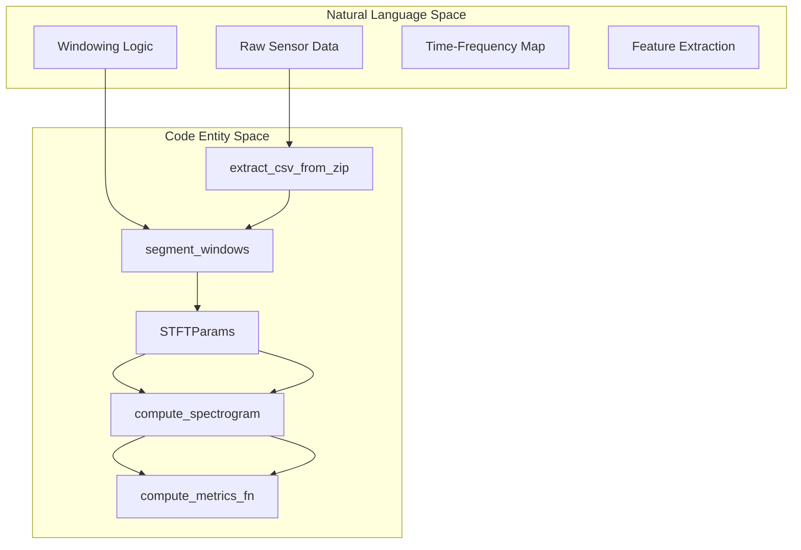
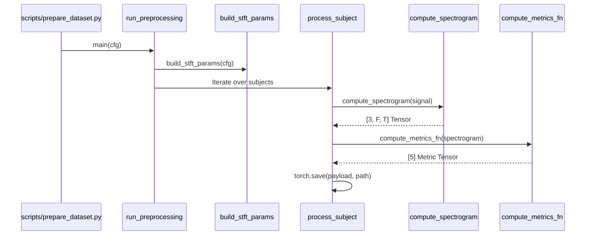

# Spectrogram Preprocessing

> **Relevant source files**
> * [cgdap/data/preprocessing.py](https://github.com/yashwantherukulla/IoT-Data-Aug/blob/3c2a9426/cgdap/data/preprocessing.py)
> * [configs/dataset/har_dataset.yaml](https://github.com/yashwantherukulla/IoT-Data-Aug/blob/3c2a9426/configs/dataset/har_dataset.yaml)
> * [scripts/prepare_dataset.py](https://github.com/yashwantherukulla/IoT-Data-Aug/blob/3c2a9426/scripts/prepare_dataset.py)

The Spectrogram Preprocessing stage transforms raw, time-domain HAR (Human Activity Recognition) sensor signals into multi-channel log-magnitude spectrograms. This process converts 1D time-series data from tri-axial sensors (accelerometer and gyroscope) into a 2D time-frequency representation suitable for the Conditional UNet denoiser.

## STFT Configuration and Windowing

The pipeline utilizes the Short-Time Fourier Transform (STFT) to extract frequency components over time. Configuration is driven by physical time parameters (milliseconds) rather than raw sample counts to maintain consistency across varying sensor hardware.

### Parameter Calculation

The `build_stft_params` function calculates the discrete FFT parameters based on the sampling rate and the desired temporal resolution defined in the configuration.

| Parameter | Configuration Key | Calculation Logic |
| --- | --- | --- |
| `win_length` | `fft_window_ms` | `round(sample_rate * fft_window_ms / 1000)` |
| `n_fft` | N/A | Next power of 2 greater than `win_length` |
| `hop_length` | `hop_ms` | `max(1, round(sample_rate * hop_ms / 1000))` |
| `window_samples` | `window_seconds` | `round(sample_rate * window_seconds)` |

Sources: [configs/dataset/har_dataset.yaml L40-L45](https://github.com/yashwantherukulla/IoT-Data-Aug/blob/3c2a9426/configs/dataset/har_dataset.yaml#L40-L45)

 [cgdap/data/preprocessing.py L62-L80](https://github.com/yashwantherukulla/IoT-Data-Aug/blob/3c2a9426/cgdap/data/preprocessing.py#L62-L80)

### Signal Segmentation

Raw data is extracted from sensor-specific ZIP archives (e.g., `acc_walking_csv.zip`) and parsed into `[N, 3]` arrays representing X, Y, and Z axes [cgdap/data/preprocessing.py L101-L128](https://github.com/yashwantherukulla/IoT-Data-Aug/blob/3c2a9426/cgdap/data/preprocessing.py#L101-L128)

 These signals are segmented into non-overlapping windows of length `window_samples` before being passed to the STFT engine [cgdap/data/preprocessing.py L179-L182](https://github.com/yashwantherukulla/IoT-Data-Aug/blob/3c2a9426/cgdap/data/preprocessing.py#L179-L182)

## Spectrogram Computation Flow

The computation pipeline transforms a 3-channel signal window into a 3-channel spectrogram tensor. The process follows a strict sequence: windowing, complex STFT, magnitude extraction, and optional log-scaling.

### Transformation Logic

1. **Windowing**: A Hann or Hamming window is applied to each segment to minimize spectral leakage [cgdap/data/preprocessing.py L88-L93](https://github.com/yashwantherukulla/IoT-Data-Aug/blob/3c2a9426/cgdap/data/preprocessing.py#L88-L93)
2. **STFT**: Performed via `torch.stft` with `center=True` to ensure the temporal alignment of the output frames [cgdap/data/preprocessing.py L145-L153](https://github.com/yashwantherukulla/IoT-Data-Aug/blob/3c2a9426/cgdap/data/preprocessing.py#L145-L153)
3. **Magnitude**: The complex output is converted to magnitude via `.abs()`. If `power` is set to 1.0 (default), it remains magnitude; if 2.0, it becomes power [cgdap/data/preprocessing.py L154-L157](https://github.com/yashwantherukulla/IoT-Data-Aug/blob/3c2a9426/cgdap/data/preprocessing.py#L154-L157)
4. **Log Transformation**: If `log1p` is true, the transformation $S_{log} = \ln(1 + S)$ is applied to compress the dynamic range and emphasize lower-amplitude harmonic structures [cgdap/data/preprocessing.py L158-L159](https://github.com/yashwantherukulla/IoT-Data-Aug/blob/3c2a9426/cgdap/data/preprocessing.py#L158-L159)

### Code Entity Mapping: Preprocessing Pipeline

The following diagram maps the logical transformation steps to the specific functions and configurations within the `cgdap` package.

Sources: [cgdap/data/preprocessing.py L55-L80](https://github.com/yashwantherukulla/IoT-Data-Aug/blob/3c2a9426/cgdap/data/preprocessing.py#L55-L80)

 [cgdap/data/preprocessing.py L135-L160](https://github.com/yashwantherukulla/IoT-Data-Aug/blob/3c2a9426/cgdap/data/preprocessing.py#L135-L160)

 [cgdap/data/preprocessing.py L179-L182](https://github.com/yashwantherukulla/IoT-Data-Aug/blob/3c2a9426/cgdap/data/preprocessing.py#L179-L182)

## Data Schema (v2.1)

The output of the preprocessing pipeline is a series of PyTorch `.pt` files, organized by modality and activity. Each file contains a dictionary with the spectrogram, its corresponding differentiable metrics, and metadata required for reconstruction and evaluation.

### .pt File Structure

| Key | Type | Description |
| --- | --- | --- |
| `spectrogram` | `Tensor[3, F, T]` | The 3-channel (XYZ) log-magnitude spectrogram. |
| `metrics` | `Tensor[5]` | Pre-computed metrics: range, f0, contrast, flatness, entropy. |
| `label` | `int` | Integer class ID mapped via `activity_map`. |
| `activity` | `str` | Canonical activity name (e.g., "climbing_up"). |
| `subject` | `str` | Subject identifier for train/val splitting. |
| `freq_axis_hz` | `Tensor[F]` | Frequency bins in Hz for visualization. |
| `time_axis_s` | `Tensor[T]` | Time steps in seconds relative to window start. |

Sources: [cgdap/data/preprocessing.py L13-L25](https://github.com/yashwantherukulla/IoT-Data-Aug/blob/3c2a9426/cgdap/data/preprocessing.py#L13-L25)

 [cgdap/data/preprocessing.py L162-L171](https://github.com/yashwantherukulla/IoT-Data-Aug/blob/3c2a9426/cgdap/data/preprocessing.py#L162-L171)

## Execution Flow

The preprocessing is triggered via `scripts/prepare_dataset.py`, which invokes `run_preprocessing`.

Sources: [scripts/prepare_dataset.py L22-L25](https://github.com/yashwantherukulla/IoT-Data-Aug/blob/3c2a9426/scripts/prepare_dataset.py#L22-L25)

 [cgdap/data/preprocessing.py L44](https://github.com/yashwantherukulla/IoT-Data-Aug/blob/3c2a9426/cgdap/data/preprocessing.py#L44-L44)

 [cgdap/data/preprocessing.py L62-L80](https://github.com/yashwantherukulla/IoT-Data-Aug/blob/3c2a9426/cgdap/data/preprocessing.py#L62-L80)

### Directory Layout

The pipeline enforces a strict directory hierarchy to support the `ModalityDataset` and `PairedDataset` loaders:

* `data/processed/HAR/train/<modality>/<activity>/<subject>_<window_idx>.pt`
* `data/processed/HAR/val/<modality>/<activity>/<subject>_<window_idx>.pt`

The `metadata.json` file is generated at the root of the processed directory to store the label-to-index mapping and global statistics [cgdap/data/preprocessing.py L4-L11](https://github.com/yashwantherukulla/IoT-Data-Aug/blob/3c2a9426/cgdap/data/preprocessing.py#L4-L11)