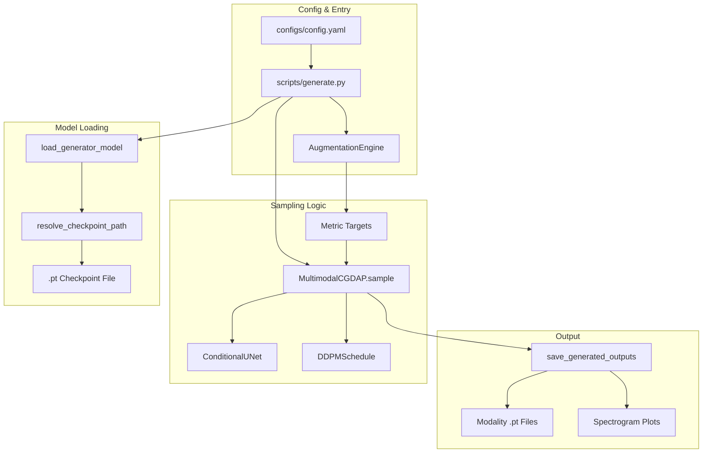
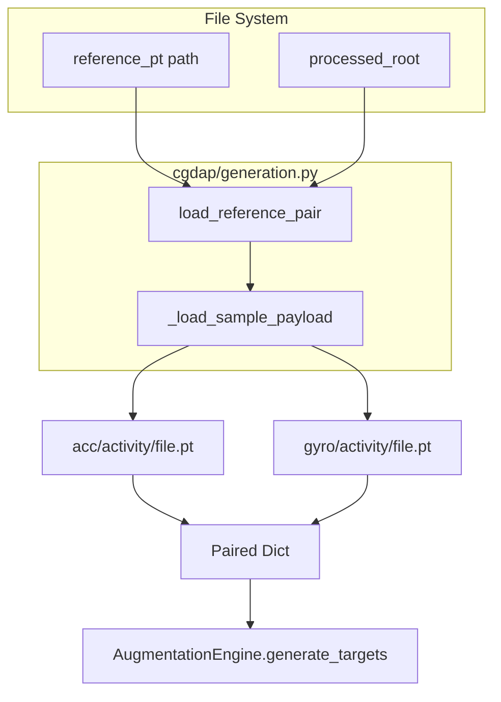

# Synthetic Sample Generation

> **Relevant source files**
> * [cgdap/generation.py](https://github.com/yashwantherukulla/IoT-Data-Aug/blob/3c2a9426/cgdap/generation.py)
> * [configs/config.yaml](https://github.com/yashwantherukulla/IoT-Data-Aug/blob/3c2a9426/configs/config.yaml)
> * [scripts/generate.py](https://github.com/yashwantherukulla/IoT-Data-Aug/blob/3c2a9426/scripts/generate.py)

The Synthetic Sample Generation module provides the standalone entry point and utility functions for producing high-fidelity, multimodal sensor spectrograms using a trained `MultimodalCGDAP` model. This process leverages the `AugmentationEngine` to define target conditioning (metrics and labels) and the `DDPMSchedule` to perform iterative reverse diffusion.

## Generation Workflow

The generation process follows a structured pipeline that resolves model weights, aligns multimodal references, samples from the diffusion model, and persists the results with associated metadata.

### 1. Resource Resolution and Loading

The workflow begins by identifying the correct model checkpoint and, if required, loading a "reference pair" to ensure synchronization across modalities (e.g., accelerometer and gyroscope).

* **`resolve_checkpoint_path`**: Searches for model weights based on `configs/config.yaml` or explicit CLI overrides. It prioritizes the most recent epoch (`ckpt_epoch*.pt`) within the experiment directory if no specific file is provided [cgdap/generation.py:24-51].
* **`load_generator_model`**: Instantiates the `MultimodalCGDAP` module using the configuration factory and loads the state dictionary into the specified device [cgdap/generation.py:53-65].
* **`load_reference_pair`**: For modes like `disturbance`, this function ensures that the reference data for all modalities (e.g., `acc` and `gyro`) are loaded from the same subject, activity, and time window to maintain multimodal coherence [cgdap/generation.py:76-138].

### 2. Target Construction

Before sampling, the `AugmentationEngine` generates the conditioning vectors (metrics and labels) that guide the diffusion process.

* **Interpolation**: Samples two real data points and mixes their metrics [scripts/generate.py:80-84].
* **Disturbance**: Takes a reference sample and applies controlled noise to its extracted metrics [scripts/generate.py:65-69].
* **Domain Instruction**: Uses expert-defined ranges for specific activities [scripts/generate.py:71-79].

### 3. Diffusion Sampling Loop

The core generation occurs within the `MultimodalCGDAP.sample` method, which orchestrates the reverse diffusion process across all modalities simultaneously.

* **Noise Initialization**: Starts with pure Gaussian noise of shape `[B, 3, F, T]` [cgdap/models/cgdap.py:171-182].
* **Iterative Denoising**: For each timestep $t$ in the `num_steps` schedule, the model predicts noise $\epsilon_\theta$, calculates the posterior mean, and subtracts noise to reach $t-1$ [cgdap/models/schedule.py:100-145].
* **Trajectory Tracking**: If enabled, intermediate denoising steps are captured for visualization [cgdap/generation.py:150-165].

### 4. Output Persistence

Generated samples are saved in multiple formats to support both machine learning training and human inspection.

* **Individual Modalities**: Each modality is saved as a `.pt` file containing the spectrogram, the target metrics, and the generation metadata (e.g., `checkpoint_path`, `generation_mode`) [cgdap/generation.py:170-193].
* **Paired Bundles**: If `save_bundle` is true, a single file containing all modalities is created to facilitate paired dataset loading [cgdap/generation.py:214-228].
* **Visualizations**: Generates PNG plots of the spectrograms and, optionally, "trajectory plots" showing the evolution from noise to signal [cgdap/generation.py:194-212].

---

## System Architecture Diagrams

### Generation Data Flow

The following diagram illustrates the relationship between configuration entities, the generation script, and the core model components.

**Title: Standalone Generation Component Interaction**

**Sources:** [scripts/generate.py L89-L180](https://github.com/yashwantherukulla/IoT-Data-Aug/blob/3c2a9426/scripts/generate.py#L89-L180)

 [cgdap/generation.py L24-L65](https://github.com/yashwantherukulla/IoT-Data-Aug/blob/3c2a9426/cgdap/generation.py#L24-L65)

 [cgdap/generation.py L141-L230](https://github.com/yashwantherukulla/IoT-Data-Aug/blob/3c2a9426/cgdap/generation.py#L141-L230)

### Multimodal Synchronization

This diagram highlights how `load_reference_pair` ensures that synthetic generation remains grounded in synchronized real-world sensor pairs.

**Title: Reference Pair Loading and Alignment**

**Sources:** [cgdap/generation.py L76-L138](https://github.com/yashwantherukulla/IoT-Data-Aug/blob/3c2a9426/cgdap/generation.py#L76-L138)

 [scripts/generate.py L102-L105](https://github.com/yashwantherukulla/IoT-Data-Aug/blob/3c2a9426/scripts/generate.py#L102-L105)

---

## Key Implementation Details

### Standalone Generation Entry Point

The `scripts/generate.py` script uses Hydra to compose configurations. It supports generating multiple samples in a single execution by incrementing the random seed for each iteration to ensure diversity.

| Parameter | Role | Source |
| --- | --- | --- |
| `generation.num_samples` | Number of synthetic samples to produce | [configs/config.yaml L51](https://github.com/yashwantherukulla/IoT-Data-Aug/blob/3c2a9426/configs/config.yaml#L51-L51) |
| `generation.num_steps` | Number of DDPM denoising steps (default 1000) | [configs/config.yaml L52](https://github.com/yashwantherukulla/IoT-Data-Aug/blob/3c2a9426/configs/config.yaml#L52-L52) |
| `generation.reference_pt` | Path to a real `.pt` file to use as a template | [configs/config.yaml L46](https://github.com/yashwantherukulla/IoT-Data-Aug/blob/3c2a9426/configs/config.yaml#L46-L46) |
| `augmentation.mode` | Strategy for target metric generation | [scripts/generate.py L64](https://github.com/yashwantherukulla/IoT-Data-Aug/blob/3c2a9426/scripts/generate.py#L64-L64) |

### Metadata and Traceability

To ensure synthetic data can be audited, `save_generated_outputs` embeds comprehensive provenance data into every saved tensor:

* **`checkpoint_path`**: The specific model weights used [cgdap/generation.py:181].
* **`generation_mode`**: The augmentation strategy (interpolation, etc.) [cgdap/generation.py:182].
* **`reference_path`**: If generated via disturbance, the path to the original source sample [cgdap/generation.py:185].
* **`reference_metrics`**: The original metrics of the source sample for delta analysis [cgdap/generation.py:186].

**Sources:**

* `cgdap/generation.py`: [24-230](https://github.com/yashwantherukulla/IoT-Data-Aug/blob/3c2a9426/24-230)
* `scripts/generate.py`: [1-180](https://github.com/yashwantherukulla/IoT-Data-Aug/blob/3c2a9426/1-180)
* `configs/config.yaml`: [45-61](https://github.com/yashwantherukulla/IoT-Data-Aug/blob/3c2a9426/45-61)