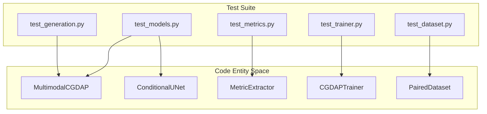
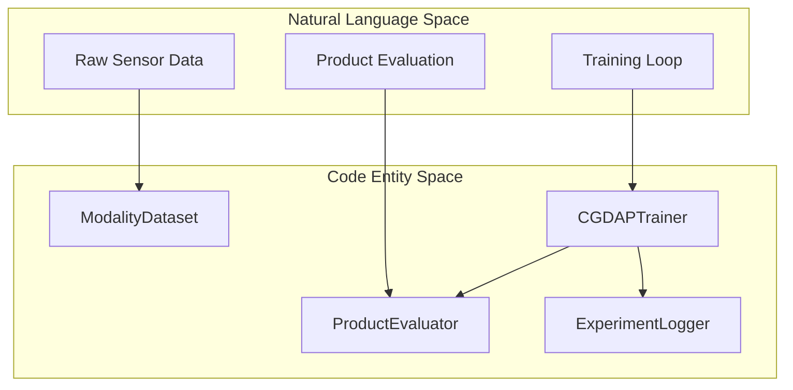

# Testing

> **Relevant source files**
> * [tests/test_generation.py](https://github.com/yashwantherukulla/IoT-Data-Aug/blob/3c2a9426/tests/test_generation.py)
> * [tests/test_models.py](https://github.com/yashwantherukulla/IoT-Data-Aug/blob/3c2a9426/tests/test_models.py)
> * [tests/test_trainer.py](https://github.com/yashwantherukulla/IoT-Data-Aug/blob/3c2a9426/tests/test_trainer.py)

The testing suite for the CGDAP project ensures the integrity of the multimodal diffusion pipeline, from differentiable metric extraction to the full training loop. The suite utilizes `pytest` and focuses on verifying shape consistency, gradient flow, and data loading across the various modalities.

### Testing Philosophy

The project follows a "smoke test" philosophy for complex components like the trainer and diffusion models, ensuring that forward and backward passes execute without error on mock data. Specialized tests verify the mathematical correctness of the `DDPMSchedule` and the differentiability of the `MetricExtractor`.

## Test Suite Overview

The following diagram maps the relationship between the test modules and the core system components they validate.

### System Test Mapping

**Sources:** [tests/test_models.py L1-L14](https://github.com/yashwantherukulla/IoT-Data-Aug/blob/3c2a9426/tests/test_models.py#L1-L14)

 [tests/test_trainer.py L10-L12](https://github.com/yashwantherukulla/IoT-Data-Aug/blob/3c2a9426/tests/test_trainer.py#L10-L12)

---

## 9.1 Model and Metrics Tests

This section covers the verification of the generative backbone and the signal processing metrics.

* **Model Components**: Tests in `test_models.py` validate that `ConditionalUNet` preserves spatial dimensions [tests/test_models.py L34-L40](https://github.com/yashwantherukulla/IoT-Data-Aug/blob/3c2a9426/tests/test_models.py#L34-L40)  and that the `CrossAttentionConditionEmbedder` correctly projects metrics and labels into the conditioning space [tests/test_models.py L25-L31](https://github.com/yashwantherukulla/IoT-Data-Aug/blob/3c2a9426/tests/test_models.py#L25-L31)
* **Diffusion Logic**: `DDPMSchedule` is tested for its ability to add noise (`q_sample`) and predict the original signal (`predict_x0`) [tests/test_models.py L43-L59](https://github.com/yashwantherukulla/IoT-Data-Aug/blob/3c2a9426/tests/test_models.py#L43-L59)
* **Multimodal Integration**: The `MultimodalCGDAP` module is tested for a full forward and backward pass, ensuring that `L_G` and `L_metric` losses are computed for all modalities (e.g., `acc` and `gyr`) [tests/test_models.py L61-L91](https://github.com/yashwantherukulla/IoT-Data-Aug/blob/3c2a9426/tests/test_models.py#L61-L91)

For details, see [Model and Metrics Tests](/yashwantherukulla/IoT-Data-Aug/9.1-model-and-metrics-tests).

**Sources:** [tests/test_models.py L17-L154](https://github.com/yashwantherukulla/IoT-Data-Aug/blob/3c2a9426/tests/test_models.py#L17-L154)

---

## 9.2 Trainer, Dataset, and Generation Tests

This section covers the integration of the model with data loading and the high-level training/generation scripts.

* **Trainer Lifecycle**: `test_trainer.py` uses a mock processed data directory [tests/test_trainer.py L30-L40](https://github.com/yashwantherukulla/IoT-Data-Aug/blob/3c2a9426/tests/test_trainer.py#L30-L40)  to verify that `CGDAPTrainer` can execute training epochs, handle gradient clipping via `compute_grad_norm`, and perform validation without crashing [tests/test_trainer.py L140-L194](https://github.com/yashwantherukulla/IoT-Data-Aug/blob/3c2a9426/tests/test_trainer.py#L140-L194)
* **Data Integrity**: Tests for `ModalityDataset` and `PairedDataset` ensure that spectrograms and metadata are correctly loaded from the `.pt` file schema and moved to the appropriate device via `batch_to_device` [tests/test_trainer.py L157-L184](https://github.com/yashwantherukulla/IoT-Data-Aug/blob/3c2a9426/tests/test_trainer.py#L157-L184)
* **Generation & Evaluation**: `test_generation.py` verifies the standalone generation utilities, including `load_reference_pair` for multimodal synchronization and `save_generated_outputs` for writing synthetic samples and visualizations to disk [tests/test_generation.py L27-L114](https://github.com/yashwantherukulla/IoT-Data-Aug/blob/3c2a9426/tests/test_generation.py#L27-L114)

For details, see [Trainer, Dataset, and Generation Tests](/yashwantherukulla/IoT-Data-Aug/9.2-trainer-dataset-and-generation-tests).

### Training Integration Flow

**Sources:** [tests/test_trainer.py L10-L12](https://github.com/yashwantherukulla/IoT-Data-Aug/blob/3c2a9426/tests/test_trainer.py#L10-L12)

 [tests/test_trainer.py L152-L155](https://github.com/yashwantherukulla/IoT-Data-Aug/blob/3c2a9426/tests/test_trainer.py#L152-L155)

 [tests/test_trainer.py L186-L194](https://github.com/yashwantherukulla/IoT-Data-Aug/blob/3c2a9426/tests/test_trainer.py#L186-L194)

---

## Test Execution Reference

| Test Module | Primary Target | Key Verification |
| --- | --- | --- |
| `test_models.py` | `MultimodalCGDAP` | Forward/Backward pass, shape consistency. |
| `test_trainer.py` | `CGDAPTrainer` | Epoch loops, gradient clipping, RNG restoration. |
| `test_generation.py` | `cgdap.generation` | Checkpoint resolution, output file structure. |
| `test_metrics.py` | `MetricExtractor` | Differentiability of HPS and spectral metrics. |
| `test_dataset.py` | `PairedDataset` | Multi-modality alignment and label mapping. |

**Sources:** [tests/test_trainer.py L1-L110](https://github.com/yashwantherukulla/IoT-Data-Aug/blob/3c2a9426/tests/test_trainer.py#L1-L110)

 [tests/test_generation.py L1-L115](https://github.com/yashwantherukulla/IoT-Data-Aug/blob/3c2a9426/tests/test_generation.py#L1-L115)

 [tests/test_models.py L1-L154](https://github.com/yashwantherukulla/IoT-Data-Aug/blob/3c2a9426/tests/test_models.py#L1-L154)