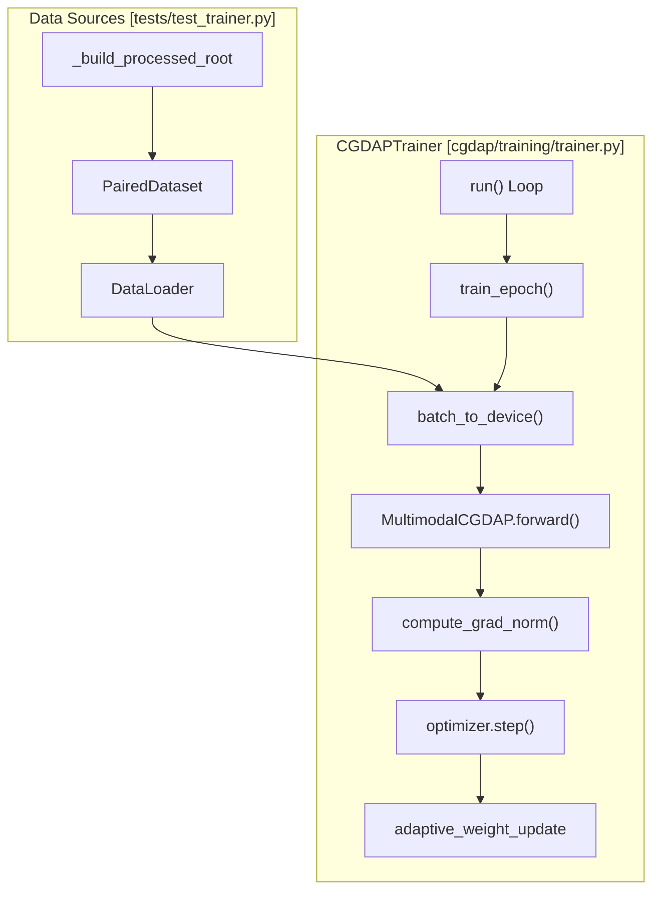
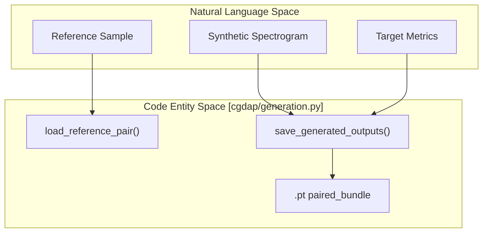

# Trainer, Dataset, and Generation Tests

> **Relevant source files**
> * [tests/test_dataset.py](https://github.com/yashwantherukulla/IoT-Data-Aug/blob/3c2a9426/tests/test_dataset.py)
> * [tests/test_generation.py](https://github.com/yashwantherukulla/IoT-Data-Aug/blob/3c2a9426/tests/test_generation.py)
> * [tests/test_product_eval.py](https://github.com/yashwantherukulla/IoT-Data-Aug/blob/3c2a9426/tests/test_product_eval.py)
> * [tests/test_trainer.py](https://github.com/yashwantherukulla/IoT-Data-Aug/blob/3c2a9426/tests/test_trainer.py)

This page documents the testing suite for the core operational components of the CGDAP pipeline, specifically focusing on the training loop, data loading mechanisms, synthetic generation utilities, and the product evaluation logic. These tests ensure that the integration between the diffusion model, the metric-guided loss, and the multimodal data structures remains robust.

## Trainer and Training Loop Tests

The `test_trainer.py` suite validates the `CGDAPTrainer` lifecycle, ensuring that the training and validation epochs correctly update model weights and adaptive metric weights.

### CGDAPTrainer Integration

The tests utilize a mock environment created by `_build_processed_root` and `_build_cfg` to simulate a full training run without requiring the complete HAR dataset [tests/test_trainer.py L30-L40](https://github.com/yashwantherukulla/IoT-Data-Aug/blob/3c2a9426/tests/test_trainer.py#L30-L40)

* **Mock Data Generation**: Creates a temporary directory structure mimicking the `processed/HAR` layout with `.pt` payloads containing spectrograms, metrics, and labels [tests/test_trainer.py L14-L27](https://github.com/yashwantherukulla/IoT-Data-Aug/blob/3c2a9426/tests/test_trainer.py#L14-L27)
* **Gradient Tracking**: `test_compute_grad_norm_tracks_preclip_value` verifies that `compute_grad_norm` correctly captures the gradient magnitude before `clip_grad_norm_` is applied [tests/test_trainer.py L140-L150](https://github.com/yashwantherukulla/IoT-Data-Aug/blob/3c2a9426/tests/test_trainer.py#L140-L150)
* **Device Management**: `test_batch_to_device` ensures that nested dictionaries containing tensors (e.g., multimodal batches) are recursively moved to the target device while preserving non-tensor metadata like activity strings [tests/test_trainer.py L157-L184](https://github.com/yashwantherukulla/IoT-Data-Aug/blob/3c2a9426/tests/test_trainer.py#L157-L184)

### Trainer Execution Flow

The following diagram illustrates the data flow within the trainer as verified by the test suite.

**Trainer Data Flow (Code Entity Space)**

Sources: [tests/test_trainer.py L10-L11](https://github.com/yashwantherukulla/IoT-Data-Aug/blob/3c2a9426/tests/test_trainer.py#L10-L11)

 [tests/test_trainer.py L173-L184](https://github.com/yashwantherukulla/IoT-Data-Aug/blob/3c2a9426/tests/test_trainer.py#L173-L184)

 [tests/test_trainer.py L193-L194](https://github.com/yashwantherukulla/IoT-Data-Aug/blob/3c2a9426/tests/test_trainer.py#L193-L194)

---

## Dataset and Loading Tests

`test_dataset.py` focuses on the structural integrity of the `ModalityDataset` and `PairedDataset` classes, which are responsible for serving synchronized sensor data.

### Dataset Verification

* **ModalityDataset**: Validates that individual modalities (e.g., "acc") load the expected 3-channel spectrograms and 5-element metric vectors [tests/test_dataset.py L14-L23](https://github.com/yashwantherukulla/IoT-Data-Aug/blob/3c2a9426/tests/test_dataset.py#L14-L23)
* **PairedDataset Alignment**: Ensures that when loading multiple modalities, the samples are correctly aligned by file stem (e.g., `running_0.pt` for both `acc` and `gyr`) [tests/test_dataset.py L26-L35](https://github.com/yashwantherukulla/IoT-Data-Aug/blob/3c2a9426/tests/test_dataset.py#L26-L35)
* **Data Integrity**: `test_dataset_no_nan` performs a smoke test on the processed `.pt` files to ensure no `NaN` values exist in the spectrogram or metric fields [tests/test_dataset.py L38-L45](https://github.com/yashwantherukulla/IoT-Data-Aug/blob/3c2a9426/tests/test_dataset.py#L38-L45)

| Test Function | Target Class | Verification Goal |
| --- | --- | --- |
| `test_modality_dataset_shapes` | `ModalityDataset` | Spectrogram shape `[3, F, T]` and Metrics `[5]` |
| `test_paired_dataset_alignment` | `PairedDataset` | Synchronized modalities for the same window |
| `test_dataset_no_nan` | `ModalityDataset` | Numerical stability of processed data |

Sources: [tests/test_dataset.py L3-L35](https://github.com/yashwantherukulla/IoT-Data-Aug/blob/3c2a9426/tests/test_dataset.py#L3-L35)

---

## Generation and Checkpoint Tests

`test_generation.py` validates the standalone utilities used during the `generate` phase of the pipeline, specifically handling reference sample loading and output persistence.

### Reference Loading and Saving

* **Reference Resolution**: `load_reference_pair` is tested for its ability to find corresponding modalities across different subdirectories within the `processed/HAR` root [tests/test_generation.py L27-L48](https://github.com/yashwantherukulla/IoT-Data-Aug/blob/3c2a9426/tests/test_generation.py#L27-L48)
* **Output Serialization**: `save_generated_outputs` is verified to produce a comprehensive set of files for every generated sample, including: * Individual `.pt` samples for each modality [tests/test_generation.py L95-L96](https://github.com/yashwantherukulla/IoT-Data-Aug/blob/3c2a9426/tests/test_generation.py#L95-L96) * A `paired_bundle.pt` for multimodal evaluation [tests/test_generation.py L97](https://github.com/yashwantherukulla/IoT-Data-Aug/blob/3c2a9426/tests/test_generation.py#L97-L97) * Visualizations (spectrogram plots and diffusion trajectories) [tests/test_generation.py L98-L102](https://github.com/yashwantherukulla/IoT-Data-Aug/blob/3c2a9426/tests/test_generation.py#L98-L102)

**Generation Logic (Natural Language to Code)**

Sources: [tests/test_generation.py L10-L11](https://github.com/yashwantherukulla/IoT-Data-Aug/blob/3c2a9426/tests/test_generation.py#L10-L11)

 [tests/test_generation.py L40-L48](https://github.com/yashwantherukulla/IoT-Data-Aug/blob/3c2a9426/tests/test_generation.py#L40-L48)

 [tests/test_generation.py L80-L93](https://github.com/yashwantherukulla/IoT-Data-Aug/blob/3c2a9426/tests/test_generation.py#L80-L93)

---

## Product Evaluator Tests

`test_product_eval.py` ensures that the `ProductEvaluator` correctly calculates the metrics used to track model quality during training.

### Evaluation Metrics Verification

The tests use a `StubGenerator` and `IdentityMetricExtractor` to provide deterministic outputs, allowing for exact verification of RMSE and distance calculations [tests/test_product_eval.py L14-L50](https://github.com/yashwantherukulla/IoT-Data-Aug/blob/3c2a9426/tests/test_product_eval.py#L14-L50)

* **Deterministic Probes**: `test_product_evaluator_probe_selection_is_deterministic` ensures that the evaluator selects the same "probe" samples (reference points) across different runs if the seed is fixed [tests/test_product_eval.py L176-L188](https://github.com/yashwantherukulla/IoT-Data-Aug/blob/3c2a9426/tests/test_product_eval.py#L176-L188)
* **RMSE Accuracy**: `test_product_evaluator_reports_expected_pair_rmse_for_disturbance` verifies that the `pair_rmse` (the error between requested metric targets and extracted metrics from generated samples) is calculated correctly [tests/test_product_eval.py L194-L200](https://github.com/yashwantherukulla/IoT-Data-Aug/blob/3c2a9426/tests/test_product_eval.py#L194-L200)
* **Augmentation Logic**: The evaluator is tested against different `augmentation` modes (`disturbance`, `interpolation`, `domain_instruction`) to ensure the metric targets are generated according to the configuration [tests/test_product_eval.py L104-L130](https://github.com/yashwantherukulla/IoT-Data-Aug/blob/3c2a9426/tests/test_product_eval.py#L104-L130)

### Evaluator Configuration Reference

| Parameter | Role in Test |
| --- | --- |
| `samples_per_activity` | Number of unique activities to evaluate [tests/test_product_eval.py L163](https://github.com/yashwantherukulla/IoT-Data-Aug/blob/3c2a9426/tests/test_product_eval.py#L163-L163) |
| `samples_per_probe` | Number of synthetic samples to generate per reference [tests/test_product_eval.py L164](https://github.com/yashwantherukulla/IoT-Data-Aug/blob/3c2a9426/tests/test_product_eval.py#L164-L164) |
| `z_score_threshold` | Threshold for identifying outlier drift in metrics [tests/test_product_eval.py L167](https://github.com/yashwantherukulla/IoT-Data-Aug/blob/3c2a9426/tests/test_product_eval.py#L167-L167) |

Sources: [tests/test_product_eval.py L11-L12](https://github.com/yashwantherukulla/IoT-Data-Aug/blob/3c2a9426/tests/test_product_eval.py#L11-L12)

 [tests/test_product_eval.py L131-L173](https://github.com/yashwantherukulla/IoT-Data-Aug/blob/3c2a9426/tests/test_product_eval.py#L131-L173)