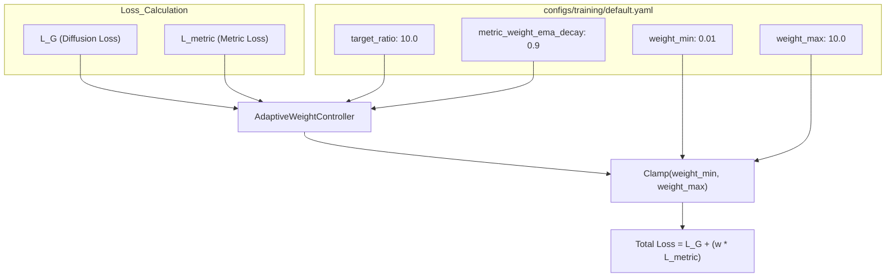
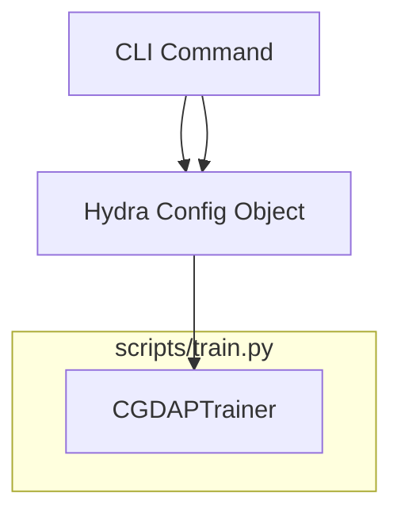

# Training Configuration

> **Relevant source files**
> * [configs/logging/console.yaml](https://github.com/yashwantherukulla/IoT-Data-Aug/blob/3c2a9426/configs/logging/console.yaml)
> * [configs/logging/wandb.yaml](https://github.com/yashwantherukulla/IoT-Data-Aug/blob/3c2a9426/configs/logging/wandb.yaml)
> * [configs/training/default.yaml](https://github.com/yashwantherukulla/IoT-Data-Aug/blob/3c2a9426/configs/training/default.yaml)
> * [runner.ipynb](https://github.com/yashwantherukulla/IoT-Data-Aug/blob/3c2a9426/runner.ipynb)

This page documents the training configuration for the CGDAP project, primarily defined in `configs/training/default.yaml`. The configuration governs the optimization strategy, learning rate scheduling, adaptive loss weighting for metric consistency, and the logging/checkpointing lifecycle.

## Configuration Overview

The training process is orchestrated by a set of hyperparameters that balance the generative diffusion loss ($L_G$) with the metric-consistency loss ($L_{metric}$). The configuration supports standard deep learning practices like gradient clipping and cosine annealing, alongside specialized controllers for multi-objective optimization.

### Optimizer and Scheduler

The system uses the **AdamW** optimizer by default [configs/training/default.yaml L10-L16](https://github.com/yashwantherukulla/IoT-Data-Aug/blob/3c2a9426/configs/training/default.yaml#L10-L16)

 which decouples weight decay from the gradient update. To ensure stable convergence, a **Cosine Annealing** scheduler is employed to decay the learning rate toward a minimum value over the course of training [configs/training/default.yaml L19-L22](https://github.com/yashwantherukulla/IoT-Data-Aug/blob/3c2a9426/configs/training/default.yaml#L19-L22)

| Parameter | Default Value | Description |
| --- | --- | --- |
| `optimizer.lr` | `1.0e-4` | Initial learning rate. |
| `optimizer.betas` | `[0.9, 0.999]` | AdamW momentum parameters. |
| `optimizer.clip_norm` | `1.0` | Maximum gradient norm for clipping. |
| `scheduler.name` | `cosine` | LR decay strategy. |
| `scheduler.T_max` | `100` | Maximum iterations (matches `max_epochs`). |
| `scheduler.eta_min` | `1.0e-6` | Minimum learning rate floor. |

**Sources:** [configs/training/default.yaml L9-L22](https://github.com/yashwantherukulla/IoT-Data-Aug/blob/3c2a9426/configs/training/default.yaml#L9-L22)

---

## Adaptive Metric Weight Controller

A critical component of the CGDAP training pipeline is the **Adaptive Metric Weight Controller**. Because the scale of the metric-consistency loss ($L_{metric}$) can vary significantly compared to the diffusion loss ($L_G$), the system dynamically adjusts the weights of individual metrics to maintain a specific ratio.

### Controller Implementation Logic

The goal of the controller is to keep the total generative loss approximately 10 times larger than the metric loss ($L_G : L_{metric} \approx 10:1$) [configs/training/default.yaml L29](https://github.com/yashwantherukulla/IoT-Data-Aug/blob/3c2a9426/configs/training/default.yaml#L29-L29)

1. **EMA Smoothing**: Raw per-batch metric losses are smoothed using an Exponential Moving Average (EMA) with a decay of `0.9` to prevent aggressive weight oscillations [configs/training/default.yaml L33](https://github.com/yashwantherukulla/IoT-Data-Aug/blob/3c2a9426/configs/training/default.yaml#L33-L33)
2. **Target Ratio**: The controller calculates a scaling factor to drive the ratio toward the `target_ratio`.
3. **Clamping**: Weights are strictly clamped between `weight_min` (0.01) and `weight_max` (10.0) to prevent loss collapse or explosion [configs/training/default.yaml L35-L36](https://github.com/yashwantherukulla/IoT-Data-Aug/blob/3c2a9426/configs/training/default.yaml#L35-L36)
4. **Delayed Start**: Adaptive reweighting begins after `adaptive_start_epoch` (default: 1) to allow initial diffusion gradients to stabilize [configs/training/default.yaml L31](https://github.com/yashwantherukulla/IoT-Data-Aug/blob/3c2a9426/configs/training/default.yaml#L31-L31)

### Data Flow: Loss Weighting

The following diagram illustrates how configuration parameters interact with the loss calculation during a training step.

**Training Loss Weighting Flow**



**Sources:** [configs/training/default.yaml L24-L36](https://github.com/yashwantherukulla/IoT-Data-Aug/blob/3c2a9426/configs/training/default.yaml#L24-L36)

---

## Logging and Checkpointing

The configuration supports two primary logging backends: **Weights & Biases (W&B)** for cloud-based experiment tracking and **Console** for local development.

### Logging Modes

* **W&B (`configs/logging/wandb.yaml`)**: Configures project name, entity, and online synchronization [configs/logging/wandb.yaml L5-L12](https://github.com/yashwantherukulla/IoT-Data-Aug/blob/3c2a9426/configs/logging/wandb.yaml#L5-L12)
* **Console (`configs/logging/console.yaml`)**: Standard stdout logging with a frequency of 10 steps [configs/logging/console.yaml L5-L7](https://github.com/yashwantherukulla/IoT-Data-Aug/blob/3c2a9426/configs/logging/console.yaml#L5-L7)

### Checkpoint Strategy

The trainer automatically saves model states, optimizer states, and RNG states to the `checkpoint_dir` [configs/training/default.yaml L39](https://github.com/yashwantherukulla/IoT-Data-Aug/blob/3c2a9426/configs/training/default.yaml#L39-L39)

* **Frequency**: Checkpoints are saved every epoch by default (`save_every_n_epochs: 1`) [configs/training/default.yaml L41](https://github.com/yashwantherukulla/IoT-Data-Aug/blob/3c2a9426/configs/training/default.yaml#L41-L41)
* **Resumption**: If `resume` is set to `true`, the trainer loads the state from `resume_checkpoint` and restores the global RNG state to ensure reproducibility in data shuffling and noise generation [configs/training/default.yaml L45-L47](https://github.com/yashwantherukulla/IoT-Data-Aug/blob/3c2a9426/configs/training/default.yaml#L45-L47)

**Sources:** [configs/training/default.yaml L38-L48](https://github.com/yashwantherukulla/IoT-Data-Aug/blob/3c2a9426/configs/training/default.yaml#L38-L48)

 [configs/logging/wandb.yaml L1-L17](https://github.com/yashwantherukulla/IoT-Data-Aug/blob/3c2a9426/configs/logging/wandb.yaml#L1-L17)

 [configs/logging/console.yaml L1-L15](https://github.com/yashwantherukulla/IoT-Data-Aug/blob/3c2a9426/configs/logging/console.yaml#L1-L15)

---

## Execution and Overrides

The configuration is managed via Hydra, allowing any parameter in `default.yaml` to be overridden via the command line. This is frequently used to adjust batch sizes or epoch counts for different hardware environments.

**CLI Override Mapping**



**Example Command:**

```
uv run python scripts/train.py \  model.unet.base_channels=32 \  training.batch_size=4 \  training.max_epochs=2
```

**Sources:** [runner.ipynb L12](https://github.com/yashwantherukulla/IoT-Data-Aug/blob/3c2a9426/runner.ipynb#L12-L12)

 [configs/training/default.yaml L5-L6](https://github.com/yashwantherukulla/IoT-Data-Aug/blob/3c2a9426/configs/training/default.yaml#L5-L6)