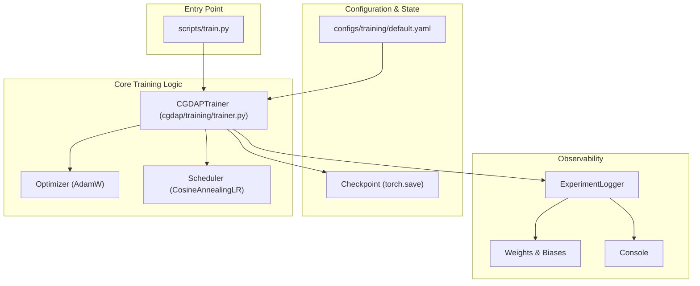
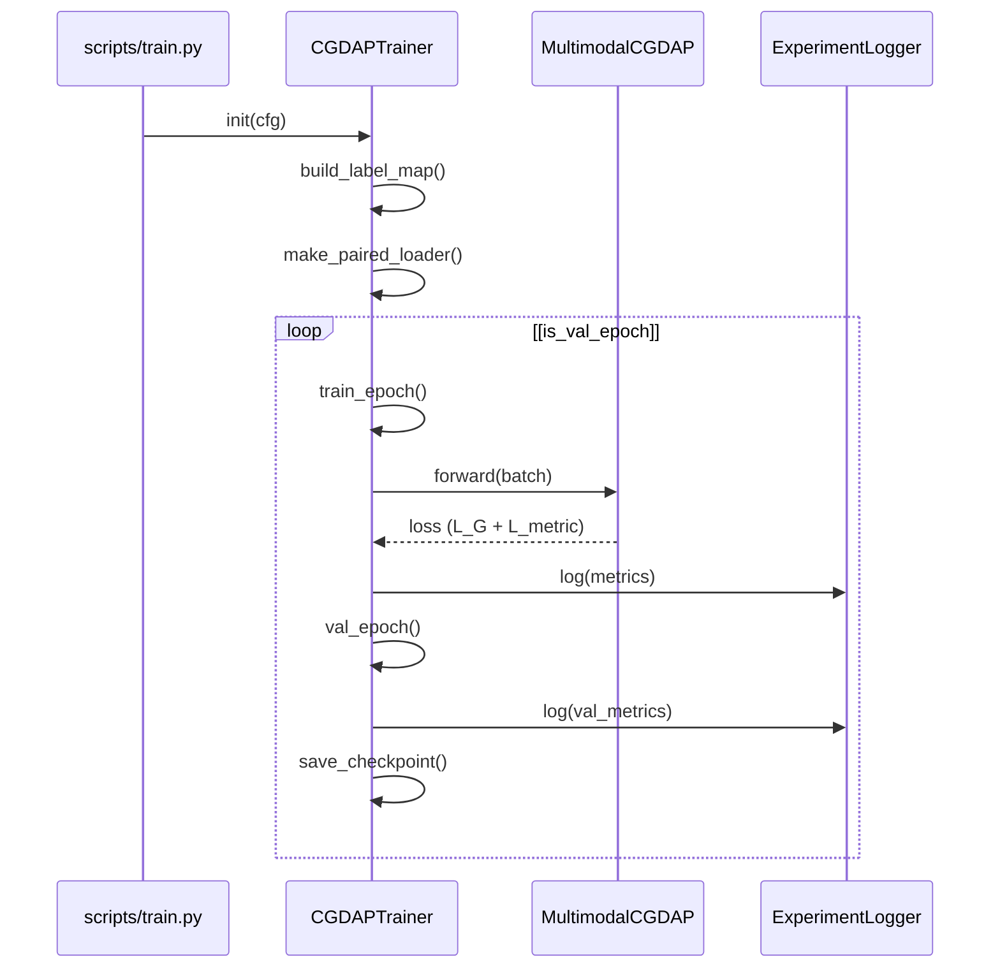

# Training

> **Relevant source files**
> * [cgdap/training/__init__.py](https://github.com/yashwantherukulla/IoT-Data-Aug/blob/3c2a9426/cgdap/training/__init__.py)
> * [cgdap/training/trainer.py](https://github.com/yashwantherukulla/IoT-Data-Aug/blob/3c2a9426/cgdap/training/trainer.py)
> * [configs/training/default.yaml](https://github.com/yashwantherukulla/IoT-Data-Aug/blob/3c2a9426/configs/training/default.yaml)
> * [scripts/train.py](https://github.com/yashwantherukulla/IoT-Data-Aug/blob/3c2a9426/scripts/train.py)

The training system in the CGDAP project is designed to handle the complex requirements of multimodal diffusion models, specifically focusing on the synchronization of sensor modalities (e.g., Accelerometer and Gyroscope) and the integration of differentiable metric-consistency losses. The system is centered around a unified trainer class that manages the lifecycle of the model, from data loading to periodic evaluation and checkpointing.

### Training Lifecycle Overview

The training process is orchestrated by the `CGDAPTrainer` class [cgdap/training/trainer.py L167-L175](https://github.com/yashwantherukulla/IoT-Data-Aug/blob/3c2a9426/cgdap/training/trainer.py#L167-L175)

 It follows a standard epoch-based loop but includes specialized logic for multimodal data synchronization using paired loaders and an adaptive weighting mechanism for the auxiliary metric loss ($L_{metric}$).

The high-level execution flow is as follows:

1. **Initialization**: The trainer builds the label map, initializes the `MultimodalCGDAP` model, and sets up the `ExperimentLogger` [cgdap/training/trainer.py L177-L217](https://github.com/yashwantherukulla/IoT-Data-Aug/blob/3c2a9426/cgdap/training/trainer.py#L177-L217)
2. **Epoch Loop**: For each epoch, the trainer executes a `train_epoch` pass followed by an optional `val_epoch` pass and a `ProductEvaluator` diagnostic run [cgdap/training/trainer.py L355-L385](https://github.com/yashwantherukulla/IoT-Data-Aug/blob/3c2a9426/cgdap/training/trainer.py#L355-L385)
3. **Checkpointing**: The system saves the model state, optimizer state, and RNG states to allow for bit-perfect resumption of training [cgdap/training/trainer.py L532-L564](https://github.com/yashwantherukulla/IoT-Data-Aug/blob/3c2a9426/cgdap/training/trainer.py#L532-L564)

#### Training System Architecture

The following diagram illustrates the relationship between the trainer, the configuration, and the logging infrastructure.

"Training System Components"

Sources: [cgdap/training/trainer.py L167-L175](https://github.com/yashwantherukulla/IoT-Data-Aug/blob/3c2a9426/cgdap/training/trainer.py#L167-L175)

 [scripts/train.py L16-L20](https://github.com/yashwantherukulla/IoT-Data-Aug/blob/3c2a9426/scripts/train.py#L16-L20)

 [configs/training/default.yaml L1-L48](https://github.com/yashwantherukulla/IoT-Data-Aug/blob/3c2a9426/configs/training/default.yaml#L1-L48)

---

### CGDAPTrainer

The `CGDAPTrainer` is the central controller for the training process. It encapsulates the `MultimodalCGDAP` model and ensures that training data is fed through the `make_paired_loader` to maintain temporal and label alignment across modalities [cgdap/training/trainer.py L200-L207](https://github.com/yashwantherukulla/IoT-Data-Aug/blob/3c2a9426/cgdap/training/trainer.py#L200-L207)

Key responsibilities include:

* **Gradient Management**: Implements gradient clipping based on the `clip_norm` configuration [cgdap/training/trainer.py L441-L443](https://github.com/yashwantherukulla/IoT-Data-Aug/blob/3c2a9426/cgdap/training/trainer.py#L441-L443)
* **Metric Weighting**: Dynamically adjusts the importance of the metric-consistency loss relative to the diffusion loss using a `target_ratio` controller [cgdap/training/trainer.py L448-L460](https://github.com/yashwantherukulla/IoT-Data-Aug/blob/3c2a9426/cgdap/training/trainer.py#L448-L460)
* **Deterministic Validation**: Ensures validation metrics are computed with fixed noise seeds for reproducibility [cgdap/training/trainer.py L480-L485](https://github.com/yashwantherukulla/IoT-Data-Aug/blob/3c2a9426/cgdap/training/trainer.py#L480-L485)

For a deep dive into the trainer's internal methods and the epoch lifecycle, see **[CGDAPTrainer](/yashwantherukulla/IoT-Data-Aug/6.1-cgdaptrainer)**.

Sources: [cgdap/training/trainer.py L167-L500](https://github.com/yashwantherukulla/IoT-Data-Aug/blob/3c2a9426/cgdap/training/trainer.py#L167-L500)

 [cgdap/data/dataset.py L15](https://github.com/yashwantherukulla/IoT-Data-Aug/blob/3c2a9426/cgdap/data/dataset.py#L15-L15)

---

### Training Configuration

The training behavior is governed by `configs/training/default.yaml`. The project uses **Hydra** for configuration management, allowing for easy overrides of hyperparameters such as learning rate, batch size, and loss weights via the CLI [scripts/train.py L16-L17](https://github.com/yashwantherukulla/IoT-Data-Aug/blob/3c2a9426/scripts/train.py#L16-L17)

The configuration specifies:

* **Optimizer**: Defaulting to `AdamW` with configurable weight decay [configs/training/default.yaml L10-L16](https://github.com/yashwantherukulla/IoT-Data-Aug/blob/3c2a9426/configs/training/default.yaml#L10-L16)
* **Scheduler**: A `CosineAnnealingLR` schedule that decays the learning rate over the course of `max_epochs` [configs/training/default.yaml L19-L22](https://github.com/yashwantherukulla/IoT-Data-Aug/blob/3c2a9426/configs/training/default.yaml#L19-L22)
* **Adaptive Loss**: Parameters for the EMA-based metric weight controller, including `weight_min` and `weight_max` clamps [configs/training/default.yaml L25-L36](https://github.com/yashwantherukulla/IoT-Data-Aug/blob/3c2a9426/configs/training/default.yaml#L25-L36)

For a detailed reference of all training parameters, see **[Training Configuration](/yashwantherukulla/IoT-Data-Aug/6.2-training-configuration)**.

Sources: [configs/training/default.yaml L1-L48](https://github.com/yashwantherukulla/IoT-Data-Aug/blob/3c2a9426/configs/training/default.yaml#L1-L48)

 [cgdap/training/trainer.py L120-L152](https://github.com/yashwantherukulla/IoT-Data-Aug/blob/3c2a9426/cgdap/training/trainer.py#L120-L152)

---

### Experiment Logging & Checkpointing

The `ExperimentLogger` provides a unified interface for tracking training progress [cgdap/training/trainer.py L45-L48](https://github.com/yashwantherukulla/IoT-Data-Aug/blob/3c2a9426/cgdap/training/trainer.py#L45-L48)

 It supports two backends:

1. **Console**: Standard logging for local development.
2. **Weights & Biases (W&B)**: Comprehensive experiment tracking, including loss curves, gradient norms, and learning rate schedules [cgdap/training/trainer.py L87-L92](https://github.com/yashwantherukulla/IoT-Data-Aug/blob/3c2a9426/cgdap/training/trainer.py#L87-L92)

**Checkpointing Strategy**:
Checkpoints are saved periodically (controlled by `save_every_n_epochs`) [configs/training/default.yaml L41](https://github.com/yashwantherukulla/IoT-Data-Aug/blob/3c2a9426/configs/training/default.yaml#L41-L41)

 Each checkpoint includes the `model_state_dict`, `optimizer_state_dict`, `scheduler_state_dict`, and the `global_step`. If `restore_rng_state` is enabled, the trainer also restores the state of `torch`, `numpy`, and `random` to ensure continuity in stochastic processes upon resumption [cgdap/training/trainer.py L532-L564](https://github.com/yashwantherukulla/IoT-Data-Aug/blob/3c2a9426/cgdap/training/trainer.py#L532-L564)

"Trainer Lifecycle & Data Flow"

Sources: [cgdap/training/trainer.py L355-L400](https://github.com/yashwantherukulla/IoT-Data-Aug/blob/3c2a9426/cgdap/training/trainer.py#L355-L400)

 [cgdap/training/trainer.py L532-L540](https://github.com/yashwantherukulla/IoT-Data-Aug/blob/3c2a9426/cgdap/training/trainer.py#L532-L540)